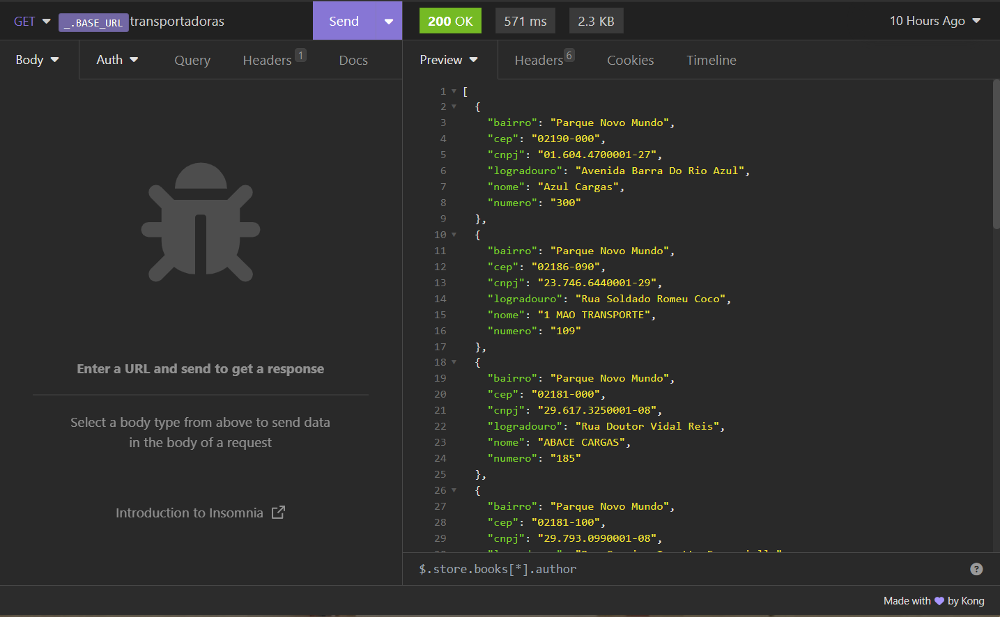
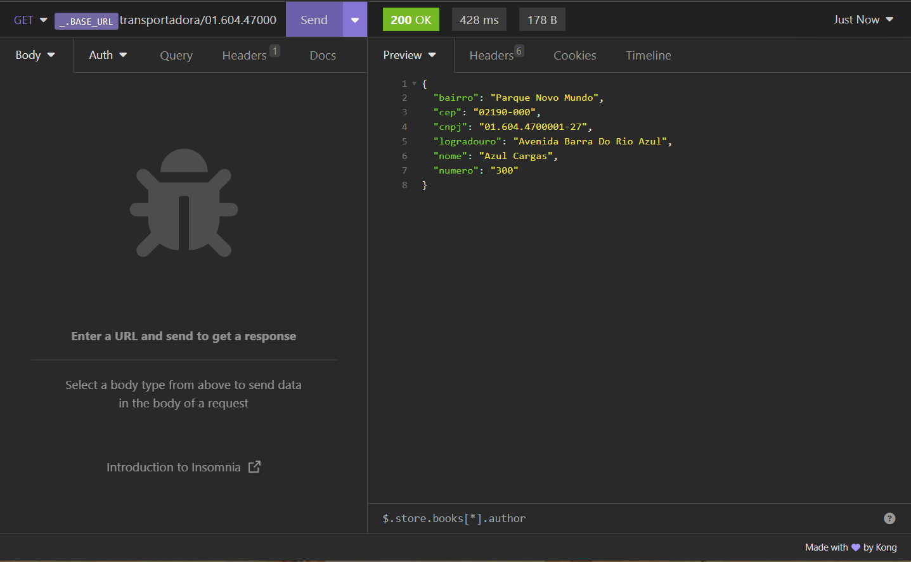
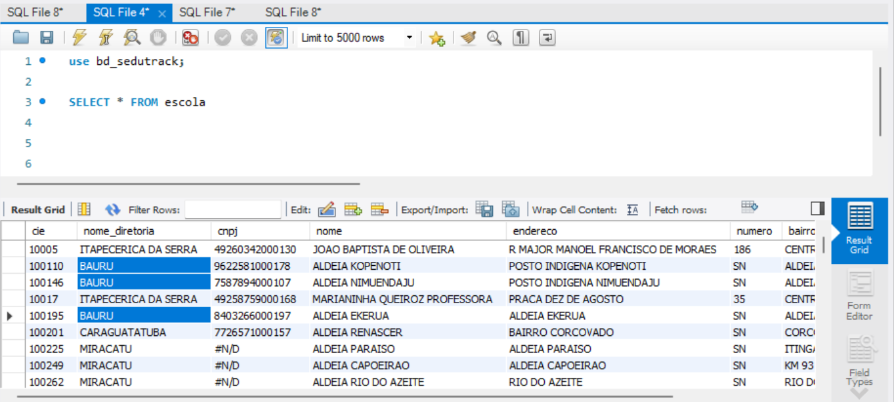
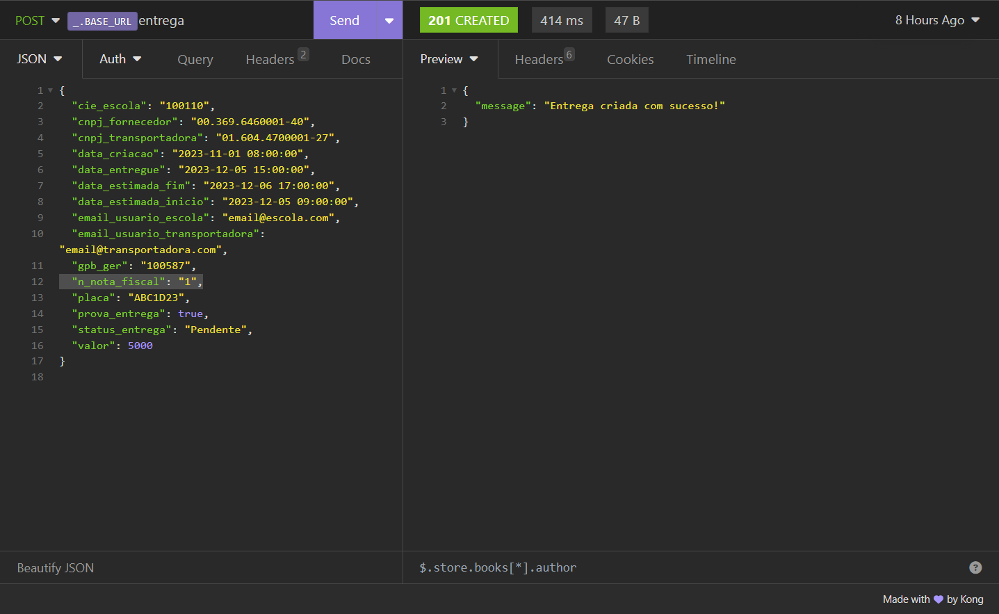

<table>
<tr>
<Table>
  <tr>
    <td><a href= "https://www.educacao.sp.gov.br/"></td>
    <td>
      <a href= "https://www.inteli.edu.br/"></a>
    </td>
  </tr>
</table>

# EduTrack

## Sedutech

## :student: Integrantes:

- <a href="https://www.linkedin.com/in/emely-tavares-3575ba24a/">Emely Tavares</a>
- <a href="https://www.linkedin.com/in/israel-carvalho-706133241/">Israel Carvalho</a>
- <a href="https://www.linkedin.com/in/luiscmiranda/">Luis Miranda</a> 
- <a href="https://www.linkedin.com/in/lfcovas97/">Luiz Fernando Covas</a> 
- <a href="https://www.linkedin.com/in/vitor-santos-851408196/">Vitor Santos</a>
- <a href="https://www.linkedin.com/in/yuri-toledo-964123230/">Yuri Toledo</a>

## Conteúdo

- [Visão Geral do Projeto](#visão-geral-do-projeto)
  - [Parceiro de Negócios](#parceiro-de-negócios)
  - [Análise da Indústria](#análise-da-indústria)
  - [Problema](#problema)
    - [Análise do Problema](#análise-do-problema)
    - [Matriz SWOT](#matriz-swot)
    - [Matriz de Risco](#matriz-de-risco)
    - [Análise Financeira](#análise-financeira-do-projeto)
  - [Proposta da Solução](#proposta-de-solução)
    - [Descritivo da Solução](#descritivo-da-solução)
    - [Objetivos](#objetivos)
    - [Proposta de Valor - Value Proposition Canvas](#proposta-de-valor---value-proposition-canvas)
    - [Matriz de Avaliação de valor Oceano Azul](#matriz-de-avaliação-de-valor-oceano-azul)
  - [Partes Interessadas](#partes-interessadas)
- [Requisitos](#requisitos)
  - [Mapeamento do processo em alto nível](#mapeamento-do-processo-em-alto-nível)
  - [Requisitos Funcionais](#requisitos-funcionais)
  - [Requisitos não Funcionais](#requisitos-não-funcionais)
  - [Perfis de Usuários](#perfis-de-usuários)
  - [Casos de Uso](#casos-de-uso)
  - [Matriz de Rastreabilidade de Requisitos](#matriz-de-rastreabilidade-de-requisitos)
- [Arquitetura do Sistema](#arquitetura-do-sistema)
  - [Arquitetura](#arquitetura-SOA)
  - [Instrumentos de Arquitetura](#instrumentos-de-arquitetura-soa)
- [Interface](#interface)
  - [Wireframes](#wireframes)
  - [Mockup Navegável](#mockup-navegável)
  - [Design de Interface - Guia de Estilos](#design-de-interface---guia-de-estilos)
  - [Análise de Usabilidade](#análise-de-usabilidade)
- [Projeto de Banco de Dados](#projeto-de-banco-de-dados)
  - [Especificação para recomendação](#especificação-para-recomendação-csv)	
  - [Modelo Conceitual](#modelo-conceitual)
  - [Modelo Lógico](#modelo-conceitual)
- [Projeto de Construção API](#projeto-de-construção-da-api)
  - [Modelo de Recomendação Baseado em Filtragem Colaborativa](#modelo-de-recomendação-baseado-em-filtragem-colaborativa)	
  - [Arquitetura de Intregação](#arquitetura-de-integração-diagramas-uml)
  - [Documentação da API](#documentação-da-api-swagger)
- [Testes de Software](#testes-de-software)
  - [Teste Unitário](#teste-unitário)
  - [Teste de Integração](#testes-de-integração)
  - [Teste de Regressão](#teste-de-regressão)
  - [Teste de Usabilidade](#teste-de-usabilidade)
  - [Teste de Funcionalidade](#teste-de-funcionalidade)
  - [Teste de API](#teste-de-api)
- [Funcionalidades Implementadas](#funcionalidades-implementadas-na-prova-de-conceito)
- [Custo de implementação da prova de conceito e estimativa de custo para a solução final](#custo-de-implementação-da-prova-de-conceito-e-estimativa-de-custo-para-a-solução-final)
- [Benefícios Entregues pelo Projeto](#benefícios-entregues-pelo-projeto)
- [Aperfeiçoamentos futuros](#aperfeiçoamentos-futuros)
- [Manual do Usuário](#manual-do-usuário)
- [Referências](#referências)
- [Apêndice](#apêndice)


# Visão Geral do Projeto

Este capítulo apresenta uma visão abrangente do projeto, abordando desde a análise inicial do ambiente da indústria até os benefícios tangíveis e intangíveis esperados com a implementação da solução proposta. Ao longo das seções, exploraremos a parceria estratégica com a Secretaria de Educação do Estado de São Paulo (SEDUC), analisaremos a dinâmica da indústria logística de entregas para Unidades Escolares e identificaremos os desafios cruciais que motivaram este projeto.

Aprofundando-se na análise do problema, destacaremos as ineficiências no controle de remessas, a falta de transparência nas entregas e as dificuldades enfrentadas na avaliação e seleção de fornecedores. Utilizaremos ferramentas como a Matriz SWOT para uma compreensão holística do cenário, e a Matriz de Risco para antecipar e mitigar possíveis desafios durante a implementação.

Em seguida, apresentaremos uma análise financeira, projetando economias de custos operacionais e delineando o Retorno sobre Investimento (ROI) esperado. A proposta da solução será detalhada, destacando objetivos específicos, a proposta de valor através do Value Proposition Canvas e a avaliação de inovação com a Matriz de Avaliação de Valor Oceano Azul.

Por fim, examinaremos as partes interessadas envolvidas no projeto, reconhecendo suas necessidades e expectativas. Este capítulo proporcionará uma visão completa do escopo, dos desafios e dos ganhos potenciais que delineiam o projeto em questão, preparando o leitor para explorar as seções subsequentes com uma compreensão sólida do contexto e dos objetivos almejados.

## Parceiro de Negócios
A Secretaria de Estado da Educação (SEDUC) é uma instituição governamental presente em cada estado do Brasil, cada uma operando de forma independente dentro de seu respectivo estado. Aqui está uma descrição geral, considerando as características comuns às SEDUCs em diferentes estados:

**Porte:** As SEDUCs são grandes instituições, considerando que são responsáveis pela educação pública em todo o estado. Elas administram uma vasta rede de escolas públicas, atendendo a milhares de alunos desde a educação infantil até o ensino médio.

**Área de Atuação:** As SEDUCs atuam na área de educação pública. Elas são responsáveis pela gestão das escolas estaduais, incluindo infraestrutura, currículo, contratação e formação de professores, e implementação de políticas educacionais.

**Mercado de Atuação:** A principal "área de mercado" da SEDUC é o setor educacional público. Ela não atua no sentido comercial tradicional, já que é uma instituição governamental. Seu objetivo é fornecer educação de qualidade acessível a todos os estudantes do estado.

**Posicionamento no Mercado:** Como entidade governamental, a SEDUC não compete no mercado da mesma forma que as instituições privadas. Seu posicionamento é de um provedor primário e regulador da educação pública no estado. Ela desempenha um papel crucial na formulação e implementação de políticas educacionais, visando melhorar os padrões de educação e garantir igualdade de acesso à educação para todos os estudantes do estado.

Cada SEDUC é única em termos de seu tamanho, orçamento, e desafios específicos, dependendo do estado em que opera e das necessidades educacionais locais. No entanto, todas compartilham o objetivo comum de promover e melhorar a educação pública.

## Análise da Indústria

A análise da indústria de gestão escolar, especialmente do ponto de vista público e no contexto da Secretaria de Educação do Estado de São Paulo (SEDUC), revela vários aspectos críticos:

**Complexidade Logística:** A SEDUC, gerenciando um grande número de escolas, enfrenta desafios logísticos significativos. A distribuição de equipamentos e recursos para escolas espalhadas por um grande estado é uma operação complexa que exige uma gestão eficiente.

**Falta de Rastreabilidade:** A ausência de um sistema de rastreamento para equipamentos e materiais educativos resulta em ineficiências significativas, como extravios e entregas incorretas. Isso impacta diretamente a qualidade da educação, pois recursos essenciais podem não estar disponíveis quando necessários.

**Necessidade de Transparência e Responsabilidade:** No setor público, a transparência e a responsabilidade são fundamentais. Sem um sistema adequado para rastrear as entregas, é difícil para a SEDUC prestar contas de forma eficaz sobre a utilização dos fundos e recursos.

**Impacto na Educação e Desempenho dos Alunos:** A eficiência na gestão de recursos afeta diretamente o ambiente educacional. Atrasos ou erros na entrega de materiais podem prejudicar o processo de aprendizagem.

**Tecnologia como Solução:** A introdução de tecnologias, como um aplicativo para gerenciar e rastrear entregas, pode ser uma solução poderosa. Isso não só melhoraria a eficiência logística, mas também aumentaria a transparência e a responsabilidade.

**Adaptação às Necessidades Locais:** Cada região tem suas peculiaridades, e um sistema eficaz deve ser flexível o suficiente para se adaptar a diferentes contextos e necessidades das escolas.

**Desafios de Implementação:** A implementação de novas tecnologias no setor público pode ser desafiadora, devido a fatores como limitações orçamentárias, resistência à mudança e necessidade de treinamento dos usuários.

**Potencial para Escalabilidade e Replicabilidade:** Uma solução bem-sucedida em um grande estado como São Paulo pode servir de modelo para outras regiões enfrentarem desafios semelhantes.

## Problema

Nesta seção do relatório, apresentaremos uma análise detalhada do problema da Secretaria de Educação do Estado de São Paulo (SEDUC), focando em seus pontos fortes, fraquezas, oportunidades e ameaças. Abordaremos a capacidade administrativa e a infraestrutura da SEDUC, identificando as limitações burocráticas e tecnológicas que enfrenta. Além disso, exploraremos as oportunidades de modernização e parcerias público-privadas, bem como as ameaças externas como mudanças políticas e desafios econômicos. 

### Análise do Problema

Ao analisar o projeto para a Secretaria de Educação do Estado de São Paulo (SEDUC), vários problemas e necessidades dos usuários foram identificados, junto com uma avaliação da situação atual e possíveis soluções. É crucial também identificar os obstáculos e limitações para garantir uma implementação bem-sucedida.

#### *Problemas Identificados e Necessidades dos Usuários*

**Falta de Rastreabilidade:** Não há um sistema eficaz para rastrear os equipamentos desde a compra até a entrega nas escolas.

- **Necessidade:** Implementar um sistema de rastreamento em tempo real para monitorar a localização e o status das entregas.

**Ineficiência na Distribuição:** Equipamentos frequentemente não são entregues nas escolas corretas, resultando em extravios.

- **Necessidade:** Melhorar a precisão e a eficiência das entregas.

**Falta de Dados e Relatórios:** Não existem dados confiáveis sobre entregas em andamento ou concluídas.

- **Necessidade:** Desenvolver um sistema de coleta e análise de dados para gerar relatórios detalhados.

#### *Avaliação da Situação Atual*
**Infraestrutura Tecnológica Limitada:** Pode haver limitações na infraestrutura tecnológica existente, necessitando upgrades ou novas implementações.

**Resistência à Mudança:** Usuários podem resistir à adoção de novas tecnologias e processos.

**Restrições Orçamentárias:** Como um órgão público, a SEDUC pode ter um orçamento limitado para novas implementações.

#### *Possíveis Soluções*

**Sistema de Rastreamento GPS:** Utilizar tecnologia GPS para rastrear as entregas.

- **Obstáculos:** Custo de implementação e necessidade de treinamento dos usuários.

**Aplicativo Móvel e Plataforma Web:** Desenvolver um aplicativo para monitorar e gerenciar as entregas.

- **Obstáculos:** Compatibilidade com diferentes dispositivos e garantia de usabilidade.

**Banco de Dados Centralizado:** Criar um banco de dados para armazenar informações das entregas e gerar relatórios.

- **Obstáculos:** Segurança dos dados e integração com sistemas existentes.

#### *Obstáculos e Limitações*
**Orçamento e Financiamento:** Garantir financiamento suficiente para o desenvolvimento e manutenção do sistema.

**Adoção e Treinamento:** Assegurar que os usuários estejam confortáveis e capacitados para usar o novo sistema.

**Infraestrutura de TI:** Atualizar ou implementar infraestrutura de TI adequada para suportar o novo sistema.

**Manutenção e Suporte:** Estabelecer um plano de manutenção contínua e suporte técnico.

**Segurança e Privacidade dos Dados:** Implementar medidas robustas de segurança e privacidade para proteger os dados.

**Integração com Sistemas Existentes:** Garantir que o novo sistema seja compatível e possa se integrar com sistemas já em uso.

**Flexibilidade e Escalabilidade:** O sistema deve ser capaz de se adaptar a mudanças futuras e escalar conforme necessário. 

### Matriz SWOT


Figura 1: Matriz análise SWOT

**Strengths (Forças)**

- Ampla Cobertura: A SEDUC gerencia uma grande rede de escolas, oferecendo amplo alcance e impacto.
- Experiência Administrativa: Possui experiência significativa na gestão de recursos educacionais e operações de larga escala.
- Acesso a Recursos Governamentais: Disponibilidade de recursos financeiros e políticos como órgão do governo.
- Infraestrutura Estabelecida: Já possui uma infraestrutura educacional básica sobre a qual novos sistemas podem ser construídos.

**Weaknesses (Fraquezas)**
- Burocracia Governamental: Processos lentos e burocráticos que podem retardar a implementação de novas iniciativas.
- Limitações Orçamentárias: Apesar do acesso a recursos, há limitações orçamentárias e restrições no uso de fundos públicos.
- Falta de Tecnologia Avançada: Pode haver uma lacuna em termos de tecnologia de ponta e sistemas de informação modernos.
- Resistência à Mudança: Inércia institucional e possíveis resistências internas à adoção de novas tecnologias e processos.

**Opportunities (Oportunidades)**
- Modernização e Inovação: Oportunidade de modernizar os sistemas existentes e adotar novas tecnologias.
- Parcerias Público-Privadas: Possibilidade de colaborar com empresas de tecnologia para melhorar a eficiência.
- Pressão Social por Melhorias: Demanda pública por maior transparência e eficiência pode impulsionar mudanças.
- Programas de Financiamento e Subsídios: Acesso a programas de financiamento nacionais e internacionais para educação e tecnologia.

**Threats (Ameaças)**
- Restrições Políticas e Legislativas: Mudanças na liderança política ou políticas governamentais podem afetar o financiamento e o apoio a projetos.
- Desafios Econômicos: Limitações econômicas mais amplas podem afetar o orçamento disponível para educação.
- Concorrência por Recursos: Competição interna por recursos limitados dentro do governo.
- Mudanças nas Necessidades Educacionais: A evolução rápida das necessidades educacionais pode exigir constantes atualizações e adaptações do sistema.

### Matriz de Risco

A imagem a seguir evidencia a distribuição dos riscos e oportunidades identificados no projeto e sua relação de Probabilidade x Impacto, ou seja, ela indica qual chance da ocorrência (10%, 50%, 90%) do respectivo risco / oportunidade e qual o impacto (Baixo, Moderado, Alto) no desenvolvimento e implantação da solução. As cores associadas indicam uma classificação de importância, onde vermelho indica um risco que exige maior atenção ou uma oportunidade de "pouca" importância, seguindo o mesmo raciocínio, a cor amarela indica uma importância razoável e a cor verde indica um risco de "pouca" importância e uma oportunidade de maior importância. 


Figura 2: Matriz de Risco

**Riscos:**

**1 - Falha técnica na comunicação entre os Serviços na arquitetura SOA:** Devido a complexidade da arquitetura, existem diversas interações entre serviços e é possível que alguma dessas comunicações apresente uma falha, comprometendo um fluxo da Arquitetura, porém, vale ressaltar que devido a alta granularidade do projeto, essa falha é facilmente identificada e comprometerá apenas a respectiva funcionalidade.

Estratégias de mitigação de risco: Durante o desenvolvimento, serão conduzidos testes de integração dos sistemas para garantir que nenhum erro possa causar falhas no sistema.

**2 - Reajuste na segurança que possa comprometer a conformidade do projeto:** O projeto consiste em um rastreio  da entrega e isso pode ser entendido como informação sensível. 

Estratégias de mitigação de risco: Registro no banco de dados será criptografado, a fim de preservar a segurança do entregador

**3 - Baixa adaptabilidade dos atores envolvidos no projeto:** Para o funcionamento ideal do projeto é esperado que o entregador cumpra com seus deveres, assim como o membro da escola a receber a entrega, por isso, é possível que esses usuários tenham dificuldade em realizar as tarefas estipuladas e isso comprometa a utilização correta da solução.

Estratégias de mitigação de risco: O desenvolvimento do frontend será orientado por interfaces intuitivas e de fácil acesso.

**4 - Falta de Clareza na User Interface:** Este risco se relaciona com a possibilidade de o projeto não apresentar uma experiência de usuário clara. Embora o impacto seja moderado, o risco é alto, pois a falta de clareza na UX pode afetar a usabilidade e a aceitação do projeto.

Estratégias de mitigação de risco: Portanto, o frontend do projeto será construído seguindo as heurísticas de Nielsen, a fim de proporcionar clareza no que precisa ser feito.

**5 - Entrega de Resultados Incoerentes:** Este risco envolve a possibilidade de entregar resultados inconsistentes ou de baixa qualidade. Devido ao impacto significativo que isso pode ter nos objetivos do projeto, é considerado um risco alto que requer atenção especial.

Estratégias de mitigação de risco: Vamos realizar reuniões quinzenais com o parceiro para alinhar as perspectivas de ambos os lados e garantir que sigamos o mesmo escopo de projeto.

**6 - Falta de Informação dos Fornecedores:** Neste risco, considera-se a possibilidade de não receber informações adequadas dos fornecedores. O risco e o impacto são médio, pois a falta de informações dos fornecedores pode afetar a colaboração e a qualidade das entregas.

Estratégias de mitigação de risco: Para garantir isso, não será permitida a criação de uma nova entrega se dados básicos e extremamente necessários não forem fornecidos.

**7 - Segurança dos dados de Usuários:** Este risco refere-se à segurança dos dados dos usuários do projeto. Embora o impacto seja moderado, o risco também é moderado, pois qualquer violação de segurança pode comprometer a confiança dos usuários e resultar em sérias consequências legais.

Estratégias de mitigação de risco: Recomendamos a adoção de sistemas de autenticação, como o sistema gov.br ou similares, como o Google OAuth2, quando for implementado.
tecnologias

**Oportunidades:**

**1 - Fácil replicabilidade do projeto:** O projeto possui um caráter genérico que permite que seja replicada em diversas regiões da cidade, podendo evoluir para ser uma solução para toda Cidade, posteriormente para todo Estado e por fim, para todo o País.

**2 - Adaptabilidade para novas tecnologias:** A arquitetura SOA permite que uma nova tecnologia possa ser implementada em um Serviço sem que haja uma dificuldade de integração com o restante do projeto. Como exemplo, podemos citar uma nova IA que seja capaz de predizer a necessidade de suprimento para cada escola, ou então a implementação de blockchain para garantir transparência às transações realizadas.

**3 - Eficácia da Equipe:** Esta oportunidade representa a possibilidade de melhorar significativamente a eficácia da equipe envolvida no projeto. O impacto é moderado, pois uma equipe mais eficaz pode acelerar a execução do projeto e melhorar a qualidade do trabalho. A oportunidade também é moderada, sugerindo que é uma meta viável a ser perseguida.

### Análise Financeira do Projeto

Estruturar a análise financeira de um projeto é crucial para entender a viabilidade, ROI (retorno sobre o investimento) e riscos associados. Reconhecendo a importância dessa etapa, organizamos de maneira detalhada todos os gastos previstos para a construção desta aplicação, conforme descrito a seguir:

**Custo de infraestrutura**
O custo de manter um RDS (Relational Database Service) pode variar conforme a necessidade de armazenamento do cliente assim como os custos de uma EC2 para hospedar nosso backend. Dito isso, realizamos os cálculos através da AWS Pricing Calculator conforme podemos verificar na imagem abaixo:


Figura 3: Orçamento feito na AWS Pricing Calculator

**Observações:** Você pode verificar as configurações das nossas instâncias no tópico “resumo da configuração” na imagem acima. 

**Custo com Desenvolvedores**
Segundo informações disponibilizadas pelo site vagas.com.br, em 2023, a remuneração média de um engenheiro de software está estimada em R$6.300,00 por mês. A partir desta base salarial, podemos calcular o custo por hora do desenvolvedor em aproximadamente R$28,64. Esse cálculo é feito considerando uma jornada de trabalho padrão de 220 horas mensais.
Considerando que o projeto terá uma duração de 10 semanas, que equivale a 2 meses e meio, teremos um total de 550 horas trabalhadas por desenvolvedor. Como temos um grupo composto por 6 desenvolvedores, o custo total relativo à mão de obra para o desenvolvimento da nossa aplicação é de R$94.500,00.

**Orçamento para Manutenção do Software**
Entendemos que a manutenção contínua de um software é essencial devido a várias razões: adaptação a requisitos em evolução, correções de eventuais defeitos, e atualizações para acompanhar as inovações tecnológicas, entre outras. Dado esse cenário, consideramos imprescindível contar com a expertise de um engenheiro pleno dedicado ao monitoramento e manutenção da aplicação. Isso reflete em um investimento mensal de R$12.700,00, garantindo a operação contínua e otimizada da nossa plataforma.

**API de envio de email da SendGrid**
Para habilitar o envio de emails de forma eficiente e confiável, escolhemos a API da SendGrid. Essa poderosa ferramenta nos permite integrar facilmente o envio de emails em nosso sistema, garantindo a entrega de mensagens importantes aos nossos usuários. Levando em consideração nossa previsão de um volume moderado de envios mensais, optamos pelo plano mais acessível, que oferece suporte para até 1.000 solicitações ao custo de R$ 90 por mês. Com a SendGrid, podemos garantir uma experiência de comunicação fluida e eficaz com nossos clientes.

**Observações**
Dentro do escopo definido para o nosso projeto, não planejamos a utilização de softwares ou outras APIs pagas. Contudo, se no futuro identificarmos essa necessidade, ajustaremos os valores conforme necessário

**Tabela de custo total**


**Nota:** O custo da infraestrutura foi determinado com base na cotação do dólar estabelecida em R$5,00 em 23 de outubro de 2023. Estes valores estão sujeitos a flutuações cambiais.

Para melhorar a interação e estimar custos por períodos mais longos, você pode utilizar nossa planilha [clicando aqui](https://docs.google.com/spreadsheets/d/1QIsEgiiDPO4fgDyvFff02sha03h6MqASQQYbgoi4Vks/edit?usp=sharing)


## Proposta de Solução

Neste capítulo do relatório, exploramos em profundidade a solução proposta para aprimorar a gestão de equipamentos escolares na Secretaria de Educação do Estado de São Paulo (SEDUC). Também discutimos o objetivo principal do projeto, focando na melhoria da eficiência logística e rastreabilidade dos equipamentos e enxergando como isso agrega valor para nosso cliente. Por fim, destacamos os principais stakeholders envolvidos e seus papéis essenciais no sucesso deste projeto. Este capítulo oferece um panorama completo do projeto.

### Descritivo da Solução

A solução desenvolvida para a Secretaria de Educação do Estado de São Paulo (SEDUC) é um aplicativo móvel robusto, complementado por uma arquitetura de backend escalável e segura na nuvem. Este sistema visa aprimorar a gestão e rastreabilidade de equipamentos escolares. Abaixo está uma descrição detalhada da solução, incluindo arquitetura e funcionalidades principais:

**Arquitetura Geral**
- Backend em Nuvem: Utilizamos uma instância EC2 na AWS para hospedar nosso servidor backend, garantindo flexibilidade, escalabilidade e segurança.

- Banco de Dados: Implementamos um banco de dados MySQL em um serviço RDS da AWS, oferecendo desempenho confiável e facilidade de manutenção.

- Arquitetura SOA (Service-Oriented Architecture): Integrada ao projeto estão duas aplicações SOA - um sistema de recomendação desenvolvido internamente e uma API externa para envio de e-mails.

- Desenvolvimento Mobile: O aplicativo foi desenvolvido usando Flutter, garantindo uma experiência de usuário consistente e de alta qualidade em diferentes dispositivos móveis.

**Funcionalidades Principais**
- Rastreamento de Equipamentos: Monitoramento em tempo real da localização e status dos equipamentos desde a aquisição até a entrega nas escolas.

- Relatórios e Análises: Capacidade de gerar relatórios detalhados sobre o status das entregas, inventário e outras métricas relevantes.

- Sistema de Recomendação: Utiliza dados históricos e análise de tendências para sugerir os melhores e mais eficientes fornecedores de equipamentos.

- Comunicação Integrada: Envio automatizado de e-mails para escolas e a SEDUC, facilitando a comunicação e atualizações sobre entregas e pedidos.

- Interface Intuitiva: Uma interface de usuário amigável e intuitiva, projetada para facilitar a navegação e o uso eficiente do aplicativo.

- Segurança de Dados: Proteção robusta dos dados, garantindo a privacidade e a segurança das informações das escolas e dos fornecedores.

### Objetivos

O principal objetivo do projeto para a Secretaria de Educação do Estado de São Paulo (SEDUC) é desenvolver e implementar um sistema integrado para gerenciar e rastrear equipamentos escolares, utilizando um aplicativo móvel e uma plataforma de backend em nuvem. Este sistema tem como foco principal melhorar a rastreabilidade e a eficiência logística, possibilitando o monitoramento em tempo real da localização e do status dos equipamentos desde a aquisição até a entrega nas escolas. Além disso, busca garantir uma distribuição mais precisa e eficiente dos recursos, reduzindo extravios e otimizando o uso dos equipamentos. A intenção é proporcionar uma gestão mais transparente e responsiva dos recursos educacionais, melhorando assim a qualidade e a eficácia da educação fornecida pela rede de escolas estaduais de São Paulo.

### Proposta de Valor - Value Proposition Canvas

Este Value Proposition Canvas destaca os principais elementos do projeto, incluindo os segmentos de cliente, as tarefas e necessidades dos clientes, a proposta de valor, os benefícios esperados para os parceiros e os principais entregáveis do projeto. Ele fornece uma visão clara das características e funcionalidades que a plataforma de gestão de projetos oferecerá para atender às necessidades dos clientes e atingir os objetivos do projeto.


Figura 4: Value Proposition Canvas

Para uma melhor visualização da porposta de valor (VPC), [clique aqui](https://miro.com/app/board/uXjVNYD8L8k=/?share_link_id=478321053130) para acessar o nosso Miro.

### Matriz de avaliação de valor Oceano Azul

A matriz Oceano Azul é uma estratégia de negócios que busca criar um novo espaço de mercado, diferenciado da concorrência existente, ao invés de competir em mercados saturados (Oceano Vermelho). No contexto deste projeto, a matriz Oceano Azul foi adotada para inovar e aprimorar o sistema, identificando elementos a serem reduzidos, eliminados, elevados e criados. Abaixo está sua implementação:


Figura 5: Matriz de avaliação de valor Oceano Azul

A construção do gráfico foi feita considerando a matriz oceano azul, alguns pontos podem ser considerados:

1 - **Gastos em geral** - Com a redução das perdas (inconsistências) de cargas, haverá menos necessidade de reprocessar pedidos, além de eliminar a necessidade de mão de obra para a validação das entregas por meio de confirmação de nota, entre outros. Isso resultará em uma diminuição dos gastos de compra e operacionais de maneira geral. 

2 - **Incertezas de rastreamento** - Teremos acesso a uma variedade de dados para apoiar o acompanhamento e evitar extravios das remessas, proporcionando assim maior confiabilidade a todo o processo.

3 - **Entregas incorretas** - Como as escolas devem confirmar os pedidos, não haverá o risco de materiais serem entregues em escolas ou locais diferentes, o que reduzirá os erros nas entregas.

4 - **Falta de transparência no sistema** - O aplicativo abrangerá todo o processo, desde a criação da remessa/entrega pela fornecedora, passando pela confirmação do entregador de que a entrega foi concluída e finalizando com a escola confirmando a entrega. Todos poderão acompanhar esse processo com dados dos responsáveis por cada etapa.

5 - **Confiança no processo** - Com todas as funcionalidades apresentadas em nosso projeto, vamos elevar a confiança no processo, permitindo que todos os envolvidos possam se respaldar com base nos dados caso ocorra algum problema.

6 - **Persistência de dados** - Apesar de a SEDUC já possuir alguns dados das remessas, optaremos por utilizar um banco de dados em nuvem, no qual armazenaremos ainda mais informações, conforme mencionado anteriormente. Esses dados serão mantidos de maneira extremamente persistente e segura e nos ajudaram a contemplar os demais requisitos.

7 - **Ferramenta de feedback** - Desenvolvemos uma maneira para que os funcionários possam avaliar as entregas dos fornecedores, proporcionando um amplo feedback. Isso nos permite avaliar a qualidade dos produtos, o tratamento profissional e respeitoso por parte dos funcionários da fornecedora, bem como o cuidado com a mercadoria.

8 - **Sistema de recomendação de fornecedores** - O modelo preditivo de recomendações é algo totalmente único no âmbito dos pedidos, o que irá facilitar na tomada de decisão da SEDUC.


## Partes Interessadas 

**Secretaria de Educação do Estado de São Paulo (SEDUC):**

- **Papel:** Cliente principal e beneficiário do projeto. Responsável pela definição de requisitos, aprovação de etapas do projeto e implementação do sistema nas escolas.

**Escolas Estaduais:**

- **Papel:** Usuários finais do sistema. Gerentes e funcionários das escolas utilizarão o aplicativo para gerenciamento de entregas como rastreamento de equipamentos e comunicação com usuário SEDUC.

**Fornecedores de Equipamentos:**

- **Papel:** Parceiros no fornecimento de equipamentos para as escolas. Eles interagem com o sistema para cadastrar entregas e receber informações logísticas.

**Transportadoras:**

- **Papel:** Realizar e confirmar entregas efetuadas nas devidas escolas.

# Requisitos

## Mapeamento do processo em alto nível

A modelagem de processos BPMN foi adotada neste projeto com o objetivo de representar de forma clara e visual todos os principais processos e fluxos de trabalho envolvidos no sistema, tanto dentro, quanto fora da aplicação. Isso é fundamental para a compreensão, comunicação e documentação eficaz das funcionalidades do aplicativo, além de permitir identificar possíveis gargalos, ineficiências e oportunidades de otimização nos processos, contribuindo para uma implementação mais eficiente e aprimorada do sistema de gestão de entregas. Essa abordagem garante que o grupo, professores e parceiro, compartilhem uma visão comum das operações do sistema e de seu entendimento.


Figura 6: Modelagem de processos BPMN

## Requisitos Funcionais

**RF01. Registro de Remessas**

**Descrição:** Em nosso sistema, o usuário fornecedor poderá registrar remessas por meio de uma interface intuitiva. Essa interface solicitará detalhes sobre o remetente, destinatário, características do pacote e informações da empresa responsável pela entrega.

**Entradas:** 

**Remetente:** Nome, endereço, telefone e e-mail.

**Destinatário:** Nome, endereço, telefone e e-mail. 

**Detalhes do Pacote:** Peso, dimensões, descrição do conteúdo, quantidade e valor declarado.

**Entrega:** Data e hora estimadas, nome e RG do responsável pela entrega, e nome e RG do responsável pelo recebimento da mercadoria.

**Processos:** Apenas usuários com perfis autorizados poderão registrar novas remessas.

**Saídas:** Em caso de sucesso, o sistema confirmará o cadastro. Se dados essenciais estiverem ausentes ou ocorrer um problema de validação, o sistema exibirá uma mensagem de erro.

**Restrições:**
1. Remessas só podem ser editadas ou excluídas se ainda não tiverem sido despachadas para o destino.
2. A criação de uma nova remessa só é possível com o preenchimento de todas as informações obrigatórias.

**Observações:** Essa funcionalidade será exclusiva dos usuários com login de fornecedores que terão capacidade plena para criar, visualizar, editar e excluir remessas. 

---

**RF02. Atualização de Status de Entrega**

**Descrição:** Modificar o aplicativo para fornecer atualizações de status da entrega em momentos-chave, em vez de rastrear a entrega em tempo real. As atualizações de status serão baseadas em marcos importantes no processo de entrega, gerenciados pelo fornecedor e pela transportadora. Isso inclui o registro de uma nova entrega pelo fornecedor (Pedido com a transportadora), o início da entrega pela transportadora (Pedido saiu para entrega) e a conclusão da entrega pelo entregador (Pedido entregue).

**Entrada:**

Informações de status fornecidas pelo fornecedor e pela transportadora em três momentos distintos: ao registrar a entrega, ao iniciar a entrega e ao concluir a entrega.

**Processo:** 

O sistema atualiza o status da entrega no aplicativo com base nas informações recebidas.

Apenas o usuário escola associado à entrega tem a capacidade de visualizar essas atualizações de status.

**Saída:**

O aplicativo exibirá as informações de status da entrega, incluindo a confirmação de que o pedido foi registrado, está a caminho ou foi entregue.

**Observações:** 

Após a confirmação de que o pedido foi entregue, o usuário escola é responsável por registrar a conclusão da entrega e proceder com o registro de comprovação de entrega.

Não haverá rastreamento em tempo real ou uso de APIs de localização, focando apenas na atualização do status da entrega.

---

**RF03. Avaliação de Fornecedores**

**Descrição**: Desenvolver a funcionalidade que permite a avaliação de fornecedores das remessas recebidas, com base em critérios específicos, como qualidade dos produtos e das entregas, pontualidade e atendimento.

- Integração com o Sistema de Recomendação: este requisito é importante para o desenvolvimento do sistema de recomendações do app. As avaliações registradas devem ser usadas como dados de entrada para o algoritmo de recomendação, ajudando a Seduc a tomar decisões informadas ao selecionar fornecedores em alguma compra/pedido futuro.

- Avaliação dos Fornecedores: é necessário criar um sistema que permita que as unidades escolares avaliem os fornecedores responsáveis pela entrega de materiais, suprimentos e serviços.

- Critérios de Avaliação Personalizáveis: o sistema deve ser flexível, permitindo que os administradores definam e atualizem os critérios de avaliação. Podemos incluir como critérios:

1. > Qualidade dos materiais: representando a qualidade dos produtos ou serviços fornecidos.
2. > Pontualidade na entrega: avaliando se o fornecedor cumpriu os prazos acordados.
3. > Atendimento: medindo o nível de suporte ao cliente oferecido pelo fornecedor.

- Registro e armazenamento de avaliações: as avaliações feitas pelas unidades escolares precisam ser registradas e armazenadas no banco de dados do sistema.

- Função “confirmar remessa”: é preciso criar uma função “confirmar remessa” que permite às unidades escolares verificar e confirmar o recebimento das remessas.

**Entrada**: 
Pop-up com preenchimento de 3 campos com qualidade dos materiais, atendimento e pontualidade.

**Saída**:
Registro de avaliação no banco de dados.
Visualização das avaliações por parte das fornecedoras.

---
**RF04. Recomendação de Fornecedores**

**Descrição:** Implementar algoritmos de recomendação que sugerem fornecedores com base em dados de avaliação, histórico e qualidade de entregas e preferências das Unidades Escolares.

Detalhes:
- Algoritmos de recomendação analisam as avaliações de fornecedores , o histórico de entregas e as preferências das Unidades Escolares para sugerir fornecedores relevantes.
As recomendações podem ser visualizadas pela SEDUC ao procurar novos fornecedores.

**Entradas:**
- Avaliações de desempenho: Dados de avaliações de desempenho fornecidos pelas Unidades Escolares, que incluem classificações e comentários sobre os fornecedores .
- Histórico de Entregas: Informações sobre entregas anteriores realizadas pelas fornecedores, incluindo datas, locais de entrega, tempo de entrega e quaisquer problemas relatados.
- Preferências das Unidades Escolares: Preferências registradas pelas Unidades Escolares, como horários de entrega preferidos, tipos de carga aceitáveis, restrições específicas e quaisquer instruções especiais.
- Cadastro de Fornecedores: Dados cadastrais dos fornecedores, incluindo informações de contato, serviços oferecidos, áreas de atuação e tipos de carga que podem transportar.
- Algoritmos de Recomendação: Os algoritmos desenvolvidos para analisar as entradas e gerar recomendações.

**Processos:**
- Coleta e Armazenamento de Dados: O sistema coleta e armazena dados de avaliações de desempenho, histórico de entregas, preferências das Unidades Escolares e informações cadastrais dos fornecedores .
- Análise de Dados: Os algoritmos de recomendação analisam os dados coletados para avaliar o desempenho dos fornecedores com base em critérios como qualidade do serviço, pontualidade e conformidade com as preferências das Unidades Escolares.
- Classificação e Priorização: Com base na análise dos dados, o sistema classifica e prioriza os fornecedores de acordo com a adequação para atender às necessidades das Unidades Escolares.
- Geração de Recomendações: O sistema gera recomendações de fornecedores relevantes com base na classificação e priorização deles.
- Apresentação das Recomendações: As recomendações são apresentadas de maneira organizada à SEDUC, permitindo que elas visualizem os fornecedores sugeridos.
- Interação do Usuário: A SEDUC pode explorar os perfis detalhados dos fornecedores recomendados, verificar informações de contato, histórico de desempenho e detalhes sobre os tipos de carga que as transportadoras podem transportar.

**Saídas:**
- Recomendações de Fornecedores: Lista de fornecedores sugerido com base nas análises, prontas para visualização pela SEDUC.
- Informações Detalhadas dos Fornecedores: Perfis detalhados dos fornecedores recomendados, incluindo informações de contato, histórico de desempenho, serviços oferecidos e tipos de carga.
- Feedback do Usuário: Feedback da SEDUC sobre a precisão das recomendações e qualquer melhoria necessária

---

**RF05. Notificações e Alertas**

**Descrição:** Exibir notificações por meio de atualizações de entrega, principalmente para informar as Unidades Escolares e SEDUC sobre o status dos pedidos, atualizações de entrega e eventuais questões.

Detalhes:
- As notificações são enviadas assim que uma mudança no status é identificada.
- Apenas escolas autenticadas e a SEDUC receberão notificações. 

**Entradas:**
- Dados de status de entrega: Essa entrada envolve informações sobre o status da entrega, incluindo atualizações e mudanças que ocorrem durante o processo de entrega, tais como confirmação de entrega, atrasos, problemas ou outras atualizações relevantes.

**Processos:**
Geração de notificações: O backend gera notificações via API de envio de email (SandGrid) com base nas atualizações do status de entrega.

Exibição de notificações: As notificações são enviadas aos emails das Unidades Escolares e da SEDUC, onde serão exibidas ao usuário informando qual entrega foi reaizado e para qual escola.

**Saídas:**
Notificação: Notificações via email informando sobre o status dos pedidos, atualizações de entrega e eventuais questões.

---

**RF06. Geração de Relatórios**

**Nota**: Devido à priorização de funcionalidades e limitações de tempo, esta funcionalidade não foi implementada no projeto. No entanto, ela foi incluída neste documento para fins de referência e para fornecer uma visão geral de como a funcionalidade poderia ser implementada. Sugerimos que a geração de relatórios seja considerada para implementação futura, pois é uma funcionalidade importante que pode agregar valor significativo ao sistema.

**Descrição:** A funcionalidade de Geração de Relatórios permite que os usuários do aplicativo mobile produzam relatórios detalhados relacionados ao controle de entregas de materiais e suprimentos para escolas estaduais do Estado de São Paulo. Esses relatórios são fundamentais para a análise, auditoria e tomada de decisões informadas sobre o processo de entrega. Os relatórios devem ser personalizáveis para atender às necessidades específicas de cada usuário ou departamento.

**Entradas:**
- Parâmetros de consulta, como datas de início e término do período que o relatório abrange.
- Filtros de dados, como tipo de material, escola, fornecedor, ou status da entrega.

**Processos:**
- Seleção de Parâmetros: O usuário define os parâmetros de consulta, especificando datas, filtros e critérios relevantes para o relatório desejado.
- Geração de Relatório: O sistema coleta dados da base de dados em tempo real com base nos parâmetros fornecidos.
- Processamento de Dados: Os dados são processados para criar o relatório desejado, que pode incluir informações sobre entregas realizadas, atrasos, qualidade dos materiais, avaliações de fornecedores e outros dados relevantes.
- Personalização: O usuário pode personalizar o formato e a estrutura do relatório, escolhendo quais informações deseja incluir.
- Visualização e Download: O usuário pode visualizar o relatório gerado na interface do aplicativo e tem a opção de fazer o download em diferentes formatos, como PDF, CSV ou Excel.

**Saídas:**
- Relatório personalizado contendo informações detalhadas sobre as entregas e o desempenho dos fornecedores durante o período especificado.
- Opções de download do relatório em diferentes formatos.
- Notificação ao usuário quando o relatório estiver pronto para visualização ou download.

**Restrições:**
- A geração de relatórios requer acesso a dados em tempo real da base de dados do sistema de controle de entregas.
- A personalização do relatório está sujeita a limitações, dependendo dos campos e informações disponíveis para inclusão.
- Os usuários devem estar autenticados e ter as permissões adequadas para acessar e gerar relatórios.

**Observações:**
- A geração de relatórios deve ser eficiente para garantir que os usuários possam obter informações relevantes de forma rápida e conveniente.
- A capacidade de exportar relatórios em diferentes formatos é útil para atender às necessidades de diferentes departamentos ou para compartilhar informações com outros stakeholders.
- É importante que os relatórios sejam consistentes e precisos para apoiar a tomada de decisões informadas em relação ao controle de entregas e à avaliação de fornecedores.


## Requisitos não Funcionais

**RNF 01 - Segurança dos Dados**

**Descrição:** Assegurar a integridade e confidencialidade dos dados relacionados às escolas e fornecedores armazenados na plataforma, evitando perdas e acessos não autorizados.

**Caso de Teste:** 
**Descrição do Teste:** Assegurar que os dados dos clientes são protegidos contra tentativas de acesso não autorizado atendendo aos atributos de segurança da ISO 25010.

**Pré-condição:** Banco de dados MySQL alocado em um RDS na AWS. Configuração de rede privada onde somente a instância EC2 tem permissão de conexão. Restrições de IP estabelecidas para comunicações via SSH com a instância EC2.

**Procedimento:** Tentar conectar-se via SSH à instância EC2 a partir de um IP não autorizado. Tentar conectar-se ao RDS através de uma instância sem permissão adequada.

**Resultado Esperado:** Tentativas de conexão SSH para a instância EC2 e RDS devem ser negadas. Mensagens de "acesso negado" devem ser retornadas para ambos os casos.

**Pós-condição:** A integridade e confidencialidade dos dados permanecem intactas.

---

**RNF 02. Escalabilidade**

**Descrição:** Garantir que o aplicativo tenha a capacidade de lidar com um grande volume de dados e um aumento no uso à medida que o número de Unidades Escolares e fornecedores que utilizam o sistema cresce. Vale ressaltar que o projeto não indica o cenário de uso por diversos usuários, dessa forma, não há maior complexidade na escalabilidade do produto, contendo-se primordialmente para a escalabilidade vertical, disponibilizando poder computacional maior, caso necessário.

**Caso de teste:**
**Descrição do teste:** Validar a capacidade do sistema de lidar com um aumento substancial na demanda sem degradação do desempenho atendendo o atributo de eficiencia de desempenho da ISO 25010.

**Pré-condição:** O sistema deve estar em um ambiente de teste que simule o ambiente de produção e que suporte no minimo 50 acessos simultâneos.

**Procedimento:** Realizar testes de carga simulando tráfego intenso e picos de uso para verificar a capacidade de resposta do sistema.

**Resultado Esperado:** O sistema deve manter um desempenho satisfatório, sem quedas significativas de velocidade ou indisponibilidade, mesmo sob alta demanda.

**Pós-condição:** Alta disponibilidade e escalabilidade do sistema asseguradas.

---

**RNF 03. Integração de Dados**

**Descrição**: Integrar o aplicativo com sistemas de gerenciamento de transporte, sistemas de informações de fornecedores e bancos de dados de materiais/suprimentos para garantir uma troca eficiente de informações.

**Resultados Esperados:**
- O aplicativo é capaz de se comunicar e compartilhar dados de maneira eficaz com sistemas externos.
- A integração de dados é realizada de forma segura e precisa.

**Testes**:
- Testar a integração com sistemas externos para garantir que os dados sejam transmitidos corretamente.
- Verificar a segurança das conexões de integração.

**Restrições e Limitações:**
- A integração de dados deve estar em conformidade com os padrões e protocolos estabelecidos.

---

**RNF 04. Usabilidade e Experiência do Usuário**

**Descrição:** Fornecer um design intuitivo e amigável para dispositivos móveis que garanta uma excelente experiência do usuário, facilitando a interação com o aplicativo.

**Resultados Esperados:**
- Os usuários encontram o aplicativo fácil de navegar e usar.
- A interface é intuitiva, otimizada para dispositivos móveis e oferece uma experiência agradável.

**Testes:**
- Conduzir testes de usabilidade com usuários para avaliar a facilidade de uso.
- Coletar feedback dos usuários para fazer melhorias na interface.

**Restrições e Limitações:**
- A usabilidade deve ser priorizada sem comprometer a segurança e os recursos.

---

**RNF 05. Desempenho**

**Descrição:** Garantir um tempo de resposta rápido e carregamento eficiente do aplicativo, mesmo em redes móveis mais lentas, para proporcionar uma experiência de usuário fluida trazendo os dados do banco de dados em menos de 2 segundo para cada requisição.

**Resultados Esperados:**
- O aplicativo responde rapidamente aos comandos dos usuários.
- É otimizado para funcionar em redes móveis com velocidades variáveis.

**Testes:**
- Avaliar o tempo de resposta e o desempenho do aplicativo em diferentes condições de rede.
- Realizar testes de carregamento para garantir tempos de carregamento aceitáveis.

**Restrições e Limitações:**
- O desempenho deve ser mantido sem comprometer a segurança e a qualidade dos dados.

---

**RNF 06. Manutenibilidade**

**Descrição:** A manutenibilidade é um requisito não funcional fundamental que se concentra na capacidade do sistema de ser facilmente mantido, atualizado e aprimorado ao longo do tempo. Isso é crucial para garantir que o sistema continue a atender às necessidades em constante evolução da SEDUC, dos fornecedores e de outros stakeholders.

**Resultados Esperados:**
- O sistema é capaz de acomodar atualizações, correções e melhorias de forma eficaz e oportuna.
- A documentação do sistema está atualizada e é facilmente acessível para a equipe de desenvolvimento.

**Testes:**
- Testar a capacidade de realizar atualizações e correções de maneira eficiente e sem afetar a funcionalidade existente.
- Avaliar a facilidade de estender ou adicionar novos recursos ao sistema.

**Restrições e Limitações:**
- Recursos limitados podem afetar a velocidade com que as atualizações e melhorias são implementadas.
- A manutenibilidade pode ser limitada por dependências de terceiros fora do controle direto da equipe de desenvolvimento.


## Perfis de Usuários 

O aplicativo desenvolvido para a Secretaria de Educação do Estado de São Paulo (SEDUC) possui três perfis de usuários principais: Fornecedor, Transportadora e Escola. Cada perfil tem responsabilidades específicas, garantindo uma experiência eficiente e intuitiva para todos os envolvidos no processo de entrega de equipamentos escolares.

### Perfil Fornecedor

Responsabilidades:

Registro de Entregas: O fornecedor é responsável por registrar no sistema cada nova entrega destinada às escolas. Este registro inicia o processo de rastreamento.

Atualização de Informações: Deve manter as informações de entrega atualizadas, incluindo detalhes do pedido e prazos previstos.

Comunicação com a Transportadora: Coordenar com a transportadora para garantir a precisão e a eficiência na coleta e entrega dos equipamentos.

### Perfil Transportadora

Responsabilidades:

Atualização de Status da Entrega: Ao receber a informação de uma nova entrega, a transportadora atualiza o status no sistema quando inicia a entrega ("Pedido saiu para entrega") e ao concluí-la ("Pedido entregue").

Monitoramento da Entrega: Garantir o transporte eficiente e seguro dos equipamentos até as escolas.

Comunicação com as Escolas: Informar as escolas sobre qualquer mudança ou atualização no status de entrega.

### Perfil Escola

Responsabilidades:

Acompanhamento do Status de Entrega: Monitorar o status da entrega e receber atualizações sobre o progresso do pedido.

Confirmação de Recebimento: Confirmar o recebimento dos equipamentos através do sistema uma vez que a entrega for concluída.

Registro de Comprovação de Entrega: Completar o processo de recebimento registrando a comprovação de entrega no sistema.

### Perfil SEDUC

Responsabilidades:

Monitoramento Global das Entregas: A SEDUC tem a capacidade de visualizar e monitorar todas as entregas em andamento e concluídas para todas as escolas sob sua administração.

Gestão de Informações e Relatórios: Coletar e analisar dados sobre as entregas, gerando relatórios detalhados sobre eficiência, tempos de entrega e outros KPIs (Key Performance Indicators).

Supervisão e Controle de Qualidade: Supervisionar o processo de entrega para garantir que os padrões de qualidade e prazos sejam atendidos por fornecedores e transportadoras.

Comunicação com Escolas e Fornecedores: Facilitar a comunicação entre escolas, fornecedores e transportadoras, especialmente em casos de problemas ou atrasos nas entregas.

## Casos de Uso 

Na matriz de rastreabilidade abaixo, é possível ver como cada requisito está associado ao caso de uso correspondente. Isso permite que a equipe de desenvolvimento saiba quais casos de uso estão relacionados a quais requisitos e, assim, possa garantir que todas as funcionalidades exigidas pelos requisitos sejam adequadamente implementadas.

| Requisitos | Casos de Uso   |
|------------|----------------|
| RF1        | Caso de Uso 1  |
| RF2        | Caso de Uso 2  |
| RF3        | Caso de Uso 3  |
| RF4        | Caso de Uso 4  |
| RF5        | Caso de Uso 5  |
| RF6        | Caso de Uso 6  |


### Caso de uso RF01 - Registro de remessa

**Objetivo:** Capacitar o fornecedor a visualizar, criar, editar e deletar remessas cadastradas, bem como identificar pendências.

**Ator principal:** Fornecedor

**Descrição:** Para adicionar uma nova remessa ao sistema, o usuário precisa estar autenticado no aplicativo. Ao acessar a tela principal, é apresentada uma lista das remessas pendentes. A partir daí, ele pode:

Criar uma nova remessa: Ao clicar no botão "Criar", um formulário é exibido. O usuário deve inserir todos os campos obrigatórios, incluindo detalhes da transportadora como nome, endereço, telefone e email. Com tudo preenchido, basta clicar em "Criar Remessa" para registrar a nova entrada.

Consultar ou editar remessas: O usuário pode visualizar e, se necessário, modificar os detalhes de qualquer remessa que ainda não tenha sido enviada para entrega. Para isso, basta clicar sobre a remessa desejada. Entretanto, remessas já em processo de entrega não podem ser editadas.

Deletar remessas: Se uma remessa ainda não foi enviada e pode ser cancelada, o usuário tem a opção de deletá-la do sistema.

**Critérios de Aceitação:**

- A lista de remessas deve ser apresentada em ordem cronológica, por padrão;
- O fornecedor deve ser capaz de identificar remessas pendentes com facilidade (por exemplo, através de um destaque ou ícone);
- O sistema deve responder rapidamente à ação do usuário, exibindo os dados em, no máximo, 3 segundos após o acesso à seção.

**User Stories:**
1. Como fornecedor, quero visualizar remessas cadastradas para identificar se há pendências.

2. Como fornecedor, quero cadastrar novas remessas, assegurando que o entregador possua todas as informações para entregar os produtos corretamente.

3. Como fornecedor, quero visualizar os detalhes de uma remessa específica para obter informações completas sobre a entrega.

4. Como fornecedor, quero editar os detalhes de uma remessa, corrigindo informações incorretas.

5. Como fornecedor, quero deletar remessas canceláveis para evitar confusões durante o envio.


Figura 7: Caso de uso de Registro de remessa

### Caso de uso RF02 - Rastreamento de remessa

**Objetivo:** Permitir que a escola receba atualizações de status da entrega em momentos-chave, eliminando a necessidade de rastreamento em tempo real.

**Ator principal:** Transportadora e fornecedor

**Descrição:** O usuário Fornecedor inicia o processo ao registrar uma nova entrega no sistema, indicando que o pedido está com a transportadora. Em seguida, o usuário Transportadora atualiza o status da entrega em dois momentos críticos: ao iniciar o transporte, sinalizando que o pedido saiu para entrega, e ao concluir a entrega, indicando que o pedido foi entregue. Essas atualizações de status são refletidas no aplicativo para o usuário Escola, permitindo que acompanhem o progresso da entrega. Após a entrega ser concluída, a escola confirma o recebimento e procede com o registro de comprovação de entrega, fechando assim o ciclo de rastreamento da entrega.

**Critérios de Aceitação:**

- A escola deve ser capaz de visualizar e acompanhar as atualizações de status da entrega no aplicativo;
- A transportadora deve ser capaz de atualizar o status da entrega de forma simples e intuitiva no sistema.

**User Stories:**

1. Como fornecedor, quero ser capaz de cirar uma nova entrega.

2. Como Transportadora, quero ser capaz de iniciar a minha entrega.

3. Como Transportadora, quero ser capaz de concluir a minha entrega.

4. Como Escola, quero ser capaz de visualizar o status atual da minha entrega.

5. Como Escola, quero ser capaz de visualizar o tempo estimado de entrega.

6. Como Escola, quero ser capaz de confirmar o recebimento da entrega.


Figura 8: Caso de uso de rastreamento de remessas

### Caso de uso RF03 - Avaliação de Fornecedores

**Objetivo:** Permitir que as Unidades Escolares avaliem os fornecedores e registrem avaliações com base em critérios específicos, como qualidade dos produtos e entregas, pontualidade e atendimento.

**Ator principal:** Unidade Escolar

**Descrição:** Para alcançar sua execução ideal, a Unidade Escolar deve ser capaz de avaliar os fornecedores com base em critérios definidos, como "Qualidade dos Materiais," "Pontualidade na Entrega," e "Atendimento." As avaliações registradas devem ser usadas como dados de entrada para o sistema de recomendação, que ajuda a Seduc a tomar decisões informadas ao selecionar fornecedores em futuras compras/pedidos. As Unidades Escolares devem registrar as avaliações no sistema, que também inclui a função "Confirmar Remessa" para verificar e confirmar o recebimento das remessas.

**Critérios de Aceitação:**
- As Unidades Escolares devem ser capazes de selecionar fornecedores e atribuir classificações com base em critérios específicos.
- As avaliações feitas pelas Unidades Escolares devem ser registradas e armazenadas no sistema.
- Os critérios de avaliação devem ser personalizáveis e atualizáveis pelos administradores do sistema.
- As avaliações registradas devem ser usadas como dados de entrada para o sistema de recomendação da Seduc.

**User Stories:**

1. Como Unidade Escolar, devo ser capaz de avaliar fornecedores com base em critérios de "Qualidade dos Materiais," "Pontualidade na Entrega," e "Atendimento" para fornecer feedback útil à Seduc.

2. Como Unidade Escolar, devo ser capaz de registrar minhas avaliações no sistema para que elas possam ser usadas para futuras decisões de compra/pedido.


Figura 9: Caso de uso de avaliação de fornecedores

### Caso de Uso RF04 - Recomendação de Fornecedores

**Objetivo:** Permitir que a Seduc receba recomendações de fornecedores com base em avaliações de desempenho, histórico de entregas e preferências registradas.

**Ator principal:** Seduc

**Descrição:** Para a execução deste caso de uso, a Seduc pode acessar as recomendações de fornecedores por meio do sistema. O sistema analisa as avaliações de desempenho, o histórico de entregas e as preferências das Unidades Escolares para sugerir os fornecedores mais adequadas. A Seduc pode explorar os perfis detalhados dos fornecedores recomendados, verificar informações de contato, histórico de desempenho e detalhes sobre os tipos de carga que as transportadoras podem transportar.

**Critérios de Aceitação:**

- O sistema deve recomendar os fornecedores após a análise com base em avaliações de desempenho, histórico de entregas e preferências.
- O sistema deve poder apresentar informações detalhadas das transportadoras recomendadas.

**User Stories:**

1.  Como Seduc, quero receber recomendações de fornecedores com base nas avaliações de desempenho, histórico de entregas e preferências registradas.

2. Como Seduc, quero poder visualizar informações detalhadas dos fornecedores recomendados, incluindo informações de contato, histórico de desempenho, serviços oferecidos e tipos de carga.

3. Como Seduc, quero fornecer feedback sobre a precisão das recomendações e qualquer melhoria necessária.

4. Como Escola, quero avaliar a qualidade da entrega feita pela fornecedora.


Figura 10: Caso de uso de recomendação de fornecedores

### Caso de uso RF05 - Notificações e Alertas

**Objetivo:** Exibir notificações através de atualizações de entrega.

**Ator principal:** Transportadora

**Descrição:** O colaborador da transportadora deve ter o aplicativo instalado, autenticado e permitido o acesso à localização. O aplicativo deve enviar informações de localização, e assim gerar atualizações no status de entrega. 
Essas informações serão enviadas ao backend. O backend deve enviar essas informações para o aplicativo instalado nos dispositivos das partes relacionadas, e assim gerar notificações push para informar as Unidades Escolares e fornecedores sobre o status dos pedidos, atualizações da entrega e eventuais questões.
Para receber as atualizações, as unidades devem estar autenticadas em suas respectivas contas. As notificações devem ser clicáveis a fim de acessar a página relacionada, expandindo a informação apresentada.

**Critérios de aceitação:**

- A localização deve ser enviada periodicamente, a cada 1 segundo, após a entrega ser iniciada e a permissão concedida.
- As notificações devem ser geradas assim que o aplicativo receber uma nova atualização.
- Após a notificação ser acessada, o aplicativo deve rapidamente se autenticar, e acessar a página relacionada.

**User stories:** 	

1. Como transportadora, quero permitir o acesso ao GPS, a fim de atualizar o status de entrega.

2. Como escola, quero receber informações relevantes pelas notificações, a fim de me manter informado sobre a entrega.

3. Como escola, quero ter informações detalhadas ao acessar a notificação, a fim de interagir com o sistema ou obter maior clareza sobre o assunto.


Figura 11: Caso de uso de notificações e alertas
=======
## Matriz de Rastreabilidade de Requisitos

Para ser possível visualizar e entender a relação entre os requisitos estipulados, seus casos de usos, suas razões e descrições, uma matriz de rastreabilidade foi desenvolvida:

https://docs.google.com/spreadsheets/d/1D-Ke29iiEv17948XvPlDCnYnPMHWrCk48fk2tO9Va0o/edit?usp=sharing

Nessa matriz buscamos sintetizar os requisitos estipulados já os relacionando aos seus casos de uso, evidenciando os testes desenvolvidos para validar a entrega respectiva àquele requisito, trazendo uma visão geral e clara sobre como e onde os requisitos estão presentes no produto desenvolvido.


# Arquitetura do Sistema

A nossa Arquitetura SOA descrita é composta por várias camadas e componentes que trabalham em conjunto para fornecer funcionalidades a um aplicativo móvel.

Descrição Textual:

1. Camada Mobile App (Frontend): A primeira camada da arquitetura é a interface do aplicativo, conhecido como "Mobile App". Ela é responsável por fornecer uma interface de usuário para clientes. Os elementos nesta camada interagem diretamente com os usuários e apresentam informações visuais e de interação.

2. Camada Backend (serviços SOA): A segunda camada consiste nos componentes de backend que oferecem funcionalidades de negócios. Essa camada incluí:

- Gerenciamento de Remessas: um serviço que lida com o gerenciamento de envios e logística.
- Rastreamento de Remessas: Permite aos usuários rastrear o status de suas remessas.
- Gerenciamento de Usuários: Responsável por gerenciar contas de usuários e autenticação.
- Sistema de Notificação: Envio de notificações para os usuários.
- Geração de Relatórios: gera relatórios com base em dados do sistema.

3. Componentes Adicionais:

- Modelos de Recomendação: Um componente que usa algoritmos para fornecer recomendações aos usuários com base em seu histórico e avaliações.

- API do Google Maps: uma interface que permite ao aplicativo interagir com os serviços do Google Maps, como geolocalização e mapas.

- Banco de Dados: Uma camada de armazenamento de dados que mantém informações essenciais para o funcionamento do sistema.

4. Interação entre os componentes:

As interações entre os componentes são as seguintes:

- A camada "Mobile App (frontend)" interage diretamente com os serviços da camada "Backend (serviços SOA)" para fornecer funcionalidades aos usuários. Os usuários interagem com a camada de frontend por meio da interface do aplicativo móvel.

- O "gerenciamento de Remessas" e o "Rastreamento de Remessas" podem se comunicar entre si, permitindo que os usuários rastreiem e gerenciem suas remessas de forma eficiente.

- O "Gerenciamento de Usuários" lida com a autenticação dos usuários, permitindo que eles acessem as funcionalidades do aplicativo.

- O "Sistema de Notificação" pode enviar notificações para os usuários, provavelmente com informações sobre suas remessas ou outras atualizações importantes.

- A "Geração de Relatórios" pode acessar dados do banco de dados e criar relatórios com base nesses dados.

- O "Modelo de recomendação" pode acessar dados do banco de dados e interagir com a camada frontend para fornecer recomendações aos usuários.

- A "API do Google Maps" permite que o aplicativo acesse serviços de geolocalização e mapeamento do Google, aprimorando as funcionalidades relacinadas à localização.

## Arquitetura SOA


Figura 12: Arquitetura SOA do projeto 

## Instrumentos de Arquitetura SOA

A seguir, apresentamos uma tabela que descreve as tecnologias que iremos utilizar no projeto e suas respectivas contribuições para o processo de desenvolvimento de software:

<table>
<tr>
  <th>Ferramenta</th>
  <th>Descrição</th>
</tr>

<tr>
  <td style="text-align:center">Visual Studio</td>
  <td>O Visual Studio é uma ferramenta de desenvolvimento usada para criar, depurar e gerenciar projetos de software, oferecendo um ambiente integrado para codificação, testes e colaboração em equipes de desenvolvimento.
  <p></p>
  
Prós:
- Multiplataforma, suportando Windows, MacOS e Linux.
- Suporte a uma ampla variedade de linguagens de programação por meio de extensões.
- Popular entre desenvolvedores web e projetos de código aberto.

Contras:
- Pode ser mais complexo de configurar para cenários de desenvolvimento mais complexos.
</td>
</tr>


<tr>
  <td style="text-align:center">Postman</td>
  <td>O Postman é uma ferramenta utilizada em projetos de desenvolvimento de software para testar e automatizar APIs, permitindo que os desenvolvedores enviem requisições HTTP, capturem respostas e validem o comportamento das APIs de forma eficiente e organizada.
  <p></p>

Prós:
- A automação de testes de APIs no Postman economiza tempo e reduz erros humanos. Permite a execução de testes repetitivos e programação de testes contínuos.
- Permite o envio manual de requisições HTTP para testar APIs rapidamente.
- Oferece recursos robustos para verificar se as respostas da API estão corretas.

Contras:
- Configurar avaliações detalhadas pode ser trabalhoso, especialmente para APIs complexas.
- Não é adequado para testes repetitivos de rotina, já que requer entrada manual.
- Requer conhecimento de scripting para configuração e manutenção.
</td>
</tr>

<tr>
  <td style="text-align:center">Python</td>
  <td>O Python é uma linguagem de programação de alto nível, versátil e fácil de aprender. Amplamente utilizada no desenvolvimento web, automação, análise de dados e inteligência artificial.
  <p></p>

Prós:
- Sintaxe clara e legível, facilitando o desenvolvimento e a manutenção de código.
- Grande comunidade e ecossistema de bibliotecas.
- Suporte a paradigmas de programação como orientação a objetos e funcional.

Contras:
- Desempenho pode ser menor em comparação com linguagens compiladas.
- Pode não ser a melhor escolha para desenvolvimento de aplicações muito específicas.

</td>
</tr>

<tr>
  <td style="text-align:center">Flask</td>
  <td>O Flask é um framework web leve em Python, utilizado para o desenvolvimento de aplicações web. Sua abordagem minimalista facilita a criação rápida de aplicações e APIs.
  <p></p>

Prós:
- Estrutura simples e fácil de aprender.
- Modularidade que permite a integração de diversas extensões.
- Ideal para pequenas e médias aplicações web.
  
Contras:
- Menos recursos embutidos em comparação com frameworks mais robustos.
- Pode não ser a escolha ideal para grandes projetos empresariais.

</td>
</tr>


<tr>
  <td style="text-align:center">SQLAlchemy</td>
  <td>O SQLAlchemy é uma biblioteca para Python que facilita a interação com bancos de dados relacionais usando SQL. Ele fornece uma camada de abstração sobre o SQL, simplificando operações de banco de dados.
  <p></p>

Prós:
- Suporta diferentes bancos de dados relacionais.
- Abstrai complexidades do SQL, facilitando a manipulação de dados.
- Integração fácil com frameworks web como o Flask.

Contras:
- Pode ter uma curva de aprendizado para usuários novos em SQL.

</td>
</tr>

<tr>
  <td style="text-align:center">Unittest</td>
  <td>O Unittest é um framework de teste em Python, que faz parte da biblioteca padrão. Ele suporta automação de testes unitários para garantir que partes específicas do código funcionem como esperado.
  <p></p>

Prós:
- Integrado à biblioteca padrão do Python.
- Suporte a automação de testes unitários.
- Estrutura modular para organização de testes.

Contras:
- Pode demandar mais código repetitivo em comparação com outras bibliotecas de teste.

</td>
</tr>

<tr>
  <td style="text-align:center">Docker</td>
  <td>O Docker é uma plataforma que permite empacotar, distribuir e executar aplicações em contêineres. Isso garante consistência entre diferentes ambientes de desenvolvimento e produção.
  <p></p>

Prós:
- Isolamento de ambientes, evitando problemas de dependências.
- Facilita a distribuição de aplicações e suas dependências.
- Suporta integração contínua e implantação contínua.

Contras:
- Pode ter um tempo de aprendizado inicial.
- A gestão de volumes e redes pode ser complexa em cenários avançados.

</td>
</tr>

<tr>
  <td style="text-align:center">MySQL Workbench</td>
  <td>O MySQL Workbench é uma ferramenta visual de design e modelagem de banco de dados para o MySQL. Ele oferece recursos para criar, executar e otimizar consultas SQL, além de modelagem visual de esquemas de banco de dados.
  <p></p>

Prós:
- Interface gráfica para design e modelagem de banco de dados.
- Ferramentas para otimização de consultas SQL.
- Suporte a administração do MySQL de forma visual.

Contras:
- Pode ser mais pesado em comparação com ferramentas de linha de comando.
- Algumas operações avançadas podem exigir conhecimento mais profundo.

</td>
</tr>


<tr>
  <td style="text-align:center">GitHub</td>
  <td>O GitHub é uma plataforma utilizada para colaboração em projetos de desenvolvimento de software, permitindo que equipes de programadores compartilhem, colaborem e controlem versões de código de forma eficiente, tudo em um ambiente centralizado e acessível pela web.
  <p></p>

  Prós:
- Protege o código de acesso não autorizado, útil para projetos proprietários e confidenciais.
- Promove a colaboração aberta e permite que outros contribuam facilmente.
- Permite o desenvolvimento paralelo de recursos sem interferir no código principal (Branches).
- Útil para rastrear e resolver problemas específicos no código.

Contras:
- Pode se tornar desorganizado em projetos maiores
- Muitas branches podem complicar a gestão.
- Torna o código acessível a todos, o que pode não ser apropriado para todos os tipos de projetos.

</td>
</tr>

<tr>
  <td style="text-align:center">Figma</td>
  <td>O Figma é utilizado em projetos para facilitar a colaboração entre designers e desenvolvedores, permitindo a criação e compartilhamento de designs de interfaces de forma colaborativa e em tempo real.
  <p></p>

  Prós: 
- Utilizar o figma como a única ferramenta simplifica o fluxo de trabalho, tornando-o mais fácil de gerenciar.
- A integração com outras ferramentas permite escolher as melhores soluções para diferentes partes do projeto.
- Usar o figma para tarefas de design e alternar para outras ferramentas para codificação ou funcionalidades específicas pode maximizar a eficiência

Contras:
- O Figma pode não ter todas as funcionalidades necessárias para projetos muito complexos.
</td>
</tr>

<tr>
  <td style="text-align:center">AWS</td>
  <td>No projeto, a AWS desempenha um papel importante, com a EC2 oferecendo escalabilidade e flexibilidade para hospedar a aplicação móvel, enquanto o RDS gerencia de forma eficaz os bancos de dados, garantindo alta disponibilidade e desempenho confiável.
  <p></p>
  
  Prós:
- A EC2 permite ajustar os recursos de computação conforme a demanda da aplicação móvel aumenta ou diminui.
- O RDS automatiza tarefas de gerenciamento de banco de dados, como backups, recuperação e manutenção, garantindo alta disponibilidade dos dados.

Contras:
- A escalabilidade da EC2 significa que os custos podem aumentar rapidamente à medida que mais recursos são provisionados.
- Embora seja conveniente, o RDS tem limitações em termos de personalização avançada de configurações de banco de dados, o que pode ser um obstáculo em cenários complexos.

  </td>
</tr>


<tr>
  <td style="text-align:center">FLUTTER</td>
  <td>Flutter é um framework de desenvolvimento de UI open-source da Google, usado para criar aplicativos nativos para dispositivos móveis, web e desktop a partir de um único código base, escrito em Dart. Utilizamos ele para o desenvolvimento do front-end do nosso aplicativo mobile.
  <p></p>
  
  Prós:
- Desenvolvimento Rápido: Flutter permite um desenvolvimento ágil com recarregamento instantâneo (hot reload), acelerando o ciclo de desenvolvimento.
- Consistência Visual: Oferece uma experiência visual consistente em diferentes plataformas, mantendo a aparência nativa.

Contras:
- Tamanho do Aplicativo: Os aplicativos Flutter podem ter um tamanho de arquivo maior comparado a soluções nativas, impactando o tempo de download.
- Comunidade Menor: Embora crescente, a comunidade Flutter ainda é menor em comparação com outras tecnologias, o que pode resultar em menos recursos e suporte disponíveis.

  </td>
</tr>

<tr>
  <td style="text-align:center">Google Colab</td>
  <td>O Google Colab é uma plataforma gratuita baseada em nuvem que permite a execução de código Python diretamente no navegador. Ele oferece ambientes de notebook colaborativos com acesso fácil a GPUs e TPUs. Utilizamos ele para o desenvolvimento do nosso sistema de recomendação, onde desenvolvemos analises exploratórias, estatísticas descritivas, modelagem e treinamento do modelo.
  <p></p>
  
  Prós:
- Gratuito e Acessível: O Colab é gratuito e acessível a partir de qualquer dispositivo com um navegador, eliminando a necessidade de configuração local.
- Recursos de Hardware: Oferece acesso a GPUs e TPUs, permitindo o processamento mais rápido de tarefas intensivas em computação.

Contras:
- Dependência da Conectividade: Requer uma conexão à internet para execução, limitando sua utilidade em ambientes offline.
- Restrições de Tempo de Execução: As sessões de notebook têm um tempo limite, o que pode ser limitante para tarefas que exigem execução contínua por longos períodos.
  </td>
</tr>
</table>


# Interface

Neste tópico, oferecemos uma visão detalhada sobre o processo de criação da nossa interface. Começamos com os primeiros insights de nossa equipe, delineando o posicionamento dos principais ícones e textos previstos para a plataforma através do nosso Wireframe. Em seguida, evoluímos para o desenvolvimento do nosso mockup de alta fidelidade. Nessa fase, tomamos decisões cruciais sobre as cores, ícones e outros elementos visuais, com base em nosso guia de estilos, proporcionando uma representação realista do design proposto. Esse mockup permitiu que tanto a nossa equipe quanto os clientes visualizassem e aprovassem o design antes de prosseguir para a fase de implementação. Concluímos com uma análise de usabilidade, um estudo meticuloso para garantir que nosso produto seja eficaz, eficiente e satisfatório para os usuários.

## Wireframes

Nosso projeto foi meticulosamente desenhado com uma abordagem "mobile first", priorizando a experiência em dispositivos móveis devido às suas características intrínsecas e particularidades. Para assegurar a mais alta qualidade na experiência do usuário, adotamos os seguintes passos e princípios:

Estabelecemos um padrão de tamanho para o design, focando em um modelo de dispositivo Android de dimensões mais compactas (Android Small). Isso se deve ao entendimento de que nosso aplicativo servirá como ferramenta de trabalho, e antecipamos que as empresas forneçam aos usuários dispositivos mais básicos e econômicos. Essa escolha não só nos guiou na limitação da quantidade de elementos na tela, mas também conferiu um aspecto mais realista durante a fase de prototipação.


Figura 13: Padrão de tela Android Small (360x640)

Após estabelecermos um padrão de tamanho para a interface, avançamos na determinação do layout de nossas páginas, adotando uma hierarquia visual distinta. Nosso foco foi sobre a estratégia de posicionamento dos elementos, priorizando o "como" e o "porquê" de sua disposição, em vez de simplesmente definir quais seriam esses componentes. Isso nos levou a concentrar na essência do conteúdo. Além disso, respeitamos o comportamento natural dos usuários, que tendem a analisar as telas dos dispositivos móveis de cima para baixo e da esquerda para a direita.


Figura 14: Layout base


Adotamos padrões de design amplamente reconhecidos e utilizados no mercado. Na nossa barra de navegação, posicionamos ícones de notificações e de busca à direita, enquanto optamos por ícones de seta à esquerda para facilitar o retorno à página anterior. Esta configuração mantém a interface simples, com ícones intuitivos e de fácil acesso.


Figura 15: Nav bar base

Utilizamos barra com guias inferiores como a maiorias dos aplicativos de hoje em dia e botões call to action para guiar o usuário para os próximos passos. Um ponto interessante é que sempre trabalhamos com textos e ícones reais a fim de compreender melhor como nosso usuário irá alcançar seus objetivos. 


Figura 16: Menu inferior base

Outro aspecto crucial para garantir uma ótima experiência do usuário é o tamanho da fonte. Em dispositivos móveis, a legibilidade é fundamental, e o tamanho da fonte desempenha um papel essencial nisso. Reconhecendo sua importância, estabelecemos que o tamanho mínimo de fonte em nossa aplicação é de 14px, garantindo que o conteúdo seja facilmente legível sem comprometer o design.


Figura 17: Cards com texto tamanho 14

Interação Baseada em Toque: Com o espaço limitado em dispositivos móveis, é crucial otimizar cada pixel. Por isso, decidimos adotar ícones de tamanho moderado e garantir espaçamentos adequados entre eles. Esta abordagem visa evitar toques acidentais, permitindo que os usuários interajam com a interface de maneira mais precisa e intuitiva.

Design Responsivo Adaptativo: Com o objetivo de garantir versatilidade, empregamos a funcionalidade "constraints" do Figma, permitindo que nosso design se adapte de maneira otimizada a diferentes modelos de celulares conforme a demanda.


Figura 18: Responsividade adaptativa

Grid Recomendado: Adotamos um grid com a estrutura recomendada para mobile, consistindo de 4 colunas. Adicionalmente, aplicamos um espaçamento de borda de 20px para guiar o posicionamento de ícones e outros elementos em nossa interface. A proporção e relação entre os elementos é essencial em design móvel. Por exemplo, os botões são dimensionados de modo a serem facilmente clicáveis, mas sem ocupar espaço excessivo ou dominar a tela.


Figura 19: Grid padrão

Interação por Toque: Considerando o perfil do nosso público, que possivelmente tem menor familiaridade com tecnologias avançadas, simplificamos as interações no nosso aplicativo para serem realizadas exclusivamente por toques. Esta decisão visa minimizar a curva de aprendizado e otimizar o fluxo de trabalho do sistema, evitando potenciais confusões com gestos mais complexos.

Espaçamento Adequado: Utilizamos o grid como guia para garantir espaçamentos adequados entre os elementos da interface. Esta estratégia tem como objetivo prevenir toques acidentais e assegurar que cada interação seja precisa e intuitiva.

Posicionamento Segundo a "Thumb Zone": Levamos em conta a ergonomia do uso de dispositivos móveis ao projetar a disposição dos ícones e informações. Reconhecemos que, durante o uso padrão, certas áreas da tela são mais facilmente acessíveis ao polegar do que outras. Com isso em mente, posicionamos as funções e interações mais frequentes na parte inferior do smartphone, alinhadas ao alcance natural do polegar, garantindo uma experiência mais confortável e eficiente para cada perfil de usuário.


Figura 20: Thumb zone

Assim, segmentamos a tela em três zonas principais, de acordo com a facilidade de alcance do polegar: EASY (Fácil), OK e HARD (Difícil).

Zona EASY (Fácil): Esta é a área mais facilmente acessada pelo polegar.

- Seduc: Facilidade de acesso à home, barra de pesquisa, notificações e perfil.
- Escola: Facilidade de acesso à home, pesquisa, histórico de remessas e perfil.
- Fornecedor: Facilidade de acesso à home, histórico, transportadoras e perfil. Nota: Nas telas 'home' e 'transportadoras', incluímos um botão adicional para criar, facilitando o registro de uma nova remessa ou transportadora no sistema.
- Entregador: Facilidade de acesso à home, barra de pesquisa, histórico de entregas e perfil.

Zona OK: Destinada ao conteúdo geral das páginas que necessitam de um espaço ampliado para apresentação.

Zona HARD (Difícil): Esta área é reservada para informações que requerem interações mínimas ou nenhuma interação. Aqui, incluímos elementos como a seta para retornar e, ocasionalmente, ícones de notificação.

Abaixo você poderá conferir a prototipação de wireframes de algumas de nossas telas

Observação: Para as telas "Carregando o aplicativo" e "Login", nossa intenção é uniformizar a interface para todos os usuários. Isso não só simplifica a experiência do usuário, mas também reforça a coesão da nossa marca, indicando que todas as funcionalidades estão harmonizadas em um único aplicativo, conforme ilustrado pelas imagens a seguir:

### Tela: Carregando o aplicativo


Figura 21: Tela carregando o aplicativo

**Cabeçalho:** Ausente.

**Rodapé:** Ausente.

**Barra lateral:** Ausente.

**Área de conteúdo:** Como demonstrado na figura X, a proposta é exibir o logo da nossa marca juntamente com um ícone de carregamento enquanto o aplicativo está sendo iniciado.

---

### Tela: Login


Figura 22: Tela de Login

**Cabeçalho:** Ausente.

**Rodapé:** Ausente.

**Barra lateral:** Ausente.

**Área de conteúdo:** Como ilustrado na figura X, apresentamos o logo da marca acompanhado do nome do app. Abaixo, encontram-se os campos para inserção de e-mail e senha, os quais o usuário preencherá para acessar a plataforma. O botão "Acessar" ficará posicionado logo após esses campos. Adicionalmente, oferecemos a opção de acesso via gov.br, representada por um ícone situado abaixo do botão de acesso.

---

## Fluxo Seduc

### Tela: Home


Figura 23: Tela Home

**Cabeçalho:** Apresentaremos uma barra de navegação (nav bar) exibindo o título da página em destaque, complementado pelas informações padrão de dispositivos móveis: horário, sinal de Wi-Fi e/ou dados móveis e nível da bateria.

**Rodapé:** O rodapé terá um menu interativo que permite ao usuário navegar pela página inicial (home), fazer pesquisas relacionadas à página atual, verificar notificações e acessar seu perfil.

**Barra lateral:** Ausente.

**Área de conteúdo:** Considerando a relevância da página inicial (home), priorizamos que o usuário da Seduc tenha acesso visual a todas as diretorias de educação. Isso facilita a busca por uma diretoria específica e ajuda no entendimento das informações subsequentes, pois o usuário estará ciente da origem de cada informação apresentada.

---

### Tela: Diretoria específica (escolas)


Figura 24: Tela Diretoria específica (escolas)

**Cabeçalho:** A barra de navegação (nav bar) destacará o título da página juntamente com o nome da diretoria específica selecionada anteriormente. Esta será complementada pelas informações padrão de dispositivos móveis: horário, sinal de Wi-Fi e/ou dados móveis e nível da bateria. Adicionaremos uma seta à esquerda do cabeçalho para facilitar o retorno do usuário à etapa anterior. Também incluiremos uma ferramenta de filtragem no cabeçalho, permitindo que o usuário da Seduc alterne entre a visualização das escolas cadastradas nessa diretoria e KPIs relevantes sobre a mesma (por exemplo: melhores e piores fornecedores da região/diretoria).

**Rodapé:** O menu no rodapé será interativo, possibilitando ao usuário navegar para a página inicial (home), realizar pesquisas específicas sobre as escolas dessa diretoria, verificar notificações e acessar seu perfil.

**Barra lateral:** Ausente.

**Área de conteúdo:** Nesta seção, o usuário poderá visualizar todas as escolas cadastradas na diretoria selecionada, simplificando a busca por escolas específicas e proporcionando clareza nas informações subsequentes, uma vez que o usuário conhecerá a origem de cada detalhe apresentado.

---

### Tela: Diretoria específica (KPIs)


Figura 25: Tela Diretoria específica (KPIs)

**Cabeçalho:** A barra de navegação (nav bar) destacará o título da página juntamente com o nome da diretoria específica selecionada anteriormente. Esta será complementada pelas informações padrão de dispositivos móveis: horário, sinal de Wi-Fi e/ou dados móveis e nível da bateria. Adicionaremos uma seta à esquerda do cabeçalho para facilitar o retorno do usuário à etapa anterior. Também incluiremos uma ferramenta de filtragem no cabeçalho, permitindo que o usuário da Seduc alterne entre a visualização das escolas cadastradas nessa diretoria e KPIs relevantes sobre a mesma (por exemplo: melhores e piores fornecedores da região/diretoria).

**Rodapé:** O menu no rodapé será interativo, possibilitando ao usuário navegar para a página inicial (home), verificar notificações e acessar seu perfil.

**Barra lateral:** Ausente.

**Área de conteúdo:** No conteúdo principal desta página, apresentaremos KPIs relacionados à diretoria específica selecionada. Esses indicadores serão visualizados em forma de gráficos, constituindo uma espécie de dashboard. O objetivo é identificar, por exemplo, os fornecedores que se destacam positivamente e aqueles que precisam melhorar naquela região. Estamos em processo de discussão para adicionar outras KPIs relevantes ao painel.

---

### Tela: Escola específica (remessas em andamento)


Figura 26: Tela Escola específica (remessas em andamento)

**Cabeçalho:** A barra de navegação (nav bar) destacará o título da página juntamente com o nome da escola específica selecionada anteriormente. Esta será complementada pelas informações padrão de dispositivos móveis: horário, sinal de Wi-Fi e/ou dados móveis e nível da bateria. Adicionaremos uma seta à esquerda do cabeçalho para facilitar o retorno do usuário à etapa anterior. Também incluiremos uma ferramenta de filtragem no cabeçalho, permitindo que o usuário da Seduc alterne entre a visualização das entregas que estão em andamento para aquela escola e as entregas que já foram concluidas.

**Rodapé:** O menu no rodapé será interativo, possibilitando ao usuário navegar para a página inicial (home), realizar pesquisas específicas sobre as remessas que estão em andamento para aquela escola, verificar notificações e acessar seu perfil.

**Barra lateral:** Ausente.

**Área de conteúdo:** No conteúdo principal desta página, os usuários encontrarão cards detalhados com as informações mais relevantes sobre cada entrega:
Número do Pedido: Identificação única da entrega;
Logo da Transportadora: Imagem representativa da empresa responsável pelo transporte;
Nome do Fornecedor: Empresa ou indivíduo responsável pelo fornecimento do item;
Data Estimada: Previsão de quando a entrega deve ocorrer;
Status da Entrega: Atualização em tempo real sobre a situação da entrega (ex: em trânsito, entregue, pendente);
Rastreamento: Um botão que permite ao usuário rastrear a entrega em tempo real.

---

### Tela: Escola específica (remessas concluida)


Figura 27: Tela Escola específica (remessas concluida)

**Cabeçalho:** A barra de navegação (nav bar) destacará o título da página juntamente com o nome da escola específica selecionada anteriormente. Esta será complementada pelas informações padrão de dispositivos móveis: horário, sinal de Wi-Fi e/ou dados móveis e nível da bateria. Adicionaremos uma seta à esquerda do cabeçalho para facilitar o retorno do usuário à etapa anterior. Também incluiremos uma ferramenta de filtragem no cabeçalho, permitindo que o usuário da Seduc alterne entre a visualização das entregas que estão em andamento para aquela escola e as entregas que já foram concluidas.

**Rodapé:** O menu no rodapé será interativo, possibilitando ao usuário navegar para a página inicial (home), realizar pesquisas específicas sobre as remessas que foram concluidas para aquela escola, verificar notificações e acessar seu perfil.

**Barra lateral:** Ausente.

**Área de conteúdo:** No conteúdo principal desta página, os usuários encontrarão cards detalhados com as informações mais relevantes sobre cada entrega:

Número do Pedido: Identificação única da entrega;
Logo da Transportadora: Imagem representativa da empresa responsável pelo transporte;
Nome do Fornecedor: Empresa ou indivíduo responsável pelo fornecimento do item;
Entrega concluída: Data de quando a entrega foi realemnte confirmada pela escola;
Status da Entrega: Concluida, extraviada ou cancelada

---

### Tela: Visualizar remessa (em andamento)


Figura 28: Tela Visualizar remessa (em andamento)

**Cabeçalho:** Apresentaremos uma barra de navegação (nav bar) exibindo o título da página em destaque, complementado pelas informações padrão de dispositivos móveis: horário, sinal de Wi-Fi e/ou dados móveis e nível da bateria. Adicionaremos uma seta à esquerda do cabeçalho para facilitar o retorno do usuário à etapa anterior.

**Rodapé:** O menu no rodapé será interativo, possibilitando ao usuário navegar para a página inicial (home), verificar notificações e acessar seu perfil.

**Barra lateral:** Ausente.

**Área de conteúdo:** Nesta página, o usuário poderá acessar informações detalhadas sobre uma remessa específica ainda não entregue. Isso inclui remessas em andamento, pendentes ou aquelas aguardando confirmação de entrega pela escola. As informações apresentadas incluem:

Fornecedor: Empresa ou indivíduo que fornece o item.

Transportadora: Entidade encarregada da movimentação física do produto.

Responsável pela Entrega: Nome da pessoa que efetuará a entrega.

RG do Responsável: Identificação oficial do responsável pela entrega.

Número da NF (Nota Fiscal): Comprovante oficial da operação.

Placa do Veículo: Identificação do meio de transporte.

Data Estimada da Entrega: Quando se espera que a entrega seja realizada.

Tipo do Produto: Categoria ou natureza do item sendo entregue.

Quantidade: Número de itens na remessa.

Para um acompanhamento mais detalhado sobre o status da remessa, oferecemos um botão de rastreio. Ao clicar nele, o usuário será redirecionado para outra tela com informações mais específicas sobre o andamento da entrega.

---

### Tela: Visualizar remessa (concluida)


Figura 29: Tela Visualizar remessa (concluida)

**Cabeçalho:** Apresentaremos uma barra de navegação (nav bar) exibindo o título da página em destaque, complementado pelas informações padrão de dispositivos móveis: horário, sinal de Wi-Fi e/ou dados móveis e nível da bateria. Adicionaremos uma seta à esquerda do cabeçalho para facilitar o retorno do usuário à etapa anterior.

**Rodapé:** O menu no rodapé será interativo, possibilitando ao usuário navegar para a página inicial (home), verificar notificações e acessar seu perfil.

**Barra lateral:** Ausente.

**Área de conteúdo:** Nesta página, o usuário poderá acessar informações detalhadas sobre uma remessa específica já entregue. Isso inclui remessas em andamento, pendentes ou aquelas aguardando confirmação de entrega pela escola. As informações apresentadas incluem:

Fornecedor: Empresa ou indivíduo que fornece o item.

Transportadora: Entidade encarregada da movimentação física do produto.

Responsável pela Entrega: Nome da pessoa que efetuará a entrega.

RG do Responsável: Identificação oficial do responsável pela entrega.

Número da NF (Nota Fiscal): Comprovante oficial da operação.

Placa do Veículo: Identificação do meio de transporte.

Data Estimada da Entrega: Quando se espera que a entrega seja realizada.

Tipo do Produto: Categoria ou natureza do item sendo entregue.

Quantidade: Número de itens na remessa.

Data da entrega: Data real de quando a entrega foi feita.

Responsável pelo recebimento: Nome da pessoa que recebeu a entrega.

RG do Responsável: Identificação oficial do responsável pelo recebimento.

---

### Tela: Rastreio de encomenda (a caminho)


Figura 30: Tela Rastreio de encomenda (a caminho)

**Cabeçalho:** Apresentaremos uma barra de navegação (nav bar) exibindo o título da página em destaque, complementado pelas informações padrão de dispositivos móveis: horário, sinal de Wi-Fi e/ou dados móveis e nível da bateria. Adicionaremos uma seta à esquerda do cabeçalho para facilitar o retorno do usuário à etapa anterior.

**Rodapé:** O menu no rodapé será interativo, possibilitando ao usuário navegar para a página inicial (home), verificar notificações e acessar seu perfil.

**Barra lateral:** Ausente.

**Área de conteúdo:** Nesta tela, o foco é oferecer uma experiência interativa e informativa ao usuário. Apresentaremos:

Mapa em Tempo Real: Este mapa mostrará a localização exata do entregador, permitindo que o usuário acompanhe o trajeto em tempo real.

Barra de Progresso com Cronologia da Entrega: A barra exibirá etapas chave do processo de entrega:
- Entrega à Transportadora: Informará a data e horário em que o pedido foi repassado à empresa de transporte.
- Saída para Entrega: Indicará a data e horário em que o pedido efetivamente saiu para ser entregue ao destino final.
- Data Estimada de Entrega: Este campo permanecerá sem preenchimento até que a entrega seja realizada, momento em que a data e hora exatas serão atualizadas.

---

### Tela: Rastreio de encomenda (Pendente e entregue)


Figura 31: Tela Rastreio de encomenda (Pendente e entregue)

**Cabeçalho:** Apresentaremos uma barra de navegação (nav bar) exibindo o título da página em destaque, complementado pelas informações padrão de dispositivos móveis: horário, sinal de Wi-Fi e/ou dados móveis e nível da bateria. Adicionaremos uma seta à esquerda do cabeçalho para facilitar o retorno do usuário à etapa anterior.

**Rodapé:** O menu no rodapé será interativo, possibilitando ao usuário navegar para a página inicial (home), verificar notificações e acessar seu perfil.

**Barra lateral:** Ausente.

**Área de conteúdo:** Nesta tela, continuamos com o objetivo de proporcionar uma experiência interativa e informativa ao usuário. O principal recurso visual é a Barra de Progresso com Cronologia da Entrega, similar à tela anterior. No entanto, a visualização do progresso se adapta de acordo com o status da remessa:

Tela de Pendentes: Somente a primeira etapa da barra, indicando a "Entrega à Transportadora", estará preenchida, sinalizando que o pedido foi repassado à transportadora, mas ainda não saiu para entrega ao destino final.

Tela de Confirmação de Entrega: A barra estará completamente preenchida, indicando que a transportadora já realizou a entrega.

Assim, com um simples olhar, o usuário pode compreender rapidamente o status da entrega, seja ela pendente ou confirmada.

---

## Fluxo escola

### Tela: Home


Figura 32: Tela home escolas

**Cabeçalho:** Apresentaremos uma barra de navegação (nav bar) exibindo o título da página em destaque, complementado pelas informações padrão de dispositivos móveis: horário, sinal de Wi-Fi e/ou dados móveis e nível da bateria. Adicionaremos uma seta à esquerda do cabeçalho para facilitar o retorno do usuário à etapa anterior juntamente com o icone de notificações a direita.

**Rodapé:** O menu no rodapé será interativo, possibilitando ao usuário navegar para a página inicial (home), realizar pesquisa na pagina específica, consultar o histórico de remessas e acessar seu perfil.

**Barra lateral:** Ausente.

**Área de conteúdo:** Reconhecendo a importância da página inicial, garantimos que os usuários da Escola tenham uma visão clara de todas as remessas destinadas à sua instituição. Isto inclui informações cruciais como o número do pedido, o nome do fornecedor, a data estimada de entrega e o status atual do pedido. Adicionalmente, um botão de rastreamento em tempo real está disponível para cada remessa, proporcionando facilidade na localização e verificação de detalhes específicos da entrega em questão.

---

### Tela: Visualizar remessa (em andamento)


Figura 33: Tela de visualização de remessa em andamento

**Cabeçalho:** Apresentaremos uma barra de navegação (nav bar) exibindo o título da página em destaque, complementado pelas informações padrão de dispositivos móveis: horário, sinal de Wi-Fi e/ou dados móveis e nível da bateria. Adicionaremos uma seta à esquerda do cabeçalho para facilitar o retorno do usuário à etapa anterior juntamente com o icone de notificações a direita.

**Rodapé:** O menu no rodapé será interativo, possibilitando ao usuário navegar para a página inicial (home), realizar pesquisa na pagina específica, consultar o histórico de remessas e acessar seu perfil.

**Barra lateral:** Ausente.

**Área de conteúdo:** Nesta seção, o usuário terá acesso detalhado à remessa selecionada previamente. As informações apresentadas incluem: nome do fornecedor, nome da transportadora, identificação do responsável pela entrega, RG do responsável, número da Nota Fiscal, placa do veículo encarregado da entrega, data estimada de entrega, tipo de produto e sua quantidade. Adicionalmente, um botão para rastreamento em tempo real está disponível, permitindo ao usuário verificar a localização exata da remessa a qualquer momento.

---

### Tela: Rastreio (em trânsito)


Figura 34: Tela de rastreio em trânsito

**Cabeçalho:** Apresentaremos uma barra de navegação (nav bar) exibindo o título da página em destaque, complementado pelas informações padrão de dispositivos móveis: horário, sinal de Wi-Fi e/ou dados móveis e nível da bateria. Adicionaremos uma seta à esquerda do cabeçalho para facilitar o retorno do usuário à etapa anterior juntamente com o icone de notificações a direita.

**Rodapé:** O menu no rodapé será interativo, possibilitando ao usuário navegar para a página inicial (home), realizar pesquisa na pagina específica, consultar o histórico de remessas e acessar seu perfil.

**Barra lateral:** Ausente.

**Área de conteúdo:** Neste segmento, apresentamos um mapa que mostra a localização em tempo real da carga. Acompanhando o mapa, há uma barra de progresso que destaca três momentos chave: a data e hora em que o pedido foi entregue à transportadora, a data e hora em que o pedido partiu para a entrega e, por último, a data estimada de entrega. O ícone correspondente à data de entrega aguardará preenchimento até que a entrega seja efetuada.

---

### Tela: Rastreio (pendente e entregue)


Figura 35: tela de rastreio pendente e entregue

**Cabeçalho:** Apresentaremos uma barra de navegação (nav bar) exibindo o título da página em destaque, complementado pelas informações padrão de dispositivos móveis: horário, sinal de Wi-Fi e/ou dados móveis e nível da bateria. Adicionaremos uma seta à esquerda do cabeçalho para facilitar o retorno do usuário à etapa anterior juntamente com o icone de notificações a direita.

**Rodapé:** O menu no rodapé será interativo, possibilitando ao usuário navegar para a página inicial (home), realizar pesquisa na pagina específica, consultar o histórico de remessas e acessar seu perfil.

**Barra lateral:** Ausente.

**Área de conteúdo:** Nesta tela, continuamos com o objetivo de proporcionar uma experiência interativa e informativa ao usuário. O principal recurso visual é a Barra de Progresso com Cronologia da Entrega, similar à tela anterior. No entanto, a visualização do progresso se adapta de acordo com o status da remessa:

Tela de Pendentes: Somente a primeira etapa da barra, indicando a "Entrega à Transportadora", estará preenchida, sinalizando que o pedido foi repassado à transportadora, mas ainda não saiu para entrega ao destino final.

Tela de Confirmação de Entrega: A barra estará completamente preenchida, indicando que a transportadora já realizou a entrega acompanha de um botão para que a escola possa confirmar que aquela entrega realmente foi realizada.

Assim, com um simples olhar, o usuário pode compreender rapidamente o status da entrega, seja ela pendente ou confirmada.

---

### Tela: Confrimação de entrega


Figura 36: Tela de confirmação de entrega

**Cabeçalho:** Apresentaremos uma barra de navegação (nav bar) exibindo o título da página em destaque, complementado pelas informações padrão de dispositivos móveis: horário, sinal de Wi-Fi e/ou dados móveis e nível da bateria. Adicionaremos uma seta à esquerda do cabeçalho para facilitar o retorno do usuário à etapa anterior juntamente com o icone de notificações a direita.

**Rodapé:** O menu no rodapé será interativo, possibilitando ao usuário navegar para a página inicial (home), realizar pesquisa na pagina específica, consultar o histórico de remessas e acessar seu perfil.

**Barra lateral:** Ausente.

**Área de conteúdo:** Neste segmento, ao informar o recebimento da entrega, o usuário receberá uma mensagem de confirmação em um destaque visual que diz: "Entrega Recebida! Parabéns, você acaba de confirmar o recebimento de mais uma entrega!"

---

### Tela: Avaliação da entrega


Figura 37: Tela de avaliação da entrega

**Cabeçalho:** Apresentaremos uma barra de navegação (nav bar) exibindo o título da página em destaque, complementado pelas informações padrão de dispositivos móveis: horário, sinal de Wi-Fi e/ou dados móveis e nível da bateria. Adicionaremos uma seta à esquerda do cabeçalho para facilitar o retorno do usuário à etapa anterior juntamente com o icone de notificações a direita.

**Rodapé:** O menu no rodapé será interativo, possibilitando ao usuário navegar para a página inicial (home), realizar pesquisa na pagina específica, consultar o histórico de remessas e acessar seu perfil.

**Barra lateral:** Ausente.

**Área de conteúdo:** Nesta seção, oferecemos uma caixa interativa solicitando o feedback do usuário com a pergunta: "O que você achou da entrega?". Estão disponíveis duas respostas claras e diretas: "Gostei" ou "Não gostei". Optamos por essa abordagem objetiva para encorajar o usuário a participar da avaliação. Se a opção "Não gostei" for selecionada, um questionário adicional será apresentado para coletar mais informações sobre a insatisfação, caso contrário, adicionamos cinco estrelas ao fornecedor.

---

### Tela: Questionario de avaliação


Figura 38: Tela do questionario da avaliação da entrega

**Cabeçalho:** Apresentaremos uma barra de navegação (nav bar) exibindo o título da página em destaque, complementado pelas informações padrão de dispositivos móveis: horário, sinal de Wi-Fi e/ou dados móveis e nível da bateria. Adicionaremos uma seta à esquerda do cabeçalho para facilitar o retorno do usuário à etapa anterior juntamente com o icone de notificações a direita.

**Rodapé:** O menu no rodapé será interativo, possibilitando ao usuário navegar para a página inicial (home), realizar pesquisa na pagina específica, consultar o histórico de remessas e acessar seu perfil.

**Barra lateral:** Ausente.

**Área de conteúdo:** Neste segmento, proporcionamos ao usuário a oportunidade de detalhar seu feedback sobre a entrega. Por meio de um questionário, ele poderá especificar os pontos que considerou insatisfatórios. Além disso, há um espaço reservado para observações adicionais, permitindo que o usuário expanda seus comentários e forneça insights mais detalhados, se desejar.

---

### Tela: Confirmação de avaliação recebida


Figura 39: Tela com confirmação da avaliação recebida

**Cabeçalho:** Apresentaremos uma barra de navegação (nav bar) exibindo o título da página em destaque, complementado pelas informações padrão de dispositivos móveis: horário, sinal de Wi-Fi e/ou dados móveis e nível da bateria. Adicionaremos uma seta à esquerda do cabeçalho para facilitar o retorno do usuário à etapa anterior juntamente com o icone de notificações a direita.

**Rodapé:** O menu no rodapé será interativo, possibilitando ao usuário navegar para a página inicial (home), realizar pesquisa na pagina específica, consultar o histórico de remessas e acessar seu perfil.

**Barra lateral:** Ausente.

**Área de conteúdo:** Neste segmento, ao avaliar a entrega, o usuário receberá uma mensagem de confirmação em um destaque visual que diz: "Avaliação Recebida! Muito obrigado pela sua avaliação. isso nos ajuda a melhorar!"

---

### Tela: Histórico de remessas


Figura 40: Tela com histórico de remessas recebidas

**Cabeçalho:** Apresentaremos uma barra de navegação (nav bar) exibindo o título da página em destaque, complementado pelas informações padrão de dispositivos móveis: horário, sinal de Wi-Fi e/ou dados móveis e nível da bateria. Adicionaremos uma seta à esquerda do cabeçalho para facilitar o retorno do usuário à etapa anterior juntamente com o icone de notificações a direita.

**Rodapé:** O menu no rodapé será interativo, possibilitando ao usuário navegar para a página inicial (home), realizar pesquisa na pagina específica, consultar o histórico de remessas e acessar seu perfil.

**Barra lateral:** Ausente.

**Área de conteúdo:** Nesta seção, apresentamos uma lista completa de todas as entregas já recebidas por essa escola. Esta lista oferece uma visão rápida das informações mais relevantes de cada remessa, incluindo: número do pedido, transportadora, nome do fornecedor, confirmação se foi entregue no prazo ou não, indicação se a entrega foi extraviada ou cancelada e a avaliação atribuída àquela entrega.

---

## Fluxo fornecedor

### Tela: Histórico de Fornecedora


Figura 41: Tela Histórico de Fornecedora

**Cabeçalho:** Apresentaremos uma barra de navegação (nav bar) exibindo o título da página em destaque, complementado pelas informações padrão de dispositivos móveis: horário, sinal de Wi-Fi e/ou dados móveis e nível da bateria. Adicionaremos uma seta à esquerda do cabeçalho para facilitar o retorno do usuário à etapa anterior.

**Rodapé:** O menu no rodapé será interativo, possibilitando ao usuário navegar para a página inicial (home), verificar notificações e acessar seu perfil.

**Barra lateral:** Ausente.

**Área de conteúdo:** Nesta tela, o foco é disponibilizar para o usuário o histórico de entregas realizado pelas fornecedoras. Dentro dela, serão exibidas em formato de cards, seprando assim cada card para uma entrega, com as informações do local onde foi entregue a remessa, número do pedido e nota atribuída ao fornecedor/entregador.

---

### Tela: Transportadoras


Figura 42: Transportadoras

**Cabeçalho:** Apresentaremos uma barra de navegação (nav bar) exibindo o título da página em destaque, complementado pelas informações padrão de dispositivos móveis: horário, sinal de Wi-Fi e/ou dados móveis e nível da bateria. Adicionaremos uma seta à esquerda do cabeçalho para facilitar o retorno do usuário à etapa anterior.

**Rodapé:** O menu no rodapé será interativo, possibilitando ao usuário navegar para a página inicial (home), verificar notificações e acessar seu perfil.

**Barra lateral:** Ausente.

**Área de conteúdo:** Nesta tela, o foco é disponibilizar para o usuário as transportadoras cadastradas no banco de dados e que já realizaram algum tipo de remessa. As transpotadoras serão apresentadas em formato de cards, onde cada card apresenta as informações voltadas para aquela transportadora, seguido da sua nota de entregas e dados cadastrais.

---

### Tela: Perfil Transportadora


Figura 43: Perfil Transportadora

**Cabeçalho:** Apresentaremos uma barra de navegação (nav bar) exibindo o título da página em destaque, complementado pelas informações padrão de dispositivos móveis: horário, sinal de Wi-Fi e/ou dados móveis e nível da bateria. Adicionaremos uma seta à esquerda do cabeçalho para facilitar o retorno do usuário à etapa anterior.

**Rodapé:** O menu no rodapé será interativo, possibilitando ao usuário navegar para a página inicial (home), verificar notificações e acessar seu perfil.

**Barra lateral:** Ausente.

**Área de conteúdo:** Nesta tela, o foco é disponibilizar para o usuário as informações que foram preenchidas no momento do seu cadastro na plataforma. Nesta tela, o usuário terá acesso a dados como: número de contato, nome, e-mail, número de entregas realizadas, número de entregas pendentes e número de entregas canceladas.

---

### Tela: Principal (Entregador)


Figura 44: Principal (Entregador)

**Cabeçalho:** Apresentaremos uma barra de navegação (nav bar) exibindo o título da página em destaque, complementado pelas informações padrão de dispositivos móveis: horário, sinal de Wi-Fi e/ou dados móveis e nível da bateria. Adicionaremos uma seta à esquerda do cabeçalho para facilitar o retorno do usuário à etapa anterior.

**Rodapé:** O menu no rodapé será interativo, possibilitando ao usuário navegar para a página inicial (home), verificar notificações e acessar seu perfil.

**Barra lateral:** Ausente.

**Área de conteúdo:** Nesta tela, o foco é disponibilizar para o usuário as informações de entregas disponíveis para o perfil. Nesta tela iremos disponibilizar as informações das remessas pendentes, em formatos de card. Dentro de cada card teremos informações como: número do pedido, local de entrega, responsavél por receber a remessa e cargo, junto com um botão de "iniciar remessa".

---

### Tela: Entrega em Andamento


Figura 45: Entrega em Andamento

**Cabeçalho:** Apresentaremos uma barra de navegação (nav bar) exibindo o título da página em destaque, complementado pelas informações padrão de dispositivos móveis: horário, sinal de Wi-Fi e/ou dados móveis e nível da bateria. Adicionaremos uma seta à esquerda do cabeçalho para facilitar o retorno do usuário à etapa anterior.

**Rodapé:** O menu no rodapé será interativo, possibilitando ao usuário navegar para a página inicial (home), verificar notificações e acessar seu perfil.

**Barra lateral:** Ausente.

**Área de conteúdo:** Nesta tela, o foco é disponibilizar para o usuário as informações das remessas na hora de confirmar a entrega de uma remessa. As informações serão disponibilizadas em formato de lista, contando com informações como: local, endereço, UF, número, cidade, estado, bairro, CEP, responsável pelo recebimento, cargo e RG. Caso tenha um segundo responsável cadastrado, as informações também serão apresentadas nesta lista. 

---

### Tela: Tirar foto


Figura 46: Tirar foto

**Cabeçalho:** Apresentaremos uma barra de navegação (nav bar) exibindo o título da página em destaque, complementado pelas informações padrão de dispositivos móveis: horário, sinal de Wi-Fi e/ou dados móveis e nível da bateria. Adicionaremos uma seta à esquerda do cabeçalho para facilitar o retorno do usuário à etapa anterior.

**Rodapé:** será apresentado o botão de tirar foto na câmera.

**Barra lateral:** Ausente.

**Área de conteúdo:** Nesta tela, o foco é disponibilizar para o usuário a utilização da câmera do smartphone para que o entregador possa registrar que a remessa foi entregue no local informado.

---

### Tela: Salvar foto


Figura 47: Salvar foto

**Cabeçalho:** Apresentaremos uma barra de navegação (nav bar) exibindo o título da página em destaque, complementado pelas informações padrão de dispositivos móveis: horário, sinal de Wi-Fi e/ou dados móveis e nível da bateria. Adicionaremos uma seta à esquerda do cabeçalho para facilitar o retorno do usuário à etapa anterior.

**Rodapé:** será apresentado o botão de tirar foto na câmera.

**Barra lateral:** Ausente.

**Área de conteúdo:** Nesta tela, o foco é disponibilizar para o usuário um pop-up com a mensagem se ele deseja salvar ou não salvar a imagem tirada. Dentro desse pop-up terá dois botões com as opções de "sim" ou "não".

---

### Tela: Finalizar Entrega


Figura 48: Finalizar Entrega

**Cabeçalho:** Apresentaremos uma barra de navegação (nav bar) exibindo o título da página em destaque, complementado pelas informações padrão de dispositivos móveis: horário, sinal de Wi-Fi e/ou dados móveis e nível da bateria. Adicionaremos uma seta à esquerda do cabeçalho para facilitar o retorno do usuário à etapa anterior.

**Rodapé:** ausente.

**Barra lateral:** Ausente.

**Área de conteúdo:** Nesta tela, o foco é disponibilizar para o usuário um pop-up com a confirmação de que a entrega foi realizada com sucesso.


Para obter detalhes sobre nosso wireframe e entender melhor o fluxo em ação, acesse nosso protótipo no Figma [clicando aqui](https://www.figma.com/file/tZ8hVSc8jCmaYnaiaHrhTK/Wireframe---SeduTrack?type=design&node-id=148%3A4926&mode=design&t=3VjdULlOwXSVXfkn-1)

Ao tocar no ícone de "play", ilustrado na imagem abaixo, você terá a opção de escolher e monitorar o fluxo desejado, simulando sua utilização em um smartphone real.


Figura 49: Botão play no Figma


Figura 50: Seleção de fluxo no Figma

Observação 1: É importante destacar que algumas telas serão desenvolvidas ao longo da execução do projeto. Isso inclui, mas não se limita a, a tela de visualização de remessas no histórico das escolas, tela de perfil para escolas e SEDUC, tela com a funcionalidade de barra de pesquisa ativada, tela de visualização de feedbacks fornecidos pelas escolas, entre outras. Nosso objetivo é adaptar e otimizar conforme as necessidades e feedbacks surgirem.

### Feedbacks
Após uma sessão de teste de usabilidade realizada na sexta-feira com nosso parceiro, identificamos algumas áreas de aprimoramento. Primeiramente, notamos a necessidade de uma tela específica para filtrar as diretorias, facilitando a visualização das escolas vinculadas a cada diretoria. Outro insight valioso foi a recomendação de simplificar o processo de feedback sobre as entregas. A ideia é tornar a primeira etapa desse feedback o mais direta e simples possível, incentivando o usuário a participar. Um feedback mais detalhado será solicitado apenas se o usuário classificar a entrega como insatisfatória, garantindo que obtenhamos informações mais profundas apenas quando realmente necessário.

## Mockup Navegável

### Tela padrão de Carregamento e Login do Aplicativo

Conforme apresentado no wireframe, buscamos padronizar as telas de carregamento e login para garantir consistência entre os usuários do nosso aplicativo. A abordagem é simples, exibindo nosso logotipo junto ao nome do aplicativo, acompanhado do símbolo de carregamento para fornecer um feedback imediato ao usuário.

Na tela de login, mantemos a simplicidade, oferecendo os elementos essenciais encontrados em qualquer aplicativo: campos para inserção de e-mail e senha. Diferenciamos as telas para usuários ligados ao governo, que têm a opção de acessar através do sistema GOV.br. Para usuários externos ao governo, facilitamos a autenticação por meio do login da conta Google.


Figura 51: Tela de carregamento e login

A seguir, você encontrará o fluxo detalhado para cada tipo de usuário, acompanhado pelas respectivas telas.

---

### Fluxo Seduc

### Tela principal (Home)

Na tela home, nosso principal objetivo é proporcionar ao usuário uma experiência intuitiva e fácil de se localizar. Para atingir esse propósito, implementamos a funcionalidade de seleção de diretorias, permitindo que o usuário escolha visualizar informações específicas de sua preferência.

Optamos por uma abordagem simplificada, utilizando cards para cada diretoria. Cada card exibe um ícone representativo juntamente com o nome da diretoria correspondente, conforme ilustrado na imagem abaixo. O design visa facilitar a filtragem de informações, uma vez que o usuário pode focar exclusivamente na diretoria desejada.


Figura 52: Tela home usuario Seduc

Através dessa disposição clara e direta, buscamos otimizar a experiência do usuário, proporcionando uma navegação eficiente e personalizada.

### Tela de Diretoria Específica - Visualização de Escolas e KPI's

Na tela de visualização de escolas, mantemos a consistência estabelecida pela tela de diretoria, utilizando o formato de cards para proporcionar uma experiência coesa ao usuário. Cada card representa uma escola, apresentando informações essenciais para facilitar a identificação.

Adicionamos um recurso adicional no topo da tela, logo abaixo da barra de navegação: um "filtro". Este elemento permite que o usuário refine sua busca, optando por visualizar escolas cadastradas naquela diretoria ou dados relacionados à mesma. A intenção é oferecer flexibilidade e personalização na exibição das informações.

Além disso, para aprimorar a compreensão e a análise de dados, planejamos incorporar gráficos e Key Performance Indicators (KPIs) de fácil visualização. Esses elementos visuais serão estrategicamente posicionados na tela, proporcionando uma compreensão rápida e intuitiva do desempenho e das estatísticas relacionadas às escolas na diretoria selecionada.

Estamos comprometidos em criar uma interface que não apenas forneça dados valiosos, mas também seja amigável e acessível.


Figura 53: Tela visualização de escolas e dados (KPIs)

**Observação:** Na tela de dados, estamos planejando incorporar a funcionalidade de upload de arquivos, permitindo que o usuário forneça dados ao nosso modelo de recomendação, conforme ilustrado na imagem a seguir:


Figura 54: Upload de arquivo para recomendação de fornecedores


### Telas Relacionadas à Escola Específica - Visualização de Remessas

Mantendo a consistência visual para uma experiência do usuário fluida, adotamos o princípio de repetição na representação das remessas. Cada registro de remessa é apresentado por meio de cards, garantindo uma transição suave entre as telas e evitando desconexão visual. 

Ainda seguindo o padrão estabelecido, reintroduzimos o filtro mencionado anteriormente, permitindo ao usuário da Seduc filtrar remessas específicas para a escola selecionada. Este filtro oferece a opção de visualizar remessas pendentes ou acessar um histórico completo de todas as entregas anteriores para a escola em questão. É importante ressaltar que a inclusão da remessa no histórico ocorre somente após a confirmação e avaliação da entrega pela escola.

Em cada card de remessa, são apresentados ícones intuitivos para facilitar a identificação de informações cruciais, como número do pedido, nome da transportadora e status da entrega (pendente, em trânsito ou entregue). Além disso, incluímos um botão na parte inferior do card para possibilitar ao usuário rastrear remessas em andamento ou verificar feedbacks para remessas já entregues.

Esta abordagem visa aprimorar a usabilidade, tornando a navegação e a compreensão das informações mais intuitivas para o usuário Seduc.


Figura 55: Telas de visualização de remessas

### Tela de Rastreio

Na tela de rastreamento, nosso objetivo é manter o usuário informado sobre o status da entrega de forma clara e intuitiva. Utilizamos uma abordagem visual por meio de uma barra de progresso, a qual se preenche conforme o pedido avança nos estágios do processo de entrega.

A barra de progresso destaca os principais marcos, indicando se o pedido foi recebido pela transportadora, está em rota para entrega ou se já foi concluído. Essa representação visual oferece ao usuário uma visão rápida e compreensível do status atual da entrega.

Adicionalmente, fornecemos informações detalhadas sobre cada estágio do processo, permitindo que o usuário saiba exatamente em que ponto se encontra o seu pedido. Isso inclui notificações sobre a entrega à transportadora, saída para entrega e confirmação de entrega bem-sucedida.

Essa abordagem visa manter o usuário Seduc atualizado de maneira eficiente e transparente, garantindo uma experiência de rastreamento intuitiva e satisfatória.


Figura 56: Telas de rastreio

**Observação Importante:** Remoção do Mapa de Acompanhamento em Tempo Real por Conformidade com a LGPD

É crucial destacar que, em conformidade com os critérios estabelecidos pela Lei Geral de Proteção de Dados (LGPD), decidimos remover o recurso de mapa que possibilita o acompanhamento em tempo real. Essa decisão visa preservar a segurança e a privacidade de todos os envolvidos no processo de entrega.

Entendemos a importância de adotar medidas rigorosas para garantir a conformidade com regulamentações de proteção de dados. A remoção do mapa assegura que as informações sensíveis relacionadas à localização e itinerário das entregas sejam tratadas com o máximo cuidado e em conformidade com as diretrizes de privacidade.

### Tela de Feedback da Entrega

Na tela de feedback da entrega, adotamos uma abordagem visual intuitiva, utilizando ícones de estrelas para simplificar a visualização do feedback. Esta escolha tem o objetivo de proporcionar uma rápida compreensão do nível de satisfação do usuário em relação à entrega.

Cada ícone de estrela representa uma classificação, permitindo ao usuário avaliar a experiência de entrega de forma simples e direta. Além disso, incluímos uma caixa de texto abaixo dos ícones de estrelas, onde o usuário pode fornecer feedback por escrito, expressando detalhes adicionais sobre sua experiência.

Essa combinação de avaliação visual e feedback textual oferece uma visão abrangente do desempenho da entrega, permitindo à Seduc entender as experiências específicas dos usuários e identificar áreas para melhorias.


Figura 57: Tela de visualização de feedback

### Tela de Visualização de Informações da Remessa

Nesta tela, priorizamos a transparência e acessibilidade ao disponibilizar todas as informações relevantes utilizadas no cadastro da remessa. O usuário Seduc terá acesso completo aos dados de cada remessa, possibilitando tomadas de decisão informadas.

Para remessas em andamento, implementamos um botão dedicado que direciona o usuário para a tela de rastreamento, simplificando o acompanhamento em tempo real, caso seja necessário.

Quando a entrega já foi concluída, apresentamos informações mais detalhadas, oferecendo uma visão abrangente do histórico da remessa. Esses detalhes podem incluir data e hora de entrega, feedbacks associados, e outros dados pertinentes.

O design da tela se concentra na clareza e na organização das informações, permitindo que o usuário acesse facilmente os dados relevantes para cada remessa. Essa abordagem visa proporcionar uma experiência intuitiva e eficiente ao usuário Seduc.


Figura 58: Tela de Visualização de Informações da Remessa em andamento e concluída

### Nav bar

O fluxo completo do aplicativo para o usuário Seduc inclui uma barra de navegação que adere às informações padrão dos smartphones, como a exibição da hora, sinal de Wi-Fi ou dados e nível da bateria. Além disso, a barra de navegação apresenta consistentemente o título da página em que o usuário está localizado, acompanhado por uma seta à esquerda para facilitar a navegação dentro da nossa plataforma.

Veja na figura abaixo:


Figura 59: Nav bar usuario seduc

### Menu inferior

Assim como a barra de navegação, o menu inferior é mantido de forma consistente ao longo de todo o fluxo, apresentando os mesmos ícones. Esses ícones proporcionam ao usuário a capacidade de retornar à tela principal (home), realizar pesquisas na página atual, acessar notificações e, futuramente, explorar o ícone de perfil, que será desenvolvido em fases subsequentes.


Figura 60: Menu inferior seduc

---

### Fluxo escola

### Tela principal (home)

Nesta tela, apresentaremos cards contendo informações cruciais sobre as entregas pendentes para a escola. Utilizando os princípios de UI, integramos ícones para destacar de forma eficaz as informações mais relevantes para a instituição. Além disso, o botão de rastreamento opera como um CTA (Call to Action), incentivando o usuário a verificar o status detalhado da entrega, proporcionando uma experiência intuitiva e funcional.


Figura 61: Tela principal - Home

### Tela de Visualização de Informações da Remessa

Aqui, as telas de visualização de remessa são praticamente idênticas para o usuário Seduc. A única distinção notável é a presença do botão "Confirmar Entrega" para remessas que já têm o status de "Entregue" confirmado pelo entregador. Essa sutil diferenciação visa proporcionar uma interação mais específica, permitindo a confirmação da entrega diretamente na interface para aquelas remessas já concluídas.


Figura 62: Telas de Visualização de Informações da Remessa


### Telas de feedback

Aqui, nas telas de feedback, buscamos proporcionar ao usuário uma maneira eficiente de expressar sua opinião sobre as informações que ele compartilhou conosco, como a confirmação da entrega e a avaliação do serviço. Após a confirmação da entrega, um pop-up é apresentado, convidando o usuário a fornecer uma avaliação breve, simplificando o processo sem comprometer a coleta de feedback quando necessário. Para otimizar a usabilidade do aplicativo, disponibilizamos o formulário de satisfação apenas quando o usuário indica que não ficou satisfeito com a entrega. Em situações em que não há relato de problemas, entendemos que a logística transcorreu sem contratempos, atribuindo automaticamente a nota máxima. Adicionalmente, oferecemos um campo de texto onde o usuário pode detalhar sua opinião sobre a entrega, proporcionando uma abordagem mais aberta para expressar suas experiências.


Figura 63: Telas de feedback 

### Telas de histórico é feedback

O propósito desta tela é oferecer ao usuário um panorama completo de todas as entregas realizadas para ele. Utilizamos os princípios de UI para destacar informações essenciais nos cards, proporcionando uma visão organizada e clara. Adicionalmente, disponibilizamos uma visualização resumida das avaliações atribuídas pelo usuário a cada entrega, permitindo uma compreensão rápida e abrangente de sua experiência global com as entregas recebidas. Além disso, o usuário terá a capacidade de visualizar o feedback completo relacionado a cada entrega, proporcionando uma análise mais detalhada quando desejado.


Figura 64: Telas de histórico é feedback 


**Observação:** As telas de rastreamento mantêm uma identidade visual idêntica às telas da diretoria.

### Nav bar
A distintiva barra de navegação para o usuário da escola apresenta um diferencial notável: a inclusão do ícone de notificação posicionado à direita do título em cada página. Este recurso adicional oferece ao usuário da escola uma rápida visualização e acesso às notificações relevantes enquanto navega pelo aplicativo. Optamos por posicionar o ícone de notificação nessa localização para respeitar a "thumb zone", priorizando a acessibilidade ao manter os ícones que consideramos mais importantes no menu inferior.


Figura 65: Nab bar usuario escola

### Menu inferior
No menu inferior do usuário Escola, a singularidade reside na adição de um ícone dedicado que direciona o usuário para um histórico abrangente de todas as entregas realizadas. Essa escolha é respaldada pela ênfase na importância dessa funcionalidade, conforme detalhado na descrição da barra de navegação. Priorizamos essa facilidade de acesso ao histórico de entregas, reconhecendo-a como uma funcionalidade essencial para a experiência do usuário Escola.


Figura 66: Menu inferior escola

---

### Fluxo Fornecedor

### Tela principal (home)

Pensando na experiência de usuário e na praticidade, trouxemos para a tela inicial do usuário "fornecedor" já as entregas que estão registradas em seu perfil.
A tela mostra uma lista de remessas, cada uma com as seguintes informações:

- Número da remessa
- Transportadora
- Destinatário
- Data de entrega estimada
- Status da entrega
- 
A tela também inclui os seguintes elementos de interface:

- Um botão "Rastrear" para rastrear uma remessa específica
- Um botão "Início" para voltar à tela inicial
- Um botão "Histórico" para visualizar um histórico de remessas
- Um botão "+" para adicionar uma nova remessa
- Um botão "Transporte" para visualizar informações sobre a transportadora
- Um botão "Perfil" para visualizar informações sobre o perfil do usuário

As informações da remessa são exibidas em uma lista. Cada item da lista contém as seguintes informações:

- Número da remessa: Um número de identificação exclusivo para a remessa.
- Transportadora: O nome da transportadora que está entregando a remessa.
- Destinatário: O nome ou endereço do destinatário da remessa.
- Data de entrega estimada: A data em que a remessa está prevista para ser entregue.
- Status da entrega: O status atual da entrega da remessa.

Os status de entrega possíveis são:

- Em trânsito: A remessa está atualmente em trânsito para o destinatário.
- Pendente: A remessa ainda não foi coletada pela transportadora.
- Entregue: A remessa foi entregue ao destinatário.

O botão "Rastrear" abre um mapa para rastrear a localização da remessa. O botão "Início" leva o usuário de volta à tela inicial do aplicativo. O botão "Histórico" permite ao usuário visualizar um histórico de remessas anteriores. O botão "+" permite ao usuário adicionar uma nova remessa. O botão "Transporte" abre uma tela com informações sobre a transportadora. O botão "Perfil" abre uma tela com informações sobre o perfil do usuário.


### Criar Remessa

Para está tela, trouxemos campos onde permite o usuário preencher as informações necessárias para criar novas remessas.

Os campos de entrada são os seguintes:

- Local: O nome ou endereço do destinatário.
- Endereço: O endereço completo do destinatário.
- Número: O número da casa ou apartamento do destinatário.
- Bairro: O bairro do destinatário.
- Cidade: A cidade do destinatário.
- UF: O estado do destinatário.
- CEP: O CEP do destinatário.

Os rótulos e instruções são os seguintes:

- Local: campo onde o usuário digita o endereço do destinatário.
- Endereço: campo onde o usuário digita o endereço completo do destinatário.
- Número: campo onde o usuário digita o número da casa ou apartamento do destinatário.
- Bairro: campo onde o usuário digita o bairro do destinatário.
- Cidade: campo onde o usuário digita a cidade do destinatário.
- UF: campo onde o usuário digita o estado do destinatário.
- CEP: campo onde o usuário digita o CEP do destinatário.


Também achamos interessante adicionarmos campos com as informações com os dados sobre quem irá realizar a entrega. Nesse contexto, temos os campos:

- Transportadora: campo onde o usuário digita o nome da transportadora que irá realizar a entrega da remessa.
- Responsável pela entrega: campo onde o usuário digita o nome do entregador responsável pela remessa.
- RG: campo onde o usuário digita o número de identificação do entregador da remessa.
- Nota Fiscal: campo onde o usuário irá adicionar a nota fiscal daquela remessa.
- Placa: campo onde a fornecedora irá adicionar a placa do carro que irá realizar a entrega da remessa.
- Data Estimada: campo onde a fornecedora irá adiconar a data estimada para a entrega daquele produto.
- Tipo de Produto: especificando o tipo de produto daquela remessa.
- Quantidade: quantidade de produtos solicitadas na remessa.


### Visualizar Remessa

Página desenvolvida para facilitar ao fornecedor visualizar as remessas já cadastradas. Nesta tela o fornecedor pode atualizar, rastrear ou deletar a remessa.

Informações da remessa

- Número da remessa: Um número único que identifica a remessa.
- Local: O local de destino da remessa.
- Endereço: O endereço completo do local de destino da remessa.
- Bairro: O bairro do local de destino da remessa.
- Cidade: A cidade do local de destino da remessa.
- UF: A sigla do estado do local de destino da remessa.
- CEP: O código postal do local de destino da remessa.
- Transportadora: A transportadora responsável pela entrega da remessa.
- Responsável pela entrega: O nome do funcionário da transportadora responsável pela entrega da remessa.
- RG: O número do registro geral do funcionário da transportadora responsável pela entrega da remessa.
- Número da NF: O número da nota fiscal da remessa.
- Placa: A placa do veículo utilizado para a entrega da remessa.
- Data estimada: A data estimada para a entrega da remessa.
- Tipo de produto: O tipo de produto que está sendo transportado na remessa.

Botões de ação

- Atualizar: Um botão que permite atualizar as informações da remessa.
- Início: Um botão que leva o usuário para a página inicial do aplicativo.
- QTD: Um campo que mostra a quantidade de produtos que estão sendo transportados na remessa.
- N°: Um número que identifica a linha da remessa.
- Rastrear: Um botão que abre uma página com o rastreamento da remessa.
- Deletar: Um botão que permite excluir a remessa.


### Tela de Rastreio

Está página foi desenvolvida com o intuito de rastrear as remessas e seus respectivos status. Adicionaos uma linha do tempo que é atualizada constantemente informando o status do pedido, como: saiu para entrega, entregue e etc. 


### Histórico de Remessas e Feedback

Nesta tela, o usuário irá conseguir visualizar, em formato de card, as remessas já realizadas, juntamente com o endereço de entrega, a nota recebida pela qualidade da entrega e o status (pendente, entregue, cancelado). Tmabém adicionamos um botão "ver feedback" para que o usuário possa ver o motivo da sua nota naquela remessa.


Ao clicar em "ver feedback", o usuário será redirecinado para a tela de feedbacks, onde conseguirá ver as estrelas recebidas (sepradas por tópicos) e um mini texto explicando o motivo da nota ter sido menor (caso presente).


### Transportadoras e Cadastro de Transportadoras

Nesta tela, o fornecedor consegue visualizar, em formato de card, as fornecedoras já cadastradas em seu sistema, bem como sua respectiva nota com a qualidade das entregas (caso a transportadora já tenha realizado alguma entrega) e informações pessoais, como, e-mail, cnpj e telefone de contato.


Também é possível, clicando no sinal de "+", adicionar uma nova transportadora. Nesta tela, o fornecedor irá preencher campos como: nome, endereço, número, bairro, cep e cnpj.


### Perfil Fornecedor

Desenvolvemos também a tela de "perfil do fornecedor", onde o fornecedor cadastrado conseguirá tem acesso a quantidade de remessas cadastradas x número de entregas realizadas, quantidade de entregas pendentes, quantidades de entregas canceladas e uma barra apresentando o grau de satisfação dos clientes. 


---

### Fluxo Entregador

### Tela principal (home)

Trouxemos para a tela principal do fluxo entregador, as entregas que estão pendentes e cadastradas no sistema dele. Essas entregas são organizadas em formato de cards, onde cada card apresenta o endereço de entrega e o responsável pelo recebimento, bem como um botão para atualizar o status da remessa.


### Entrega em Andamento

Ao clicar em um dos card das remessas cadastradas em seu sistema, o entregador conseguirá acessar as informações a respeito daquela entrega, como: endereço de entrega (local, bairro, cep, número etc), responsável pelo recebimento, bem como cargo e informações (como RG). Também disponibilizamos um botão para tirar foto ao confirmar a entrega. 


Ao clicar no botão, será acionado a câmera do celular do entregar para que o mesmo possa realizar a foto.


Após tirar a foto, iremos apresentar um pop-up, perguntando se o entregador deseja salvar a foto. Caso não, ele poderá tirar outra. Caso sim,a foto será salva e a entrega finalizada. 


Para uma compreensão mais clara, [clicando aqui](https://www.figma.com/proto/tZ8hVSc8jCmaYnaiaHrhTK/Wireframe---SeduTrack?page-id=0%3A1&type=design&node-id=217-9532&viewport=4433%2C922%2C0.27&t=Iv4EKycXrnPZBpIH-1&scaling=scale-down&starting-point-node-id=217%3A9532&show-proto-sidebar=1&mode=design) e explore o fluxo do nosso aplicativo no protótipo do Figma.


## Design de Interface - Guia de Estilos

A importância da consistência visual transcende a estética, desempenhando um papel central na construção de uma experiência de usuário eficiente e memorável em nosso produto ou serviço. Ao forjar uma identidade de marca coesa, a consistência visual infunde profissionalismo em cada faceta do nosso projeto. Além disso, um guia de estilo robusto não apenas aprimora a usabilidade, proporcionando uma compreensão instantânea para os usuários, mas também facilita a retenção de conhecimentos, aprimorando, assim, a experiência geral com a plataforma.

Adicionalmente, a consistência visual é crucial para garantir uma experiência uniforme em uma variedade de dispositivos. Um design harmonioso se adapta com destreza, preservando tanto a estética quanto a funcionalidade em telas de diferentes tamanhos. Essa abordagem coesa não apenas reforça a credibilidade do projeto, mas também assegura uma interação suave e confiável, independentemente do dispositivo utilizado.

Por isso, optamos por adotar o Design System do governo como base para o nosso guia de estilo por diversas razões que convergem para uma experiência consistente e eficaz. Primeiramente, essa escolha visa manter uma identidade sólida e confiável, alinhada à imagem oficial do governo. Ao incorporar elementos visuais, como cores, ícones e botões, presentes no Design System governamental, buscamos transmitir uma sensação de seriedade e profissionalismo aos usuários da nossa plataforma. Este enfoque torna-se ainda mais estratégico, uma vez que dois dos usuários principais são funcionários do governo, proporcionando-lhes uma experiência mais fluida e familiar, já que estão acostumados com os padrões visuais do governo.


Figura 67: Paleta de cores do Design System do GOV


Figura 68: Exemplo de Botões utilizados do Design System do GOV

Embora tenhamos mantido a maioria dos princípios tipográficos do Design System do governo, foi necessário fazer uma adaptação quanto à tipografia devido a limitações técnicas no suporte ao Figma. Entretanto, mantivemos o tamanho mínimo de 14px, adequando-nos especialmente para a experiência mobile.


Figura 69: Exemplo de card com tipografia tamanho minimo de 14px

No que tange aos ícones, optamos por utilizar ícones padrões amplamente reconhecidos no mercado. Essa escolha visa facilitar o aprendizado dos usuários, proporcionando uma familiaridade instantânea com elementos como setas para navegação, ícone de casa para representar a tela inicial, entre outros.


Figura 70: Exemplos de ícones utilizados no projeto

Cada uma dessas escolhas foi cuidadosamente moldada pelos princípios fundamentais de UI: contraste, repetição, alinhamento e proximidade, os quais desempenham um papel crucial em nossa abordagem de design. O contraste foi habilmente aplicado para destacar elementos importantes, garantindo uma hierarquia visual clara como fizemos no conteúdo nos cards destacando as principais informações. A repetição de padrões visuais, alinhada ao Design System do governo, promove consistência em toda a plataforma, criando uma experiência previsível e familiar para os usuários. O alinhamento preciso de elementos contribui para uma organização visual, tornando a interface fácil de entender e navegar principalmente por se tratar de um aplicativo mobile, para ganrantir esse principio, fizemos uso da ferramenta grid para entendermos o possicionamento idela de cada item/ícone. Além disso, a proximidade estratégica entre elementos relacionados melhora a compreensão contextual e a eficiência do usuário. Ao adotar esses princípios de UI no mockup, buscamos não apenas garantir uma estética agradável, mas, mais crucialmente, proporcionar uma experiência visual coesa, intuitiva e acessível, fortalecendo assim a eficácia e a confiabilidade do design que escolhemos.

Na imagem abaixo, vocês podem explorar o guia de estilo completo. Além disso, ele está disponível no link compartilhado no Figma para visualização do fluxo do mockup.


Figura 71: Guia de estilo do projeto

## Análise de Usabilidade

# Projeto de Banco de Dados
Neste tópico, abordaremos informações cruciais relacionadas aos dados do nosso projeto. Exploraremos como processamos os dados fornecidos para a criação do nosso sistema de recomendação e detalharemos a estruturação dos dados para melhor compreender as necessidades fundamentais do cliente. Adicionalmente, discutiremos como atendemos aos requisitos funcionais e não funcionais do projeto.

## Especificação para recomendação (csv)

## Modelo Conceitual
Este diagrama desempenha um papel crucial ao aprimorar nossa compreensão das relações entre as entidades, identificando lacunas que, por vezes, podem passar despercebidas. Ele proporciona uma representação visual da lógica que será implementada, tornando-a mais acessível. Além disso, serve como uma ferramenta eficaz para comunicar a estrutura da nossa solução aos nossos parceiros.

Como ilustrado na figura abaixo, embora não seja excessivamente detalhado, o diagrama oferece uma visão clara das conexões entre as entidades e das relações de cardinalidade que existem entre elas. Isso facilita a compreensão das interações essenciais no projeto.


Figura 72: Diagrama modelo conceitual

## Modelo Lógico 

O modelo lógico é uma representação dos dados e das relações entre eles em um banco de dados. Ele fornece uma descrição da estrutura dos dados, incluindo tabelas ou entidades, campos e suas interações. Essa representação é fundamental para tornar nossa ideia mais compreensível quando começamos a projetar o backend de nossa aplicação, priorizando sempre a eficiência e a eficácia.

É importante notar que o modelo lógico é uma abstração destinada a melhorar a compreensão de como os dados serão armazenados, e não aborda detalhes técnicos da infraestrutura, como o tipo de banco de dados, que serão discutidos posteriormente. Abaixo, apresentamos o nosso modelo lógico com descrições detalhadas de cada tabela para aprimorar o seu entendimento sobre o assunto.


Figura 73: Diagrama modelo lógico

Observação: As tabelas na cor roxa são as entidades previstas no modelo conceitual enquanto as tabelas em vermelho representam as tabelas de relacionamento.

Antes de aprofundarmos nosso entendimento sobre as tabelas, seus atributos e suas relações, é essencial fazer uma breve revisão dos pontos já abordados nesta documentação, que se concentra nos fluxos do nosso aplicativo. No contexto do nosso aplicativo, atendemos a quatro tipos distintos de usuários: o usuário comum, o usuário da SEDUC, o usuário da escola, o usuário fornecedor e o usuário entregador. Isso implica na necessidade de acessar informações de todos esses tipos de usuário, independentemente do fluxo específico que estiver em andamento.

Com base nisso, prosseguiremos com as explicações detalhadas de cada tabela, a fim de proporcionar um melhor entendimento sobre o funcionamento do sistema.

### Tabela diretoria

**Descrição:**

A tabela "Diretoria" terá a responsabilidade de armazenar todas as informações relacionadas às diretorias da região do estado de São Paulo. A necessidade de criar essa entidade surgiu após discussões com nosso parceiro, que enfatizou a importância de incluir as diretorias no sistema, uma vez que são o ponto de contato em caso de necessidade, em vez da escola em si.  inclusão dessa entidade nos permite oferecer aos usuários a informação necessária para que saibam com quem entrar em contato, principalmente em situações que envolvam o rastreamento de encomendas para as escolas da região.

**Campos:**

Nesse contexto, definimos os seguintes atributos: nome da diretoria e região.

**Relações:**

A única tabela que mantém uma relação direta com a tabela "Diretoria" é a tabela "Escola". Através dessa conexão, conseguimos acessar todas as informações necessárias para a visualização de dados e apresentá-las de maneira clara aos nossos usuários.

### Tabela escola

**Descrição:** A entidade/tabela "Escola" tem a finalidade de disponibilizar as informações necessárias para que os fornecedores e entregadores saibam o local de entrega de remessas e a quem elas se destinam. Além disso, ela facilita a organização das escolas por diretoria, baseada em sua região geográfica.

**Campos:** Neste contexto, definimos os seguintes atributos: cie da escola, nome da diretoria responsável, nome da escola, logradouro, número, bairro e cep.

**Relações:** Como mencionado anteriormente, a tabela "Escola" possui uma relação direta com a tabela "Diretoria" para a segmentação por diretoria, bem como estabelece conexões com a tabela/entidade "Remessa", a qual traz informações cruciais para o acompanhamento das entregas.

### Tabela fornecedor

**Descrição:** A tabela "Fornecedor" serve como repositório de todas as informações cruciais referentes a um fornecedor registrado em nossa aplicação. Com o auxílio desta tabela, conseguimos preencher todos os dados necessários em uma remessa e estabelecer contato em caso de eventualidades durante o rastreamento das remessas.

**Campos:** No contexto em questão, definimos os seguintes atributos: nome do fornecedor e CNPJ.

**Relações:** Como mencionado anteriormente, a tabela "Fornecedor" mantém relações com outras tabelas. Ela está vinculada à tabela de "Remessa" para complementar as informações requeridas na criação de uma nova remessa, ou seja, associar um fornecedor à mesma. Além disso, há uma relação com a tabela de "Transportadora", uma vez que os fornecedores só podem fazer uso de transportadoras registradas em nossa plataforma. Por último, a tabela "Fornecedor" se relaciona com a tabela de "Usuário", pois é necessário ter um responsável dentro da empresa para a criação de remessas em nossa plataforma.

### Tabela transportadora

**Descrição:** A tabela "Transportadora" atua como repositório para todas as informações essenciais relacionadas a uma transportadora registrada em nossa aplicação por um usuário fornecedor. Com o auxílio desta tabela, conseguimos preencher todos os dados necessários em uma remessa e estabelecer contato em caso de eventualidades durante o rastreamento das remessas.

**Campos:** No contexto em questão, definimos os seguintes atributos: nome da transportadora, CNPJ, logradouro, número, bairro e cep.

**Relações:** A entidade "Transportadora", assim como a "Fornecedor", mantém vínculos com a tabela "Remessa" para complementar as informações necessárias na criação de novas remessas, ou seja, associando uma transportadora a elas. Além disso, existe uma relação com a tabela "Fornecedor", uma vez que apenas fornecedores registrados em nossa plataforma podem fazer uso das transportadoras. Por fim, a tabela "Transportadora" se relaciona com a tabela "Usuário", uma vez que é necessário ter um responsável na empresa que utilizará nossa aplicação, garantindo que possamos rastrear todo o processo até a entrega.

### Tabela remessa

**Descrição:** A tabela "Remessa" é o núcleo essencial do nosso sistema, pois interliga todas as informações provenientes de outras entidades. Ela é a base para atender a grande parte dos nossos requisitos funcionais, como o registro de novas remessas, o rastreamento dessas remessas e a manutenção do status das entregas. Além disso, é por meio desta entidade que sustentamos o requisito de avaliação de fornecedores, já que a entidade "Categoria_Avaliacao" herda sua chave estrangeira. Por fim, as notificações e alertas também são viabilizados por esta entidade, uma vez que, assim que uma nova remessa é criada, disparamos notificações para todos os envolvidos na entrega, incluindo escolas, transportadoras e a SEDUC.

**Campos:** No contexto em questão, definimos os seguintes atributos: cnpj do fornecedor, cnpj da transportadora, data estimada de entrega, status da entrega, email do responsável pela entrega, número da nota fiscal, placa do veículo de entrega, data de entrega, cie da escola, email do responsável pelo recebimento, valor da nota fiscal e data de criação da remessa.

**Relações:** Sendo uma entidade central, a tabela "Remessa" mantém relações com as principais entidades de nosso banco de dados, incluindo a "Escola" (como destino da entrega), o "Fornecedor" (responsável pela criação da remessa), a "Transportadora" (responsável pela entrega), a "Categoria_Avaliacao" (para avaliação geral da entrega) e a "Item_Remesa" (para detalhar os itens e suas quantidades na remessa).

### Tabela item

**Descrição:** Criamos a entidade "Item" para armazenar todas as informações relacionadas aos itens que serão enviados para as escolas, com o objetivo de distinguir as entregas e obter informações mais detalhadas sobre cada remessa e seus produtos.

**Campos:** Nesse contexto, definimos os seguintes atributos: nome do produto/item, categoria e descrição.

**Relações:** Esta tabela se relaciona com a entidade "Remessa" para identificar o tipo de produto e a quantidade sendo entregue em cada remessa.

### Tabela avaliacao

**Descrição:** A tabela "avaliação" desempenha um papel fundamental na realização de mais dois de nossos requisitos funcionais, que consistem na recomendação de fornecedores com base nas avaliações realizadas pelas escolas sobre o tratamento dos materiais entregues e na geração de relatórios (KPIs) que nos auxiliam a identificar os melhores fornecedores, considerando as avaliações, o prazo de entrega e outros fatores.

**Campos:** Nesse contexto, definimos os seguintes atributos: avaliação do entregador, avaliação da embalagem, avaliação dos materiais, avaliação da pontualidade e feedback.

**Relações:** Esta tabela mantém uma relação direta com uma única entidade, que é a entidade "Remessa". Isso nos permite criar as funcionalidades necessárias para atender aos requisitos solicitados quando combinamos dados de diversas tabelas.

### Tabela usuario

**Descrição:** Juntamente com as tabelas já mencionadas, foi criada a tabela "usuário" com o propósito exclusivo de padronizar informações essenciais aplicáveis a todos os usuários da plataforma

**Campos:** Nesse contexto, definimos os seguintes atributos: Nome, email, senha, telefone e data de criação.

**Relações:** Essa tabela estabelece relações com as tabelas específicas (XXXX) destinadas à categorização e segmentação dos usuários dentro da nossa plataforma.

### Observações
No sistema, as tabelas 'fornecedor_transportadora' e 'item_remessa' funcionam como tabelas de relacionamento entre duas entidades do sistema. É importante destacar que a tabela 'item_remessa' contém o campo numérico 'quantidade_item', que permite atribuir uma quantidade específica aos itens que estão sendo transportados em cada remessa. Assim como essas tabelas, existem quatro tabelas de relacionamento com a nossa tabela 'usuario'. Isso serve para diferenciarmos os quatro tipos de usuários que teremos em nossa plataforma. Para diferenciá-los, cada tipo de usuário se relaciona com a sua entidade responsável (Escola, fornecedora e transportadora).

Toda a estrutura do nosso banco de dados foi meticulosamente projetada com foco na garantia da integridade e consistência dos dados armazenados. Isso possibilita atualizações imediatas sempre que houver qualquer modificação em um campo da nossa aplicação, graças às relações bem definidas entre nossas tabelas. Essa abordagem é essencial para cumprir as regras de negócios do nosso sistema, pois estabelece diretrizes, auxilia na tomada de decisões e mantém a conformidade do processo de forma eficaz.

Outro ponto interessante diz respeito ao armazenamento de nossos dados. Optamos por utilizar o tipo de dado "varchar" para boa parte dos números em nosso sistema, principalmente porque não realizamos operações matemáticas com esses números. Essa escolha permite economizar espaço de memória em nosso sistema, já que valores numéricos armazenados como "varchar" ocupam menos espaço do que seus equivalentes numéricos.

# Projeto de Construção da API

Este capítulo apresenta uma análise aprofundada dos elementos essenciais do nosso aplicativo de rastreamento de remessas, com foco especial no Modelo de Recomendação para Seleção de Fornecedores. Inicialmente, exploraremos o Modelo de Recomendação, que desempenha um papel crucial na identificação e sugestão dos melhores fornecedores para a Secretaria de Educação de São Paulo. Este mecanismo utiliza uma abordagem baseada em filtragem colaborativa para analisar padrões históricos de compras e oferecer recomendações personalizadas, contribuindo assim para a tomada de decisões mais informadas. Posteriormente, examinaremos a Arquitetura de Integração por meio de Diagramas UML, incluindo Diagramas de Componentes, de Implementação e de Classe, para proporcionar uma compreensão detalhada da estrutura interna do aplicativo. Finalizando este capítulo, forneceremos uma visão completa da Documentação da API, implementada com o Swagger, apresentando uma orientação clara sobre os endpoints disponíveis para integração e interação com a plataforma. Este capítulo busca não apenas ilustrar as funcionalidades técnicas do projeto, mas também destacar como o Modelo de Recomendação aprimora a eficiência na seleção de fornecedores, otimizando o processo de aquisição da Secretaria de Educação de São Paulo.

## Modelo de Recomendação Baseado em Filtragem Colaborativa

Utilizamos a técnica de filtragem colaborativa no projeto devido à sua eficácia em sistemas de recomendação. Essa abordagem utiliza as preferências de usuários semelhantes para prever as escolhas de um usuário específico. O desenvolvimento do modelo está sendo feito no Google Colab, e o código do projeto está disponível tanto no [link](https://colab.research.google.com/drive/1INLaRABm_U8azPULdnLJt_dEvxMIOEk9?usp=sharing#scrollTo=3FFSpDPosCgN), quando na pasta [Filtragem Colaborativa](../src/FiltragemColaborativa/).

A avaliação do modelo foi realizada usando as métricas de erro médio quadrático (RMSE) e erro absoluto médio (MAE). Os resultados obtidos foram os seguintes: RMSE: 1.3360 e MAE: 1.0935. Essas métricas fornecem insights sobre a precisão do modelo na previsão de avaliações das fornecedoras, sendo valores menores indicativos de um desempenho mais preciso (normalmente em uma escala de de 0 a 5).


O modelo final foi treinado usando a biblioteca Surprise para filtragem colaborativa em um conjunto de dados de recomendação de fornecedores para a Seduc. O modelo foi exportado ao final do código com sucesso e salvo no arquivo [modelo.pkl](../src/FiltragemColaborativa/modelo.pkl).

Foi desenvolvida uma função de inferência chamada fazer_recomendacao que utiliza o modelo exportado para prever avaliações de fornecedores para escolas. A função recebe como entrada o nome da escola e do fornecedor, realiza a previsão usando o modelo carregado e retorna os resultados da previsão, incluindo a avaliação prevista. Exemplo de uso da função:

```python
resultado = fazer_recomendacao('EMEF PROFESSOR JOSE RIBEIRO DE MORAES', 'DISTRIBUIDORA DE LIVROS E MATERIAL DIDATICO LTDA')
print(f"Avaliação prevista: {resultado}")
```

Para mais referências de como utilizar o modelo exportado, é recomendado a leitura do [arquivo](../src/FiltragemColaborativa/Modelo_de_Recomendação_Baseado_em_Filtragem_Colaborativa.ipynb) do código.


## Arquitetura de Integração (Diagramas UML)

### Diagrama de componentes

O diagrama de componentes representa os diversos componentes e serviços que integram o ecossistema de serviços da Arquitetura Orientada a Serviços (SOA) neste projeto. Esses serviços operam de forma independente e interagem de maneira eficiente. O sistema de software é estruturado em três camadas distintas, cada uma composta por componentes que se comunicam através de protocolos estabelecidos, como HTTP e TCP/IP. O diagrama de componentes é uma ferramenta útil para representar esses serviços como módulos componentizados e identificar suas interações e dependências. A seguir, apresentamos uma descrição atualizada das camadas e seus componentes:

**Frontend:**
Nesta camada, localizada na interface do usuário, as interações iniciais ocorrem. A comunicação com outras partes do sistema é realizada por meio de chamadas HTTP, promovendo uma interconexão eficaz.

**Camada de Serviços:**
1. Gerenciamento de Usuários:
  Responsável por receber comunicações HTTP do Frontend para executar operações relacionadas aos usuários. Além disso, estabelece comunicação bidirecional com o Banco de Dados via TCP/IP para buscar ou armazenar informações de usuário.
2. Sistema de Avaliação:
  Comunica-se com o Frontend por meio de HTTP e pode interagir com o Banco de Dados através do TCP/IP. Este componente coleta e processa avaliações dos usuários ou produtos, fornecendo funcionalidades valiosas.
3. Modelo de Recomendação:
  Interage com o Frontend e utiliza dados do Banco de Dados (via TCP/IP) para fornecer sugestões personalizadas aos usuários, destacando a independência e modularidade dos serviços.
4. Geração de Relatórios:
  Extrai dados do Banco de Dados e gera relatórios, transmitindo essas informações para o Frontend. Esta comunicação ocorre de maneira eficiente, mantendo a separação de responsabilidades.

**Camada de Gerenciamento de Remessas:**
1. Rastreamento de Remessas:
  Recebe informações do sistema de Gerenciamento de Remessas e se comunica, possivelmente, com o Banco de Dados para atualizar e consultar o status das remessas, refletindo a natureza distribuída da arquitetura.
2. Gerenciamento de Remessas:
  Componente central que lida com a lógica de negócios relacionada ao processamento de remessas. Estabelece comunicação direta com o Banco de Dados e o Sistema de Notificações, demonstrando a integração eficaz dos serviços.

**Sistema de Notificações:**
Este serviço secundário recebe notificações do Gerenciamento de Remessas, desempenhando o papel de enviar atualizações aos usuários ou sistemas externos. A comunicação assíncrona ou baseada em eventos, indicada pela linha pontilhada, destaca sua independência funcional.

**Banco de Dados:**
Representa a camada de persistência de dados, interagindo com quase todos os outros componentes via TCP/IP para realizar operações de leitura e escrita de dados. Essa interconexão estabelece a base para a integração eficiente de serviços distribuídos.

As setas indicam a direção do fluxo de informação, representando como os componentes se comunicam entre si. A arquitetura distribuída é evidenciada pelas chamadas de rede (HTTP ou TCP/IP), enquanto a linha pontilhada destaca uma comunicação mais assíncrona ou baseada em eventos entre o Gerenciamento de Remessas e o Sistema de Notificações. As linhas contínuas indicam comunicações síncronas diretas, proporcionando uma visão abrangente da interação entre os serviços independentes.


Figura 74: Diagrama de componentes

### Diagrama de Implementação

O diagrama de implementação destaca a integração com a Arquitetura Orientada a Serviços (SOA), utilizando EC2 para instâncias de Backend e componentes da Camada de Serviços, e RDS para o Banco de Dados. Os serviços operam de forma independente e interagem eficientemente. O sistema de software é dividido em 6 nós, cada um composto por componentes que se comunicam através de protocolos estabelecidos, como HTTP e TCP/IP. A seguir, apresentamos uma descrição atualizada dos nós e seus respectivos componentes:

**SmartPhone:**
Neste nó, temos o componente "App Mobile" e "Frontend, é através dele que os usuários do aplicativo conseguem utilizar o nosso aplicativo, juntamente com uma conexão TCP/IP com o nó "API EduTrack".

**EC2 - API EduTrack:**

**Gerenciamento de Usuários:**
Responsável por receber comunicações TCP/IP do Frontend, este componente executa operações relacionadas aos usuários. Além disso, estabelece uma comunicação bidirecional com o Banco de Dados RDS via TCP/IP para buscar e armazenar informações de usuário. Isso inclui operações como cadastro, autenticação e atualização de dados do usuário.

**Sistema de Avaliação:**
Comunicando-se com o Frontend por meio de TCP/IP, este componente interage de forma dinâmica e eficaz com os usuários. Além disso, pode interagir com o Banco de Dados RDS por meio do TCP/IP. Sua função principal é coletar e processar avaliações de usuários ou produtos, fornecendo funcionalidades para a tomada de decisões informadas.

**Geração de Relatórios:**
Extração de dados do Banco de Dados RDS e geração eficiente de relatórios são as responsabilidades centrais deste componente. A comunicação ocorre de maneira otimizada, garantindo a entrega de informações precisas para o Frontend. Essa separação de responsabilidades permite um controle mais eficaz sobre as análises e insights gerados a partir dos dados do sistema.

**Gerenciamento de Remessas:**
Como componente central para a lógica de negócios relacionada ao processamento de remessas, este módulo estabelece uma comunicação direta e eficaz com o Banco de Dados RDS e o Sistema de Notificações. Suas responsabilidades incluem o gerenciamento completo do ciclo de vida das remessas, desde a criação até a entrega, garantindo uma integração harmoniosa entre os serviços.

**Rastreamento de Remessas:**
Focado na lógica de negócios relacionada ao rastreamento de remessas, este componente estabelece uma comunicação direta tanto com o Banco de Dados RDS quanto com o Sistema de Notificações. Sua função é oferecer informações precisas sobre o status e a localização das remessas em tempo real, garantindo uma experiência transparente para os usuários.

**EC2 - Modelo de Recomendação:**
Interagindo diretamente com o Frontend, este componente utiliza dados do Banco de Dados RDS (via TCP/IP) para fornecer sugestões personalizadas aos usuários. Sua capacidade de operar de forma independente destaca a modularidade dos serviços, promovendo uma experiência personalizada e eficiente para os usuários finais.

**RDS - Banco de Dados:**
Representa a camada de persistência de dados, interagindo com quase todos os outros componentes via TCP/IP para realizar operações de leitura e escrita de dados. Essa interconexão estabelece a base para a integração eficiente de serviços distribuídos.

**Sendmail:**
A API da SendGrid facilita o envio de e-mails em grande escala, oferecendo recursos para gerenciar, monitorar e personalizar mensagens. Em uma arquitetura SOA, a SendGrid é integrada para processar eficientemente o envio de e-mails em diversos serviços, proporcionando uma comunicação confiável e escalável.

As linhas indicam a conexão entre os nódulos, representando como os componentes se comunicam entre si. A arquitetura distribuída é evidenciada pelas chamadas de rede (HTTP ou TCP/IP), enquanto a linha pontilhada destaca uma comunicação mais assíncrona ou baseada em eventos entre o Gerenciamento de Remessas e o Sistema de Notificações. As linhas contínuas indicam comunicações síncronas diretas, proporcionando uma visão abrangente da interação entre os serviços independentes.


Figura 75: Diagrama de Implementação

### Diagramas de Classe

O diagrama de classe é responsável por explicitar como as classes do projeto irão se interagir e como será seu funcionamento. 

O fluxo a seguir apresenta o fluxo para uma das Superclasses do sistema, utilizando conceitos da orientação a objetos para permitir que as camadas interajam se aproveitando desses conceitos. Vale citar que esse fluxo será aplicado para cada Superclasse, onde teremos métodos diferentes para cada uma de suas heranças, por exemplo, a Classe Entrega deverá ter diversos métodos que sejam capazes de retornar as entregas com base no cie da escola, ou no cnpj do fornecedor, ou cnpj da transportadora, entre outros. Essas lógicas serão necessárias para outras Classes, de forma similar, todas elas obedecem ao fluxo apresentado:


Figura 76: Diagrama de Classes

Vale citar que o código não aplica as lógicas aplicadas nesses diagramas, mas eles representam o desejo do grupo de aplicar os conceitos de POO no projeto.


## Documentação da API (Swagger)

Nossa API é documentada usando o Swagger, o que facilita a compreensão e interação com os endpoints disponíveis. Para acessar a documentação Swagger, siga os passos abaixo:

1. Navegue até o Diretório do Projeto:
Abra um terminal e navegue até o diretório onde o código-fonte do projeto está localizado.

*Ex: cd caminho/para/o/projeto/src/backend*

2. Inicie o Servidor:
Execute o seguinte comando para iniciar o servidor Flask e disponibilizar a API localmente.

*Ex: python app.py*

3. Acesse a Documentação Swagger:
Abra um navegador da web e vá para o seguinte endereço:

*Ex: http://127.0.0.1:4000/apidocs/*

Isso abrirá a interface Swagger, onde você poderá explorar os endpoints, parâmetros e respostas da API.

4. Explore a Documentação:

- Clique nos diferentes endpoints para ver detalhes sobre as operações disponíveis.
- Encontre informações sobre os parâmetros necessários e as respostas esperadas.
- Utilize a interface Swagger para testar chamadas de API diretamente do navegador.
- Esta documentação Swagger oferece uma visão abrangente de nossa API, tornando mais fácil para os desenvolvedores entenderem e interagirem com os serviços fornecidos.

## Descrição de serviço SOA utilizado 

A decisão de adotar a SendGrid Mailer como nossa biblioteca principal para o envio de e-mails baseia-se na combinação de sua facilidade de uso, integração sólida com a API SendGrid, compatibilidade com a arquitetura SOA, liberdade proporcionada pela licença MIT e na confiança de contar com uma solução confiável no âmbito do envio de e-mails.

A API de envio de e-mails SendGrid Mailer oferece uma solução eficiente e simplificada para integrar a funcionalidade de envio de e-mails em projetos. Desenvolvida para trabalhar com a API SendGrid v3 Mail Send, esta biblioteca em Dart proporciona uma interface intuitiva e fácil de usar. 

A instalação dessa API pode ser realizada com apenas alguns comandos, seja em projetos Dart puros ou em aplicações Flutter. Uma vez integrada, a biblioteca permite a rápida configuração de e-mails, desde a definição de destinatários e remetentes até a personalização de conteúdo e assunto.

Instalação:
Para começar, é necessário instalar o pacote SendGrid Mailer. Se você está utilizando Dart, execute o seguinte comando:

``` $ dart pub add sendgrid_mailer ```

Se estiver usando o Flutter, utilize o seguinte comando:

``` $ flutter pub add sendgrid_mailer  ```

Isso adicionará uma linha ao seu arquivo pubspec.yaml, semelhante a:

``` 
dependencies:
  sendgrid_mailer: ^0.1.3

```

Você pode, então, realizar um dart pub get ou flutter pub get para baixar e instalar a biblioteca.

Abaixo temos um exemplo prático do uso dessa API:

1. Começamos com o envio do e-mail:


Figura x: Imagem do terminal ao utilizar o endpoint com integração SendGrid (SOA)

2. Em seguida testamos no Insomnia para ver se a chamada foi concluída:


Figura x: Imagem do Insomnia com a requisição POST ao endpoint integrado com o sistema SOA

3. Por fim temos o recebimento do e-mail com as informações fornecidas:


Figura x: E-mail recebido após a requisição do endpoint com as informações sobre a entrega

## Diagrama de Sequência:

O Diagrama de Sequência mostra a interação entre diferentes entidades durante o processo de entrega e confirmação de recebimento. 


Figura x: Diagrama de Sequência SOA

O fluxo é o seguinte:

1. **Entrega recebe confirmação da Escola:**
   - "Entrega" inicia o processo, indicando que a entrega foi recebida pela Escola.
   - A Escola confirma o recebimento e realiza uma avaliação da entrega.
   - A Escola notifica a API de Email sobre a entrega recebida e inclui a avaliação.

2. **API de Email notifica a Seduc por e-mail:**
   - A API de Email, ativada por meio da notificação da Escola, envia automaticamente um e-mail de confirmação para a Seduc.

3. **Seduc recebe e-mail de confirmação:**
   - A Seduc, que é ativada neste ponto, recebe o e-mail de confirmação enviado pela API de Email.

4. **Escola envia avaliação:**
   - A Escola, após realizar a avaliação, notifica sobre a avaliação da entrega.

5. **Registro da avaliação no Banco de Dados:**
   - A informação sobre avaliação interage com o Banco de Dados, realizando uma requisição POST para a API do backend, confirmando o feedback sobre a entrega.
   - O Banco de Dados cria um registro da avaliação no banco de dados.

# Testes de Software

## Plano de Testes

### Caso de Teste 1: Configuração do Envio de E-mails
1. **Objetivo:** Garantir que a API SendGrid Mailer permite a configuração adequada para o envio de e-mails.
2. **Passos:**
  - Utilizar a API para configurar um e-mail de teste com destinatário e remetente.
  - Verificar se a configuração é bem-sucedida sem erros.
3. **Resultados Obtidos:**
  - A configuração foi concluída sem erros.
  - Os parâmetros de e-mail estão corretamente definidos.


### Caso de Teste 2: Envio de E-mail
1. **Objetivo:** Testar o envio real de um e-mail usando a API SendGrid Mailer.
2. **Passos:**
  - Enviar um e-mail de teste usando a API.
  - Verificar se o e-mail é recebido corretamente na caixa de entrada.
3. **Resultados Obtidos:**
  - O e-mail foi enviado com sucesso.
  - O e-mail foi recebido na caixa de entrada conforme esperado.

### Caso de Teste 3: Chamada do Endpoint com Integração SendGrid (SOA)
1. **Objetivo:** Testar a chamada do endpoint integrado com a API SendGrid Mailer.
2. **Passos:**
  - Executar o endpoint de envio de e-mails.
  - Verificar se o terminal exibe os resultados esperados sem erros.
3. **Resultados Obtidos:**
  - A chamada do endpoint foi concluída sem erros.
  - Os dados foram enviados para a API SendGrid Mailer com sucesso.


### Caso de Teste 4: Requisição POST ao Endpoint no Postman
1. **Objetivo:** Confirmar se a requisição POST ao endpoint foi concluída com sucesso no Postman.
2. **Passos:**
  - Utilizar o Postman para fazer uma requisição POST ao endpoint de envio de e-mails.
  - Verificar se a resposta da chamada é 200 OK.
3. **Resultados Obtidos:**
  - A requisição POST foi concluída com sucesso.
  - A resposta da chamada é 200 OK.


## Cenários de Teste

### Cenário 1: Teste Completo de Envio de E-mails
1. **Descrição:** Verificar o processo completo de envio de e-mails, desde a configuração até o recebimento do e-mail.
2. **Passos:**
  - Executar os Casos de Teste 1, 2 e 3 em sequência.
  - Garantir que a configuração, envio e recebimento ocorram sem falhas.
3. **Resultados Obtidos:**
  - O processo completo foi executado sem falhas.
  - A integração entre os passos ocorreu conforme esperado.

### Cenário 2: Integração do Endpoint com SOA
1. **Descrição:** Testar a integração do endpoint com a API SendGrid Mailer no contexto da arquitetura SOA.
2. **Passos:**
  - Executar o Caso de Teste 3 para confirmar que o serviço SOA está integrado corretamente.
  - Verificar se os dados são enviados para a API SendGrid Mailer.
3. **Resultados Obtidos:**
  - A integração com o serviço SOA foi bem-sucedida.
  - Os dados foram enviados corretamente para a API SendGrid Mailer.

### Cenário 3: Teste de Requisição POST no Postman
1. **Descrição:** Verificar se a requisição POST ao endpoint é bem-sucedida usando o Postman.
2. **Passos:**
  - Executar o Caso de Teste 4 no Postman.
  - Confirmar que a resposta da chamada é 200 OK.
3. **Resultados Obtidos:**
  - A requisição POST foi bem-sucedida.
  - A resposta da chamada é 200 OK.


## Teste Unitário

Nessa seção, apresenta-se os testes respectivos a cada módulo do nosso projeto, ou seja, o teste unitário objetiva validar e confirmar o bom funcionamento de um módulo do código, seja ele uma função que execute uma lógica de negócio, ou uma função que interaja com o banco de dados.
Inicialmente, apresenta-se os testes unitários respectivos às repositories de cada tabela:

| Tabela         | Método                   | URL                                                     | Resultado Esperado |
|-------------------|--------------------------|---------------------------------------------------------|--------------------|
| **Transportadora**| get_all_transportadoras  | `http://127.0.0.1:4000/api/transportadora`              | Receber um Array vazio, dado que não há nenhum registro no banco de dados, sem erros. Em seguida, é adicionado um item ao bd e então espera-se que o array possua um elemento. |
|                   | get_transportadora_by_id | `http://127.0.0.1:4000/api/transportadora/<cnpj>`       | Uma mensagem confirmando o acesso e o parâmetro informado |
|                   | create_transportadora    | `http://127.0.0.1:4000/transportadora + Body`           | Após a criação de uma transportadora no banco de dados, espera-se que o método encontre a transportadora criada, sendo não nula e com o atributo cnpj correto |
|                   | update_transportadora    | `http://127.0.0.1:4000/transportadora + Body`           | Após a criação de uma transportadora no banco de dados, espera-se que o método encontre a transportadora criada, sendo não nula e com o atributo cnpj correto |
|                   | delete_transportadora    | `http://127.0.0.1:4000/transportadora + Body`           | Após a criação de uma transportadora no banco de dados, espera-se que o método encontre a transportadora criada, sendo não nula e com o atributo cnpj correto |
| **Entrega**       | get_all_entregas         | `http://127.0.0.1:4000/api/entregas`                    | Receber um Array vazio, dado que não há nenhum registro no banco de dados, sem erros. Em seguida, é adicionado um item ao bd e então espera-se que o array possua um elemento. |
|                   | get_entrega_by_nota_fiscal| `http://127.0.0.1:4000/api/entregas/<notaFiscal>`       | Uma mensagem confirmando o acesso e o parâmetro informado |
|                   | create_entrega           | `http://127.0.0.1:4000/iniciativas + Body`              | Após a criação de uma entrega no banco de dados, espera-se que o método encontre a entrega criada, sendo não nula e com o atributo n_nota_fiscal correto |
|                   | update_entrega           | `http://127.0.0.1:4000/iniciativas + Body`              | Após a criação de uma entrega no banco de dados, espera-se que o método encontre a entrega criada, sendo não nula e com o atributo n_nota_fiscal correto |
|                   | delete_entrega           | `http://127.0.0.1:4000/iniciativas + Body`              | Após a criação de uma entrega no banco de dados, espera-se que o método encontre a entrega criada, sendo não nula e com o atributo n_nota_fiscal correto |
| **Avaliacao**     | get_all_avaliacao        | `http://127.0.0.1:4000/api/avaliacao`                   | Receber um array vazio, dado que não nenhum registro no banco de dados e uma execução sem erros. |
|                   | get_avaliacao_by_nota_fiscal| `http://127.0.0.1:4000/api/avaliacao/<notaFiscal>`     | É esperado que o objeto retornado seja nulo, pois não há registro no banco de dados com a nota fiscal inserida. Execução sem erros |
|                   | create_avaliacao         | `http://127.0.0.1:4000/api/avaliacao`                   | Nesse teste, cria-se um registro de Entrega no banco de dados, para que, em seguida, seja possível criar uma avaliação que referencie a essa entrega. Após isso, acessa-se no banco de dados essa avaliação e valide se o objeto é não nulo e o seu atributo n_nota_fiscal é o correto |
| **Escola**        | GET                      | `http://127.0.0.1:4000/parceiros`                       | Receber um Json de um objeto parceiro |
|                   | GET com parâmetro        | `http://127.0.0.1:4000/parceiros/2807`                  | Uma mensagem confirmando o acesso e o parâmetro informado |
|                   | POST (Body com campo id) | `http://127.0.0.1:4000/parceiros + Body`                | Uma mensagem confirmando o acesso ao endpoint e o id criado |
| **Diretoria**     | GET                      | `http://127.0.0.1:4000/parceiros`                       | Receber um Json de um objeto parceiro |
|                   | GET com parâmetro        | `http://127.0.0.1:4000/parceiros/2807`                  | Uma mensagem confirmando o acesso e o parâmetro informado |
|                   | POST (Body com campo id) | `http://127.0.0.1:4000/parceiros + Body`                | Uma mensagem confirmando o acesso ao endpoint e o id criado |


Acima, temos a comprovação de execução dos testes.


Report dos testes realizados


# Testes de integração
A realização de testes de integração é um componente essencial no ciclo de vida do desenvolvimento de software, desempenhando um papel vital na garantia da robustez e confiabilidade do sistema. Nesta seção, você terá uma visão detalhada de como conduzimos os testes de integração em diversos aspectos críticos do nosso projeto.

Primeiramente, abordaremos a integração entre nosso banco de dados MySQL e nossa API, um processo chave para assegurar a consistência e a eficiência na manipulação e recuperação de dados. Além disso, exploraremos a comunicação e interoperabilidade entre nossa API e as APIs externas em um ambiente de Arquitetura Orientada a Serviços (SOA). Esta análise é crucial para garantir que nosso sistema interaja de maneira eficaz com serviços de terceiros, mantendo a integridade e o desempenho.

Por fim, mas não menos importante, discutiremos os testes entre todo o nosso backend e o frontend. Esta parte é fundamental para verificar a coesão e a fluidez na interação entre a lógica de negócios e a interface do usuário, assegurando uma experiência de usuário final harmoniosa e intuitiva.

Ao longo desta seção, forneceremos insights sobre as estratégias adotadas, os desafios encontrados e as soluções implementadas, oferecendo uma compreensão abrangente de como os testes de integração contribuem significativamente para a qualidade geral do nosso projeto.

## 1. Testes de Integração entre Front-End e Back-End

A. Integração do Banco de Dados e API
* Testes de Consulta *Entidade Entrega (by_nota_fiscal)*

    - **Descrição do teste:** Este endpoint foi criado para recuperar todas as informações relacionadas a uma entrega específica. Ele é projetado para fornecer os dados necessários quando um usuário solicitar a visualização das informações de uma entrega em particular.

    - **Pré-condição:** Para realizar o teste de integração deste endpoint (backend) com nosso banco de dados MySQL, é necessário que haja dados preenchidos em todas as tabelas que contêm chaves estrangeiras na tabela "entrega", a fim de garantir o preenchimento completo dos dados na tabela "entrega".

    - **Pós-condição:** Espera-se que o endpoint retorne o código de status 200, juntamente com um JSON contendo todas as informações relacionadas à nota fiscal especificada.

      
      Figura 77: Dados cadastrados em nosso banco de dados

      
      Figura 78: Testes de requisição de informações sobre uma nota fiscal específica com base me nosso banco de dados

* Testes de Consulta *Entidade Entrega (by_cie_escola)*

  - **Descrição do teste:** Este endpoint foi desenvolvido com o propósito de recuperar todas as entregas associadas a uma escola específica. Ele é projetado para fornecer os dados necessários quando um usuário solicita a visualização das entregas pendentes, em andamento e concluídas de uma única escola determinada.

  - **Pré-condição:** Para realizar com sucesso o teste de integração deste endpoint (backend) com nosso banco de dados MySQL, é essencial que todas as tabelas contendo chaves estrangeiras na tabela "entrega" tenham dados preenchidos. Isso garante que os dados na tabela "entrega" estejam completamente preenchidos e prontos para serem consumidos na requisição. Além disso, esses dados devem estar relacionados ao CIE (Código de Identificação da Escola) específico para o qual as informações estão sendo solicitadas.

  - **Pós-condição:** O endpoint retorna o código de status 200, acompanhado de um JSON que contem todas as informações relacionadas às entregas associadas à escola específica selecionada através do CIE (Código de Identificação da Escola).

    
    Figura 79: Dados cadastrados em nosso banco de dados

    
    Figura 80: Testes de requisição de informações sobre entregas de uma escola específica com base em nosso banco de dados.

* Testes de Consulta *Entidade Entrega (all_entregas)*

  - **Descrição do Teste:** Este endpoint foi inicialmente desenvolvido com o objetivo de recuperar todas as entregas cadastradas em nossa plataforma. Embora atualmente não estejamos planejando implementá-lo em nossa solução, ele foi concebido para atender à necessidade de disponibilizar uma tela com todas as entregas gerais cadastradas em nosso banco de dados, mantendo-o como uma opção viável para possíveis usos futuros.

  - **Pré-condição:** Para realizar com sucesso o teste de integração deste endpoint (backend) com nosso banco de dados MySQL, é essencial que todas as tabelas contendo chaves estrangeiras na tabela "entrega" tenham dados preenchidos. Isso garante que os dados na tabela "entrega" estejam completamente preenchidos e prontos para serem consumidos na requisição.

  - **Pós-condição:** O endpoint retorna o código de status 200, acompanhado de um JSON que contenha todas as informações relacionadas das entregas cadastradas em nossa plataforma.

    
    Figura 81: Dados cadastrados em nosso banco de dados

    
    Figura 82: Testes de requisição de informações sobre todas as entregas cadastradas com base em nosso banco de dados.

* Testes de Consulta *Entidade Transportadora (all_transportadoras)*
  - **Descrição do Teste:** Este endpoint foi criado para recuperar todas as informações relacionadas a todas as transportadoras cadastradas em nossa plataforma. Ele foi projetado para fornecer dados essenciais quando um usuário fornecedor solicita uma visualização básica de todas as transportadoras registradas em sua plataforma.

  - **Pré-condição:** Para assegurar o sucesso do teste de integração deste endpoint (backend) com nosso banco de dados MySQL, é essencial que tenhamos pelo menos duas ou mais transportadoras cadastradas em nossa plataforma, cada uma com todas as informações pertinentes preenchidas, a fim de garantir seu funcionamento adequado.

  - **Pós-condição:** O endpoint retorna o código de status 200, seguido de um JSON contendo informações sobre as transportadoras cadastradas em nossa plataforma.

    
    Figura 83: Dados cadastrados em nosso banco de dados

    
    Figura 84: Testes de requisição de informações sobre todas as transportadoras com base em nosso banco de dados.

* Testes de Consulta *Entidade Transportadora (transportadora_por_cnpj)*

  - **Descrição do Teste:** Este endpoint foi criado com o objetivo de recuperar todas as informações relacionadas a uma transportadora específica. Ele foi projetado para fornecer os dados necessários quando um usuário fornecedor solicita a visualização das informações específicas de uma transportadora cadastrada em sua plataforma.

  - **Pré-condição:** Para garantir o sucesso do teste de integração deste endpoint (backend) com nosso banco de dados MySQL, é fundamental que todas as informações relacionadas à transportadora estejam preenchidas no banco de dados e devidamente vinculadas a um fornecedor específico por meio de chaves estrangeiras.

  - **Pós-condição:** O endpoint retorna o código de status 200, seguido de um JSON contendo todas as informações relacionadas à transportadora cadastrada em nossa plataforma.

    
    Figura 85: Dados cadastrados em nosso banco de dados

    
    Figura 86: Testes de requisição de informações sobre uma transportadora com base em nosso banco de dados.

* Testes de Consulta *Entidade Diretoria (all_diretoria)*

  - **Descrição do Teste:** Este endpoint foi desenvolvido para recuperar todas as informações relacionadas a todas as diretorias cadastradas em nossa plataforma. Ele foi projetado para fornecer os dados necessários quando um usuário da SEDUC (Secretaria de Educação) solicitar a visualização das diretorias cadastradas em nossa plataforma.

  - **Pré-condição:** Para garantir o sucesso do teste de integração deste endpoint (backend) com nosso banco de dados MySQL, é essencial que haja pelo menos duas diretorias cadastradas no banco de dados.

  - **Pós-condição:** O endpoint retorna o código de status 200, seguido de um JSON contendo todas as informações relacionadas à todas as diretorias cadastrada em nossa plataforma.

    
    Figura 87: Dados cadastrados em nosso banco de dados

    
    Figura 88: Testes de requisição de informações sobre todas as diretorias com base em nosso banco de dados.

* Testes de Consulta *Entidade Diretoria (diretoria_por_nome)*

  - **Descrição do Teste:** Este endpoint foi desenvolvido para recuperar todas as escolas relacionadas a uma diretoria específica cadastradas em nossa plataforma. Ele foi projetado para fornecer os dados necessários quando um usuário da SEDUC (Secretaria de Educação) seleciona uma diretoria específica e deseja visualizar as escolas cadastradas em nossa plataforma relacionadas a essa diretoria.

  - **Pré-condição:** Para garantir o sucesso do teste de integração deste endpoint (backend) com nosso banco de dados MySQL, é fundamental que exista pelo menos uma diretoria e duas escolas relacionadas a essa diretoria cadastradas em nossa plataforma.

  - **Pós-condição:** O endpoint retorna o código de status 200, seguido de um JSON que contém todas as escolas relacionadas à diretoria específica cadastrada em nossa plataforma.

    
    Figura 89: Dados cadastrados em nosso banco de dados

    
    Figura 90: Testes de requisição de informações sobre todas as escolas referente a uma diretoria com base em nosso banco de dados.

* Testes de Consulta *Entidade Avaliação (all_avaliacao)*

  - **Descrição do Teste:** Este endpoint foi desenvolvido para recuperar todas as avaliações cadastradas em nossa plataforma. Embora tenha sido inicialmente criado apenas para fins de testes, mantemos essa funcionalidade caso haja oportunidade de utilizá-la no futuro do aplicativo.

  - **Pré-condição:** Para garantir o sucesso do teste de integração deste endpoint (backend) com nosso banco de dados MySQL, é fundamental que exista pelo menos duas avaliações cadastradas em nossa plataforma.

  - **Pós-condição:** O endpoint retorna o código de status 200, seguido de um JSON que contém todas as avaliações cadastrada em nossa plataforma.

    
    Figura 91: Dados cadastrados em nosso banco de dados

    
    Figura 92: Testes de requisição de informações sobre todas as avaliações com base em nosso banco de dados.

* Testes de Consulta *Entidade Avaliação (avaliacao_por_nota_fiscal)*

  - **Descrição do Teste:** Este endpoint foi desenvolvido para recuperar a avaliação referente a uma entrega específica com base na nota fiscal dessa entrega. Ele será utilizado para carregar as informações quando o usuário solicitar a avaliação de uma entrega em particular, incluindo as notas para cada critério e feedback detalhado.

  - **Pré-condição:** Para garantir o sucesso do teste de integração deste endpoint (backend) com nosso banco de dados MySQL, é fundamental que haja pelo menos uma avaliação cadastrada em nossa plataforma, vinculada a uma entrega específica por meio de uma chave estrangeira.

  - **Pós-condição:** O endpoint retorna o código de status 200, seguido de um JSON que contém as informações sobre a avaliação específica cadastrada em nossa plataforma.

    
    Figura 93: Dados cadastrados em nosso banco de dados

    
    Figura 94: Testes de requisição de informações sobre avaliação específica com base em nosso banco de dados.

* Testes de Inserção *Entidade Entrega (add_entrega)*

  - **Descrição do Teste:** Este endpoint foi desenvolvido para adicionar uma entrega em nossa plataforma. Ele será utilizado sempre que um fornecedor tiver uma nova entrega para uma escola específica.

  - **Pré-condição:** Para garantir o sucesso do teste de integração deste endpoint (backend) com nosso banco de dados MySQL, é fundamental que todas as informações necessárias estejam preenchidas ao realizar um novo cadastro com as devidas FK validas.

  - **Pós-condição:** O endpoint retorna o código de status 201, seguido de um JSON contendo uma mensagem que informa que a entrega foi criada com sucesso.

    
    Figura 95: Testes de requisição POST para criação de nova entrega em nosso banco de dados.

    
    Figura 96: Banco de dados atualizado

* Testes de Inserção *Entidade Transportadora (add_transportadora)*

  - **Descrição do Teste:** Este endpoint foi desenvolvido para o usuário fornecedor quando o mesmo quiser adicionar uma nova transportadora em nossa plataforma.

  - **Pré-condição:** Para garantir o sucesso do teste de integração deste endpoint (backend) com nosso banco de dados MySQL, é fundamental que todas as informações necessárias estejam preenchidas ao realizar um novo cadastro, com referência a um fornecedor cadastrado na plataforma como chave estrangeira (FK).

  - **Pós-condição:** O endpoint retorna o código de status 201, seguido de um JSON contendo uma mensagem que informa que a transportadora foi criada com sucesso.

    
    Figura 97: Testes de requisição POST para criação de nova transportadora em nosso banco de dados.

    
    Figura 98: Banco de dados atualizado

* Testes de Inserção *Entidade Avaliação (add_avaliação)*

  - **Descrição do Teste:** Este endpoint foi desenvolvido para que os usuários das escolas possam avaliar entregas específicas.

  - **Pré-condição:** Para garantir o sucesso do teste de integração deste endpoint (backend) com nosso banco de dados MySQL, é fundamental que haja uma entrega cadastrada em nossa plataforma, pois usaremos o número da nota fiscal como chave estrangeira (FK) para criar a avaliação.

  - **Pós-condição:** O endpoint retorna o código de status 201, seguido de um JSON contendo uma mensagem que informa que a avaliação foi feita com sucesso.

  
  Figura 99: Testes de requisição POST para criação de avaliação de uma entrega em nosso banco de dados.

  
  Figura 100: Banco de dados atualizado

* Testes de Inserção *Entidade Diretoria (create_diretoria)*

  - **Descrição do Teste:** Este endpoint foi desenvolvido para adicionar uma nova diretoria em nossa plataforma. Ele será utilizado sempre que for necessário cadastrar uma nova diretoria, seja para atender a uma nova região ou por qualquer outro motivo.

  - **Pré-condição:** Para garantir o sucesso do teste de integração deste endpoint (backend) com nosso banco de dados MySQL, é fundamental que todas as informações necessárias estejam preenchidas ao realizar um novo cadastro.

  - **Pós-condição:** O endpoint retorna o código de status 201, seguido de um JSON contendo uma mensagem que informa que a diretoria foi criada com sucesso.
  

Figura 101: Testes de requisição POST para criação de diretoria em nosso banco de dados.

* Testes de Inserção *Entidade Escola (add_escola)*

  - **Descrição do Teste:** Este endpoint foi desenvolvido para adicionar uma nova escola em nossa plataforma. Ele será utilizado sempre que for necessário cadastrar uma nova escola, seja para atender a uma nova região ou por qualquer outro motivo.

  - **Pré-condição:** Para garantir o sucesso do teste de integração deste endpoint (backend) com nosso banco de dados MySQL, é fundamental que todas as informações necessárias estejam preenchidas ao realizar um novo cadastro, incluindo a vinculação correta à diretoria correspondente.

  - **Pós-condição:** O endpoint retorna o código de status 201, seguido de um JSON contendo uma mensagem que informa que a escola foi criada com sucesso.


Figura 102: Testes de requisição POST para criação de escola em nosso banco de dados.

* Testes de Consulta *Entidade Fornecedor (getFornecedoras)*

  - **Descrição do Teste:** Este endpoint foi desenvolvido para consultar todas as fornecedoras cadastradas em nossa plataforma. Ele será utilizado quando for necessário visualizar a lista completa de fornecedoras disponíveis.

  - **Pré-condição:** Não há pré-condições específicas para este teste, pois é uma consulta direta à base de dados.

  - **Pós-condição:** O endpoint retorna o código de status 200, seguido de um JSON contendo todas as informações das fornecedoras cadastradas em nossa plataforma.


Figura 103: Testes de requisição GET para consulta de fornecedoras em nosso banco de dados.

* Testes de Inserção *Entidade Fornecedor ()*

  - **Descrição do Teste:** Este endpoint foi desenvolvido para adicionar uma nova fornecedora em nossa plataforma. Ele será utilizado sempre que for necessário cadastrar um novo fornecedor.

  - **Pré-condição:** Para garantir o sucesso do teste de integração deste endpoint (backend) com nosso banco de dados MySQL, é fundamental que todas as informações necessárias estejam preenchidas ao realizar um novo cadastro.

  - **Pós-condição:** O endpoint retorna o código de status 201, seguido de um JSON contendo uma mensagem que informa que a fornecedora foi criada com sucesso.


Figura 104: Testes de requisição POST para criação de fornecedora em nosso banco de dados.


### Observações:
Além desses endpoints, foram criadas exceções para atualização de entregas, permitindo o controle de seus status, e para exclusão de transportadoras, no caso de não fazerem mais parte da lista de fornecedores.

Além dos testes mencionados anteriormente, também foram realizados testes abrangendo cenários de exceções e erros em cada requisição, como evidenciado pelas imagens ilustrativas a seguir:


Figura 105: POST para caso duplicado de transportadora 


Figura 106: POST para transportadora não encontrada


Figura 107: POST com informações faltantes para cadatro de entrega

B. Integração do Front-End e Back-End

- Vídeo de Demonstração:
  - Link para o video: [Video demonstrativo](https://drive.google.com/file/d/14Lwkfhu1LfIbMyp7F8rQEYJdWHHRFfRK/view?usp=drive_link)

- Imagens de Captura de Tela:

Com o objetivo de simplificar a navegação nas telas do nosso frontend, criamos uma lista que faz referência a cada tela, proporcionando maior facilidade e compreensão da nossa plataforma. Esta lista abrange todas as telas disponíveis em nosso sistema, incluindo aquelas que ainda não foram completamente integradas com o backend.


Figura 108: Listagem de telas (frontend)

Observação: Esta lista está disponível assim que o código frontend é iniciado.

Até o momento presente, o fluxo SEDUC é o único que foi totalmente concluído e integrado com sucesso. A seguir, apresentamos algumas capturas de tela das requisições em tempo real entre nosso frontend e backend, complementando o vídeo previamente disponibilizado para um registro mais abrangente.

Na tela principal da SEDUC, é possível visualizar com clareza a solicitação do endpoint de diretorias feita ao nosso backend e a subsequente construção do nosso frontend com base nesses dados:


Figura 109: Tela principal SEDUC

Após selecionar uma diretoria específica (Bauru), é possível observar a chamada do endpoint "diretoria por nome", que retorna todas as escolas cadastradas com a chave estrangeira da diretoria específica. Em seguida, o frontend é construído com base nesses dados.


Figura 110: Tela escolas por diretoria

Ao selecionar uma escola específica, somos direcionados para a tela que exibe todas as entregas cadastradas, tanto as pendentes e em trânsito quanto as concluída, para aquela escola. Isso é possível por meio do endpoint "entregas por CIE da escola".


Figura 111: Tela entregas escola ALDEIA KOPENOTI

Quando aplicamos um filtro para exibir apenas as entregas que foram concluídas e receberam feedback, é possível visualizar todas essas entregas usando o mesmo endpoint "entregas por CIE da escola".


Figura 112: Tela de entregas concluídas

Além disso, é possível visualizar os feedbacks clicando no botão "feedback", que aciona o endpoint "avaliação por nota fiscal". Esse endpoint recupera os dados necessários do nosso banco de dados e constrói completamente o frontend com base nas informações capturadas.


Figura 113: Tela de feedback

Com o mesmo endpoint usado para buscar as informações das entregas pendentes e realizadas de uma escola específica, é possível construir a tela de visualização completa dos dados referentes a essa entrega e a tela de rastreio, como ilustrado nas imagens abaixo:


Figura 114: Tela de visualização de informações completas sobre uma entrega


Figura 115: Tela de rastreio de entrega

## Teste de Integração entre Modelo de Recomendação e Backend

No processo de integração entre o Modelo de Recomendação e o Backend, empregamos a ferramenta Postman para realizar testes abrangentes. Em um cenário específico, focalizamos na recomendação para a instituição educacional "Parque Oziel". Nesse contexto, o modelo foi designado para avaliar a adequação da fornecedora "WEBLABOR SÃO PAULO MATERIAIS DIDÁTICOS LTDA - EPP" atribuindo uma nota de 0 a 5.

Nossa abordagem consiste em gerar uma pontuação que reflete a qualidade da recomendação, onde 0 indica que a mencionada fornecedora não é uma escolha vantajosa para a escola, enquanto 5 sugere que ela é uma opção altamente indicada. 

- Pré-condição: Antes de os usuários efetuarem solicitações de recomendação de fornecedoras, é essencial que o aplicativo esteja previamente integrado ao backend. Em outras palavras, nosso frontend, construído em Flutter, deve estar conectado ao banco de dados contendo o cadastro das escolas. Somente após essa integração, os usuários estarão aptos a requisitar recomendações de fornecedoras específicas para determinadas escolas.
- Pós-condição: Após a integração bem-sucedida entre o aplicativo frontend e o backend, e com o banco de dados contendo as informações sobre as escolas devidamente cadastradas, os usuários terão a capacidade de efetuar solicitações de recomendação de fornecedoras para atender às necessidades específicas de cada escola. Este cenário pós-integração permitirá que o sistema forneça recomendações personalizadas, otimizando a experiência do usuário ao propor opções de fornecedoras adequadas e alinhadas com os requisitos individuais de cada instituição de ensino.
- Resultado Esperado: Ao finalizar a solicitação de recomendação de fornecedoras após a integração do aplicativo frontend com o backend, espera-se que o sistema retorne recomendações precisas e relevantes para atender às necessidades específicas da escola em questão. O resultado esperado consiste em oferecer ao usuário uma lista de fornecedoras potenciais, avaliadas de acordo com critérios específicos, proporcionando assim uma experiência de recomendação personalizada e útil. Essas recomendações devem refletir o alinhamento das fornecedoras com as características e requisitos individuais da escola, facilitando a tomada de decisão por parte do usuário.

A seguir, apresentamos os resultados do teste de integração, detalhando o desempenho do modelo nesse contexto específico.


### Diagrama de Sequência UML - Integração do Sistema de Recomendação com Backend

O diagrama é composto por três objetos:

Ator: Representa o usuário do aplicativo.
Mobile App: Representa o aplicativo móvel em si.
Recomendação: Representa o serviço de recomendação.

O processo começa com o usuário acessando o aplicativo móvel (1). O aplicativo então envia uma solicitação POST/Predict ao serviço de recomendação (2). O serviço de recomendação acessa os dados relevantes (4), usa um modelo de aprendizado de máquina para gerar uma recomendação (5) e envia a recomendação para o aplicativo móvel (6). O aplicativo móvel então exibe a recomendação para o usuário (7).

O diagrama também inclui as seguintes notas:

O aplicativo móvel é desenvolvido em Flutter.
O serviço de recomendação usa um modelo KNN joblib.
Os dados são armazenados em um banco de dados CSV.

A seguir, uma descrição textual mais detalhada do processo:

1. O usuário acessa o aplicativo móvel.

O usuário abre o aplicativo móvel em seu dispositivo.

2. O aplicativo móvel envia uma solicitação POST/Predict ao serviço de recomendação.

O aplicativo móvel envia uma solicitação HTTP POST para o serviço de recomendação. A solicitação inclui informações sobre o usuário, como seus interesses e histórico de compras.

3. O serviço de recomendação acessa os dados relevantes.

O serviço de recomendação acessa um banco de dados para obter os dados relevantes para a recomendação. Os dados podem incluir informações sobre produtos, serviços, preços e avaliações.

4. O serviço de recomendação usa um modelo de aprendizado de máquina para gerar uma recomendação.

O serviço de recomendação usa um modelo de aprendizado de máquina para gerar uma recomendação para o usuário. O modelo é treinado em um conjunto de dados de produtos e serviços que foram comprados por usuários com interesses semelhantes.

5. O serviço de recomendação envia a recomendação para o aplicativo móvel.

O serviço de recomendação envia a recomendação para o aplicativo móvel em formato JSON.

6. O aplicativo móvel exibe a recomendação para o usuário.

O aplicativo móvel exibe a recomendação para o usuário. A recomendação pode ser exibida na forma de uma lista, ou como uma recomendação personalizada.


## Teste de Regressão

Link ou imagem da tabela com dados organizados dos testes realizados


## Teste de Usabilidade 

O teste de usabilidade realizado no mockup foi embasado na System Usability Scale (SUS) e na escala Likert para mensurar a facilidade de uso, eficiência e satisfação dos usuários durante a interação com o sistema. A System Usability Scale (SUS) é uma métrica padronizada amplamente reconhecida para avaliação de usabilidade, composta por 10 itens que exploram a percepção do usuário sobre a facilidade de uso do sistema. Por sua vez, a escala Likert foi empregada como instrumento de medição para quantificar as respostas dos participantes em relação à usabilidade do sistema. Esta escala permite que os participantes expressem seu nível de concordância ou discordância com as afirmações apresentadas, proporcionando uma avaliação mais detalhada da experiência do usuário.

O teste de usabilidade foi cuidadosamente planejado para avaliar a eficiência, facilidade de uso e satisfação dos usuários no mockup do sistema. O processo incluiu critérios rigorosos na seleção de participantes para representar diversos contextos de uso. As tarefas foram escolhidas estrategicamente para replicar situações reais e avaliar aspectos específicos da usabilidade. Instruções claras foram fornecidas aos participantes para garantir uma avaliação imparcial. A escolha da System Usability Scale (SUS) e da escala Likert visou obter uma compreensão quantitativa e qualitativa da experiência do usuário. O planejamento buscou uma avaliação abrangente e objetiva, estabelecendo uma base sólida para a análise dos resultados.

Os objetivos dos testes foram:
- Avaliar a facilidade de navegação no fluxo do usuário SEDUC.
- Testar a clareza das informações sobre entregas de fornecedores.
- Verificar a eficiência do usuário em completar tarefas específicas.

Ao final dos testes foram feitas perguntas cuidadosamente escolhidas para abordar aspectos específicos da usabilidade, experiência do usuário e satisfação global. A uniformidade na semântica da escala Likert, onde 1 representa algo pouco ou ruim, e 5 representa algo muito ou bom, foi intencional para evitar confusões na interpretação das respostas.

1. **Você ficou satisfeito com o teste?**
   - Essa pergunta visa avaliar a satisfação geral do usuário com o teste, proporcionando insights sobre a experiência do usuário durante a sessão de teste.

2. **Com que frequência você utiliza aplicativos móveis?**
   - Essa pergunta busca compreender o nível de familiaridade e experiência do usuário com aplicativos móveis, o que pode impactar a forma como eles interagem com o sistema em teste.

3. **O design do aplicativo é atraente para você?**
   - Foca na estética e no apelo visual do aplicativo, avaliando a atratividade do design na perspectiva do usuário.

4. **Você achou fácil navegar pelo aplicativo?**
   - Essa pergunta explora a facilidade de navegação, destacando a importância da interface em proporcionar uma experiência de usuário intuitiva.

5. **Os menus e botões são intuitivos?**
   - Direciona a atenção para a intuitividade dos elementos de interface, considerando se o usuário pode facilmente compreender e utilizar os controles disponíveis.

6. **Você ficou satisfeito com o conteúdo da sessão?**
   - Avalia a relevância e a qualidade do conteúdo apresentado durante a sessão de teste, impactando a satisfação geral do usuário.

7. **Como você avaliaria a facilidade de uso do aplicativo em uma escala de 1 a 5? (sendo 1 ruim e 5 ótimo)**
   - Essa pergunta utiliza diretamente a escala Likert para avaliar a facilidade de uso do aplicativo, proporcionando uma medida quantitativa e comparativa.

8. **Com base na sua experiência, você recomendaria esse aplicativo para outras pessoas?**
   - Aborda a satisfação global do usuário e sua disposição em recomendar o aplicativo, fornecendo um indicativo da aceitação e utilidade percebida.

Foram pedidas 3 tarefas principais para o usuário, onde cada uma delas inclui objetivos secundários e até terciários, de modo que nós sejamos capazes de testar até onde o usuário chegou de forma simples e intuitiva e quantas miss clicks ocorreram, ou seja, quantas ações “erradas” foram feitas pelo usuário.

As tarefas foram divididas conforme os fluxos da própria aplicação:

FLUXO SEDUC:
- Identificar uma diretoria desejada
  - Identificar uma escola com base na sua diretoria
  - Analisar os dados desejados de uma diretoria
- Analisar e entender remessas em andamento
  - Entendimento do status da entrega com base no rastreio
- Analisar e entender remessas concluídas
  - Entender suas informações, avaliação e feedback
    - Entendimento completo das métricas de avaliação.

FLUXO ESCOLA:
- Rastrear uma entrega pendente
  - Analisar status desta entrega
- Confirmar uma entrega
  - Avaliar com Gostei
  - Avaliar com Não Gostei
    - Concluir os campos e insira um feedback
- Analisar avaliações antigas de entregas concluídas

### Resultados dos testes
**Nome**: Eric Martins

**Cargo**: Diretor de Operações (Stakeholder)

**FLUXO SEDUC**:
- Conseguiu encontrar a diretoria.

- Identificou os status.

- Localizou os dados das diretorias (com dificuldade).

- Encontrou uma entrega em andamento.

- Verificou o histórico de entrega de determinada escola.

Feedback:

  - Parte de dados precisa encontrar informações gerais sobre a diretoria.
  - Ter dados de todas as entregas por escola.
  
**FLUXO ESCOLA**:

- Conseguiu encontrar entrega pendente.

- Confirmou a entrega e a avaliou como gostou.

- Avaliou como não gostou.

- Verificou o histórico.

Feedback:

- Escolas deveriam poder ver o feedback que enviaram para determinada entrega.
- Incluir uma seção para anexar documentos.
- Confirmação com QR Code e anexação de documentos.

**Nome**: Alvaro Neto

**Cargo**: Diretor TI (Stakeholder)

**FLUXO SEDUC**:

- Conseguiu encontrar a diretoria.

- Identificou os status.

- Localizou os dados das diretorias.

- Encontrou uma entrega em andamento.

- Encontrou uma entrega concluída.

- Verificou o histórico de entrega de determinada escola.

- Visualizou todos os dados sobre determinada escola (com dificuldade).

Feedback:

- Adicionar filtro por diretoria com pedidos ativos e pendentes.
- Visualização de todos os pedidos e filtragem por escola (escola, dados, pedidos): migrar de dados mais amplos para mais específicos.
- Filtros por pedidos mais recentes e antigos.
- Ter uma visão por fornecedor (filtro?).
- Incluir um campo de pesquisa dentro das telas de diretorias e escolas.

**FLUXO ESCOLA**:

- Conseguiu encontrar entrega pendente.

- Confirmou a entrega e a avaliou como gostou.

- Avaliou como não gostou.

- Verificou o histórico.

Feedback:

- No feedback das escolas, já incluir as perguntas específicas sobre o que deu errado, como embalagem, produto faltando, produto quebrado.
- Integração com a API da Seduc de login.

**Nome**: Monica Anastassiu  (PO)

**Cargo**: Coordenadora do curso de Engenharia de Software

**FLUXO SEDUC**:
- Conseguiu encontrar a diretoria.

- Conseguiu localizar os dados das diretorias.

- Conseguiu encontrar uma entrega em andamento.

- Conseguiu encontrar uma entrega concluída (com dificuldade).

- Conseguiu verificar o histórico de entrega de determinada escola.

Feedback:

- Sugestão para substituir "concluído" por "recebido" para escolas.

**FLUXO ESCOLA**:

- Conseguiu encontrar entrega pendente.

- Conseguiu confirmar a entrega e avaliá-la como gostou.

- Conseguiu avaliar como não gostou.

- Conseguiu verificar o histórico.

Feedback:

- Opções de feedback consideradas muito genéricas.


Figuras x a x: Imagens dos gráficos com os resultados obtidos em relação às impressões dos usuários durante os testes de usabilidade


### Análise dos Resultados:

#### Análise Superficial ou Desalinhada dos Dados Coletados:

1. **Identificação das Diretorias:**
  - **Análise superficial:** Os participantes tiveram sucesso na identificação das diretorias, mas o feedback de Eric Matia indica uma necessidade de melhorar a clareza e a usabilidade na parte de dados.

2. **Análise de Remessas Concluídas:**
  - **Análise desalinhada:** Dificuldade na análise das métricas de avaliação para remessas concluídas, especialmente evidenciada por Eric Matia. É necessário fornecer uma experiência mais intuitiva nessa área.

3. **Feedbacks Genéricos:**
  - **Análise superficial:** A sugestão de tornar os feedbacks menos genéricos é uma observação válida, mas a análise poderia ter se aprofundado mais na importância específica de feedbacks mais detalhados.

### Interpretação Profunda e Baseada em Evidências, com Sugestões Claras para Otimizar o Mockup:

1. **Integração com API de Login:**
  - A sugestão de integrar a aplicação com a API de login da SEDUC demonstra uma compreensão profunda dos requisitos de segurança e experiência do usuário.

2. **Melhoria na Interface de Dados:**
  - A necessidade percebida de melhorar a interface de dados com filtros, pesquisa e visualização específica é uma interpretação fundamentada nas experiências dos participantes, evidenciando uma compreensão profunda das limitações atuais.

3. **Refinamento nas Opções de Feedback:**
  - A recomendação de incluir perguntas específicas nas opções de feedback é uma sugestão clara e fundamentada, visando a obtenção de informações mais valiosas e acionáveis.

4. **Atualização de Terminologia:**
  - A sugestão de substituir "concluído" por "recebido" é uma interpretação fundamentada nas dificuldades percebidas pelos participantes, mostrando uma compreensão profunda dos desafios de terminologia.

5. **Análise Geral:**
  - As considerações gerais abordam questões cruciais, como feedbacks genéricos, integração de API de login e melhorias na interface de dados. Isso reflete uma interpretação profunda das necessidades do usuário e das oportunidades de otimização.


Figura 116: Tabela para a visualização dos resultados obtidos durantes os Testes de Usabilidade

### Observações Gerais:

1. **Pontos Positivos:**
    - Todos os participantes conseguiram realizar as ações principais nos fluxos Seduc e Escola.
    - Sucesso geral na identificação de diretorias e escolas.
2. **Pontos de Melhoria Recorrentes:**
    - Necessidade de melhorias na interface de dados, incluindo filtros, pesquisa e visualização específica.
    - Feedbacks genéricos devem ser refinados para abordar questões específicas, como embalagem, itens faltando ou quebrados.
3. **Sugestões Claras para Otimização:**
    - Integração com API de login da SEDUC para melhorar a experiência de autenticação.
    - Refinamento na terminologia, substituindo "concluído" por "recebido" para evitar confusões.

A tabela destaca os pontos fortes, pontos de melhoria e as sugestões claras para otimização com base nos resultados dos testes de usabilidade. Essas observações fornecem uma base sólida para aprimorar o mockup, visando uma experiência do usuário mais eficiente e intuitiva.

### Conclusão
A análise dos testes realizados revela uma experiência globalmente positiva para os usuários, destacando a facilidade no login e na interação com as funcionalidades. No entanto, houve dificuldade em diferenciar status de entrega e expectativs por funcionalidades ainda não implementadas. Feedbacks apontam para a necessidade de opções mais específicas, melhor visualização de históricos e dados, sugestões para anexação de documentos e confirmação com QR Code, opções de filtros, pesquisa e integração com a API de login da Seduc.

Essas insights proporcionam orientações muito relevantes para melhorar a usabilidade e atender às expectativas dos usuários, o que será tratado nas próximas sprints ou será deixado como alerta para futuras implementações.

## Análise de usabilidade (FRONTEND)

**1. Utilização do Design System**

O Sistema de Gerenciamento de Remessas adota integralmente e de forma consistente o Design System desenvolvido pelo governo do estado de São Paulo para aplicativos e sites, e optamos pela utilização do mesmo para o desenvolvimento do aplicativo, visto que também será utilizado pelo Estado de São Paulo, neste caso, para a Seduc. Todas as implementações seguem as diretrizes específicas deste Design System, proporcionando uma experiência visual alinhada às identidade e padrões visuais do governo estadual e já conhecida pelo público.

Abaixo alguns exemplo da utilização do DS escolhido:


Figura 117: Exemplos de bottom nav do DS


Figura 118: Bottom nav implementado em nosso projeto


Figura 119: Exemplo de app bars do DS


Figura 120: app bar implementado em nosso projeto


Figura 121: Exemplo de buttons do DS


Figura 122: Button implementado em nosso projeto


Dentro de várias implementações, como ícones, caixas de diálogo e grid que foram incorporadas ao nosso sistema, se você desejar explorar mais a fundo o design system, pode [clicar aqui](https://www.gov.br/ds/home) para ser redirecionado para o Design System do governo, onde você encontrará mais detalhes para explorar e comparar com a nossa plataforma.

**2. Heurísticas de Nielsen**

Foram escolhidas três heurísticas de Nielsen para avaliação: Visibilidade do status do sistema, Prevenção de erros e Reconhecimento ao invés de memorização. A aplicação completa dessas heurísticas é evidenciada por:

Visibilidade do status do sistema: Indicação clara do status de remessas, garantindo transparência.


Figura 123: Status das entregas pendentes

Prevenção de erros: Implementação de confirmação em ações críticas, como cancelamento de rastreamento.


Figura 124: Confirmação para salvar foto de registro

Obs: Ainda iremos implementar confirmação de inicio de entrega e confimar entrega recebida

Reconhecimento ao invés de memorização: Utilização de ícones (setas, home e perfil) e rótulos intuitivos, seguindo as diretrizes do Design System já desenvolvidos pelos órgãos do Estado de São Paulo, algo bem similar ao que já existe dentro do Gov.br.


Figura 125: Tela listagem de escolas com base em uma diretoria especifica

**3. Zona do Polegar**

Todos os elementos-chave, principais botões e filtros, foram estrategicamente posicionados dentro da zona do polegar. O layout responsivo, baseado no Design System, adapta-se a diferentes dispositivos, assegurando uma experiência ergonômica para os usuários.


Figura 126: Tela principal SEDUC

Observação: Estamos planejando implementar um filtro na parte inferior da tela, levando em consideração a acessibilidade e a facilidade de alcance do polegar.

**4. Acessibilidade**

O aplicativo foi desenvolvido considerando os padrões de acessibilidade estabelecidos pelo governo do estado de São Paulo, e nas heurísticas e padrões de acessibilidade do GOV, que podem ser encontrados [aqui](https://www.gov.br/ds/acessibilidade). Alguns pontos a serem destacados são as alternativas em texto, design adaptável, discernível, tempo suficiente, navegável, previsível e robusto. A descrição de cada um desses ítens pode ser encontrado no link fornecido anteriormente, e sua aplicação está evidenciada em alguns prints a seguir:

<table>
<tr>
<td>  </td>
<td>  </td>
</tr>
</table>

Em relação a contraste de cores, definidos pelo [WCAG](https://www.w3.org/TR/WCAG/), adotamos o nível AA, que é o mínimo recomendado para atender as necessidades de acessibilidade. A cor utilizada  para o fundo é branco, e para o texto é preto, o que atende a esse nível de contraste. Para informações em destaque, a cor utilizada é #1854b4 (azul), nessa caso, o texto utilizado é em branco. 

<table>
<tr>
<td>  </td>
<td>  </td>
</tr>
</table>


**5. Códigos-fonte**

O código-fonte do projeto está organizado e devidamente comentado, seguindo as melhores práticas de desenvolvimento estabelecidas pelo Design System escolhido. Os comentários explicativos abordam a implementação dos componentes específicos do Design System, bem como as decisões tomadas para atender às heurísticas de Nielsen.

**6. Screenshots**
Aqui estão capturas de tela adicionais que nos ajudam a compreender a validação da usabilidade do nosso frontend.


Figura 127: Tela de remessas concluídas


Figura 128: Tela de visualização de feedback


Figura x: Tela visualização de informações completas de uma remessa específica

## Teste de Funcionalidade 

Link ou imagem da tabela com dados organizados dos testes realizados


## Teste de API 

Link ou imagem da tabela com dados organizados dos testes realizados


## Funcionalidades Implementadas na Prova de Conceito

Após o desenvolvimento do projeto, diversas funcionalidades foram implementadas a fim de contemplar, e ir além do TAP. Durante a etapa de elicitação de requisitos, vários requisitos funcionais e não funcionais foram levantados, portanto, está explícito em cada funcionalidade se ela atende um requisito, ou se é independente:

Funcionalidades:
1. Cadastrar uma entraga
2. Acompanhar entregas
3. Filtrar entregas
4. Confirmar o recebimento de uma entrega
5. Avaliar uma entrega
6. Visualizar diretorias
7. Filtrar diretorias
8. Cadastrar uma tranpostadora
9. Visualizar transportadoras
10. Filtrar transportadoras
11. Visualizar dados do usuário
12. Receber recomendações de fornecedores
13. Envio de emails

### Desempenho Específico

**1. Cadastrar uma entrega:**

**Descrição:** O usuário fornecedor pode cadastrar uma entrega para uma escola específica.<br>
**Atendimento aos Requisitos:** RF01 <br>
**Contribuição para o Sucesso:** Essa funcionalidade é essencial pois permite o controle das entregas através do sistema, de maneira mais eficiente.

**2. Acompanhar entregas:**

**Descrição:** O usuário escola pode acompanhar as entregas pendentes, em trânsito e entregues. <br>
**Atendimento aos Requisitos:** RF02 <br>
**Contribuição para o Sucesso:** Essa funcionalidade é essencial pois permite o acompanhamento de entregas através do sistema, evitando ou mantendo controle sobre perdas.

**3. Filtrar entregas:**

**Descrição:** O usuário escola pode filtrar as entregas pendentes, em trânsito e entregues. <br>
**Atendimento aos Requisitos:** N/A <br>
**Contribuição para o Sucesso:** Essa funcionalidade é essencial pois facilita o acompanhamento de entregas através do sistema, facilitando o controle de fluxo.

**4. Confirmar o recebimento de uma entrega:**

**Descrição:** O usuário escola pode confirmar o recebimento de uma entrega. <br>
**Atendimento aos Requisitos:** N/A <br>
**Contribuição para o Sucesso:** Essa funcionalidade é essencial pois permite o controle das entregas através do sistema, evitando ou mantendo controle sobre perdas.

**5. Avaliar uma entrega:**

**Descrição:** O usuário escola pode avaliar uma entrega concluída. Essa nota é por fim atribuída à fornecedora. <br>
**Atendimento aos Requisitos:** RF03 <br>
**Contribuição para o Sucesso:** Essa funcionalidade é essencial pois ajuda a manter apenas as melhores fornecedoras em nosso sistema, além de alimentar o modelo de recomendação.

**6. Visualizar diretorias:**

**Descrição:** O usuário SEDUC pode visualizar as diretorias cadastradas no sistema. <br>
**Atendimento aos Requisitos:** N/A <br>
**Contribuição para o Sucesso:** Essa tarefa é essencial pois permite que a SEDUC tenha maior controle sobre as escolas e suas remessas.

**7. Filtrar diretorias:**

**Descrição:** O usuário SEDUC pode filtrar as diretorias cadastradas no sistema. <br>
**Atendimento aos Requisitos:** N/A <br>
**Contribuição para o Sucesso:** Essa tarefa é essencial pois permite que a SEDUC tenha maior controle sobre as escolas e suas remessas.

**8. Cadastrar uma tranpostadora:**

**Descrição:** O usuário fornecedor pode cadastrar uma transportadora. <br>
**Atendimento aos Requisitos:** N/A <br>
**Contribuição para o Sucesso:** Essa funcionalidade é essencial pois permite que as fornecedoras tenham controle sobre as transportadoras.

**9. Visualizar transportadoras:**

**Descrição:** O usuário fornecedor pode visualizar as transportadoras cadastradas no sistema. <br>
**Atendimento aos Requisitos:** N/A <br>
**Contribuição para o Sucesso:** Essa funcionalidade é essencial pois permite que as fornecedoras tenham controle sobre as transportadoras.

**10. Filtrar transportadoras:**

**Descrição:** O usuário fornecedor pode filtrar as transportadoras cadastradas no sistema. <br>
**Atendimento aos Requisitos:** N/A <br>
**Contribuição para o Sucesso:** Essa funcionalidade é essencial pois permite que as fornecedoras tenham controle ao buscar as transportadoras.

**11. Visualizar dados do usuário:**

**Descrição:** O usuário pode visualizar seus dados cadastrados no sistema. <br>
**Atendimento aos Requisitos:** N/A <br>
**Contribuição para o Sucesso:** Essa funcionalidade é essencial pois permite que os usuários tenham controle sobre seus dados.

**12. Receber recomendações de fornecedores:**

**Descrição:** O usuário SEDUC pode receber recomendações de fornecedores. <br>
**Atendimento aos Requisitos:** RF04 <br>
**Contribuição para o Sucesso:** Essa funcionalidade é essencial pois permite que a SEDUC faça melhores decisões quando for fechar um novo contrato.

**13. Envio de emails:**

**Descrição:** Quando uma escola confirma o recebimento de uma remessa, o sistema envia um email de confiamação  para os usuários SEDUC<br>
**Atendimento aos Requisitos:** RF05 <br>
**Contribuição para o Sucesso:** Essa funcionalidade é essencial pois permite que a SEDUC tenha controle sobre as entregas concluídas.

## Custo de implementação da prova de conceito e estimativa de custo para a solução final
Para a realização do custo de implementação da prova de conceito e estimativa de custos para a solução final do projeto que foi apresentado até aqui, fizemos uma breve pesquisa sobre os custos da utilização de instâncias EC2 na Amazon Web Service (AWS) e RDS. Essa pesquisa você confere no tópico anterior de Análise Financeira.
Para converter os custos para reais, precisamos considerar as taxas de câmbio atuais e ajustar a infraestrutura. Utilizamos um valor hipotético de câmbio (1 USD = 5,50 BRL) para ilustrar a conversão.

Abaixo você pode ver informações mais detalhadas sobre o custo de implementação:

### Prova de Conceito (PoC):

**Infraestrutura AWS:**

- Uso de uma instância t2.micro EC2 para o servidor: USD 0,0116/hora x 24h/dia x 30 dias x 5,50 BRL/USD
- Banco de dados RDS (db.t2.micro): USD 0,0188/hora x 24h/dia x 30 dias x 5,50 BRL/USD

Custo Total de Infraestrutura AWS para PoC: Aproximadamente R$ 550,00/mês

**Desenvolvimento:**

- Dois desenvolvedores trabalhando por 1 mês (160 horas cada): USD 25/hora x 160 horas x 2 desenvolvedores x 5,50 BRL/USD

Custo Total de Desenvolvimento para PoC: Aproximadamente R$ 22.000,00

**Ferramentas e Licenças:**

- Ferramentas de Desenvolvimento: USD 500 x 5,50 BRL/USD

Custo Total de Ferramentas e Licenças para PoC: Aproximadamente R$ 2.750,00

**Integração com APIs Externas:**

- Taxa mensal para uso da API externa: USD 200 x 5,50 BRL/USD

Custo Total de Integração com APIs Externas para PoC: Aproximadamente R$ 1.100,00

**Contingências:**

- Reserva para contingências: USD 1.000 x 5,50 BRL/USD

Custo Total de Contingências para PoC: Aproximadamente R$ 5.500,00

Custo Total da PoC: Aproximadamente R$ 81.900,00

### Estimativa de Custo para a Solução Final:

**Infraestrutura AWS:**

- Escalabilidade para instâncias maiores (c5.large): USD 0,0858/hora x 24h/dia x 30 dias x 5,50 BRL/USD

- Banco de dados RDS (db.t3.medium): USD 0,0376/hora x 24h/dia x 30 dias x 5,50 BRL/USD

Custo Total de Infraestrutura AWS para Solução Final: Aproximadamente R$ 1.650,00/mês

**Desenvolvimento:**

- Três desenvolvedores trabalhando por 3 meses: USD 25/hora x 160 horas x 3 desenvolvedores x 3 meses x 5,50 BRL/USD

Custo Total de Desenvolvimento para Solução Final: Aproximadamente R$ 198.000,00

**Sistema de Recomendação:**

- Uso de serviços AWS para Machine Learning: USD 500 x 5,50 BRL/USD

Custo Total de Sistema de Recomendação para Solução Final: Aproximadamente R$ 2.750,00

**Tráfego de Dados:**

- Taxas de transferência de dados estimadas: USD 50 x 5,50 BRL/USD

Custo Total de Tráfego de Dados para Solução Final: Aproximadamente R$ 275,00

**Testes e Qualidade:**

- Ferramentas de teste e qualidade: USD 1.000 x 5,50 BRL/USD

Custo Total de Testes e Qualidade para Solução Final: Aproximadamente R$ 5.500,00

**Treinamento e Suporte:**

- Treinamento da equipe e suporte: USD 2.000 x 5,50 BRL/USD

Custo Total de Treinamento e Suporte para Solução Final: Aproximadamente R$ 11.000,00

**Custos Recorrentes:**

Outras taxas recorrentes (licenças, serviços externos): USD 300 x 5,50 BRL/USD

Custo Total de Custos Recorrentes para Solução Final: Aproximadamente R$ 1.650,00/mês

**Contingências:**

Reserva para contingências: USD 5.000 x 5,50 BRL/USD

Custo Total de Contingências para Solução Final: Aproximadamente R$ 27.500,00

Custo Total da Solução Final: Aproximadamente R$ 248.425,00

Vale ressaltar que esses valores são aproximados e podem variar com base nas taxas de câmbio reais e nos detalhes específicos do projeto.

### Benefícios Entregues pelo Projeto

#### Objetivos do Projeto:

Implementar um sistema eficiente de controle de remessas que simplifique o registro, rastreamento e avaliação das entregas.

Aprimorar a comunicação entre fornecedores, transportadoras, unidades escolares e a SEDUC, garantindo uma gestão mais transparente e eficaz.

Estabelecer critérios claros de avaliação de fornecedores, promovendo a seleção de parceiros mais qualificados para fornecimento de materiais e serviços.

Desenvolver algoritmos de recomendação para otimizar a escolha de fornecedores com base em avaliações, histórico e preferências das Unidades Escolares.

Aumentar a segurança e confiabilidade no manuseio de dados, garantindo a conformidade com padrões de segurança, como definido no RNF01.

#### Benefícios para as Partes Interessadas:

**Clientes (Unidades Escolares):**

Melhoria na experiência de recebimento de remessas.
Maior transparência no status das entregas.
Facilidade na avaliação e escolha de fornecedores.

**Fornecedores:**

Simplificação do processo de registro de remessas.
Oportunidade de melhoria com base em avaliações.
Participação em um sistema mais eficiente e transparente.

**SEDUC:**

Melhor gestão de entregas e fornecedores.
Tomada de decisões mais informada com base em relatórios personalizáveis.
Maior competitividade ao selecionar fornecedores de alta performance.

#### Economia de Recursos:

**Tempo:**

Redução do tempo dedicado ao rastreamento manual de remessas.
Simplificação do processo de registro de remessas economizando tempo dos fornecedores.

**Dinheiro:**

Redução de custos relacionados a atrasos e retrabalho.
Otimização de recursos ao selecionar fornecedores com melhor desempenho.

#### Melhoria da Qualidade:

**Produtos e Serviços:**
Aumento da qualidade de serviços através da avaliação contínua de fornecedores.
Melhoria na qualidade percebida pelos clientes (Unidades Escolares).

#### Aumento da Produtividade:

**Eficiência Operacional:**
Maior produtividade na gestão de remessas e fornecedores.
Agilidade no processo de tomada de decisões devido a relatórios detalhados.

#### Redução de Riscos:

**Conformidade:**
Abordagem proativa de questões de conformidade, reduzindo riscos legais.
Maior segurança na manipulação de dados sensíveis.

#### Competitividade:

**Diferenciação no Mercado:**
Oferta de um sistema inovador de controle de remessas.
Seleção de fornecedores mais competitivos com base em avaliações objetivas.

Sustentabilidade:

**Eficiência Operacional:**
Uso mais eficiente de recursos, alinhando-se a práticas sustentáveis.
Redução do desperdício devido a atrasos ou entregas inadequadas.

#### Satisfação do Cliente:

**Clientes Internos e Externos:**
Maior satisfação das Unidades Escolares e fornecedores devido a processos simplificados.
Construção de relacionamentos sólidos com base em transparência e confiabilidade.

#### Retorno sobre o Investimento (ROI):

O Retorno sobre o Investimento (ROI) é uma métrica crucial para avaliar o sucesso financeiro de um projeto. No contexto deste projeto de controle de remessas, os benefícios tangíveis e intangíveis contribuem para um ROI positivo, refletindo a eficácia e o impacto econômico da implementação do sistema.

**1. Economia de Custos Operacionais:**
   - Redução de Retrabalho: Ao otimizar o registro de remessas e melhorar a comunicação entre fornecedores e Unidades Escolares, esperamos uma redução significativa no retrabalho devido a erros ou informações incompletas. Isso se traduz diretamente em economia de recursos e tempo, contribuindo para um ROI positivo.

   - Eficiência na Gestão de Fornecedores: A seleção aprimorada de fornecedores com base em avaliações objetivas pode resultar em acordos mais favoráveis e custos mais baixos. A economia gerada nesse processo é um componente tangível do ROI.

**2. Aumento de Receitas:**
   - Satisfação do Cliente: Um processo mais eficiente e transparente de controle de remessas contribui para a satisfação das Unidades Escolares. Clientes satisfeitos tendem a permanecer leais e até mesmo recomendar o sistema a outras escolas, potencialmente aumentando a base de clientes e, consequentemente, as receitas.

   - Atratividade para Novos Fornecedores: Fornecedores experientes e eficientes podem ser mais atraídos para colaborar com o sistema, oferecendo serviços de alta qualidade a preços competitivos. Isso não apenas melhora a qualidade das entregas, mas também cria oportunidades para negociações mais vantajosas.

**3. Eficiência na Tomada de Decisões:**
   - Uso de Relatórios Personalizáveis: A capacidade de gerar relatórios detalhados e personalizáveis proporciona à SEDUC uma visão mais clara e informada do desempenho do sistema, fornecedores e processos de entrega. A tomada de decisões baseada em dados contribui para a eficiência operacional e pode resultar em escolhas mais estratégicas, impactando positivamente o ROI.

**4. Benefícios Intangíveis:**
   - Confiabilidade e Transparência: A melhoria na confiabilidade das entregas e na transparência do processo cria um ambiente de confiança entre as partes interessadas. Embora esses benefícios sejam difíceis de quantificar diretamente, eles desempenham um papel crucial na satisfação contínua das partes interessadas, contribuindo para a reputação e a percepção positiva do sistema.

**5. Avaliação de Fornecedores:**
   - Fornecedores de Qualidade: A implementação da funcionalidade de avaliação de fornecedores impulsiona a qualidade do pool de fornecedores. O ROI aqui é percebido ao longo do tempo, à medida que fornecedores de alta qualidade se destacam e são selecionados repetidamente, resultando em entregas consistentemente superiores.

O ROI deste projeto é multifacetado, abrangendo economia de custos, aumento de receitas, eficiência na tomada de decisões e benefícios intangíveis. Embora alguns benefícios, como a satisfação do cliente, sejam desafiadores de quantificar diretamente, o impacto cumulativo de todas essas melhorias contribui para um ROI positivo a longo prazo. O sucesso financeiro do projeto será monitorado continuamente à medida que os benefícios se materializam e as eficiências são realizadas.


# Manual do Usuário

Fornecer instruções detalhadas sobre como usar o software corretamente. É uma ferramenta valiosa para ajudar os usuários a compreender as funções do software, instalar o software, configurar as preferências do usuário, entre outras tarefas. O manual do usuário geralmente inclui screenshots, animações e outros recursos visuais para tornar a experiência do usuário mais clara e intuitiva. Além disso, ele também pode incluir informações sobre solução de problemas, dicas e truques, bem como informações de contato para suporte técnico. É importante que a seção de manual do usuário seja atualizada frequentemente para garantir que os usuários tenham acesso à informação mais recente e precisa sobre o software.

# Referências

Toda referência citada no texto deverá constar nessa seção, utilizando o padrão de normalização da ABNT - ABNT NBR 10520). As citações devem ser confiáveis e relevantes para o trabalho. São imprescindíveis as citações dos sites de download das ferramentas utilizadas, bem como a citação de algum objeto, música, textura ou outros que não tenham sido produzidos pelo grupo, mas utilizados (mesmo no caso de licenças gratuitas, royalty free ou similares)
Sugerimos o uso do sistema autor-data para citações.

# Aperfeiçoamentos futuros

### Integração com Sistemas de Inteligência Artificial
**Descrição:** Implementar algoritmos de Inteligência Artificial para otimizar rotas de entrega e prever demandas futuras de equipamentos escolares, baseando-se em dados históricos e tendências atuais.
- **Justificativa:** A integração com IA pode significar uma melhora significativa na eficiência logística e na previsão de necessidades, resultando em economia de custos e melhor alocação de recursos.
- **Impacto Previsto:** Redução no tempo e custo das entregas, melhor precisão na previsão de demandas e maior satisfação dos usuários finais.

### Funcionalidades Avançadas para os Usuários
**Descrição:** Desenvolver e adicionar novas funcionalidades ao aplicativo móvel, como chat integrado para comunicação direta entre escolas, fornecedores e transportadoras, e notificações personalizadas.
- **Justificativa:** Melhorar a comunicação e o acesso à informação em tempo real aumenta a transparência e a eficiência do processo de entrega.
- **Impacto Previsto:** Melhoria na comunicação, redução de mal-entendidos ou atrasos, e aumento na eficiência operacional.

### Dashboards Personalizados e Relatórios Analíticos para a SEDUC
**Descrição:** Desenvolver dashboards personalizados com capacidades analíticas avançadas para que a SEDUC possa monitorar KPIs em tempo real e gerar relatórios detalhados.
- **Justificativa:** Facilitar o acesso a informações detalhadas e análises profundas para tomada de decisões mais informadas e eficazes.
- **Impacto Previsto:** Aumento na capacidade da SEDUC de monitorar e melhorar continuamente o processo de entrega e gestão de recursos.

### Sistema de Validação de Entrega através de QR Code
**Descrição:** Implementar um sistema de validação de entrega baseado em QR Code. Quando uma entrega é realizada, um QR Code único é gerado e deve ser escaneado pelo usuário da escola. Esse processo confirma a recepção dos itens e registra automaticamente a entrega no sistema.
- **Justificativa:** O uso de QR Codes para validar entregas adiciona uma camada extra de segurança e precisão ao processo de confirmação de recebimento, minimizando erros e falsificações.
- **Impacto Previsto:** Aumento na precisão das confirmações de entrega, redução de erros no processo de recebimento, e melhoria na rastreabilidade e responsabilidade de todo o processo de entrega.

# Apêndice 

Os apêndices representam informações adicionais que não caberiam no documento exposto acima, mas que são importantes por alguma razão específica do projeto. 
